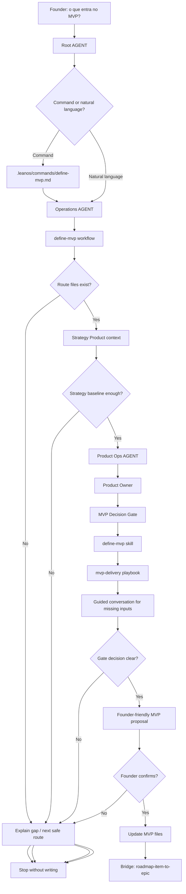

# Journey: Define MVP

## Human Overview

- **Trigger:** founder asks what should enter the first version, MVP or initial delivery.
- **Goal:** decide the smallest coherent MVP scope using fixed LeanOS criteria.
- **Starts at:** Root `AGENT.md`, or `.leanos/commands/define-mvp.md` when the founder uses the command.
- **Passes through:** `operations/workflows/define-mvp.workflow.md`, Product Ops, Product Owner, MVP Decision Gate, `define-mvp.skill.md` and `mvp-delivery.playbook.md`.
- **Ends with:** a founder-confirmed MVP scope proposal or a clear explanation of what is missing before MVP can be defined.
- **Does not do:** create Epics, Features, GitHub issues, branches, PRs, source code or design component specs.

## Flow Diagram



## Flow In Plain Words

The model starts at Root `AGENT.md` because the founder speaks naturally or invokes `/define-mvp`. It enters Operations because defining MVP is a delivery-scope decision, not implementation. If the command is used, the model reads `.leanos/commands/define-mvp.md` first because command handling requires command files before action. It then opens `operations/workflows/define-mvp.workflow.md` because MVP definition can involve Strategy context plus Product Ops and conditional Design, Security, Engineering or DevOps checks. Product Ops leads the decision through the Product Owner role. The model uses `mvp-decision-gate.md` as the fixed gate, then `define-mvp.skill.md` and `mvp-delivery.playbook.md` to guide the founder, propose scope and ask for confirmation before writing.

## Founder Trigger

- "defina o MVP"
- "qual a primeira versao?"
- "o que entra no MVP?"
- "vamos definir a primeira entrega"
- "isso entra no MVP?"

## Moment

First product definition. This happens after `/start-leanos` creates enough Strategy baseline and before `roadmap-item-to-epic`.

## Human Goal

The founder wants to avoid building too much or too randomly. The journey helps decide what is truly needed in the first version, what should wait and what still needs discovery.

## Start Condition

This journey starts when:

- there is at least a product idea, user/problem hypothesis or Strategy baseline;
- the founder wants to decide the first version scope;
- the request is not yet about Epic creation, Feature shaping or implementation.

If Strategy baseline is too weak, the model stops and recommends `/start-leanos` or Strategy Product work before shaping MVP.

## End Condition

This journey ends when:

- the founder confirms the proposed MVP scope and the model updates MVP files;
- or the model explains which missing Strategy/Product inputs block a responsible MVP decision;
- or the founder declines the proposed update and the model stops without writing.

## Owner

- Department: Operations
- Area: Product Ops
- Workflow: `operations/workflows/define-mvp.workflow.md`
- Command: `.leanos/commands/define-mvp.md`
- Primary role: `operations/product-ops/roles/product-owner.role.md`
- Gate: `operations/product-ops/knowledge/mvp-decision-gate.md`
- Primary skill: `operations/product-ops/skills/define-mvp.skill.md`
- Primary playbook: `operations/product-ops/playbooks/mvp-delivery.playbook.md`

## Route Contract

```text
Root AGENT.md
-> .leanos/commands/define-mvp.md when command is used
-> operations/AGENT.md
-> operations/workflows/define-mvp.workflow.md
-> operations/product-ops/AGENT.md
-> operations/product-ops/roles/product-owner.role.md
-> operations/product-ops/knowledge/mvp-decision-gate.md
-> operations/product-ops/skills/define-mvp.skill.md
-> operations/product-ops/playbooks/mvp-delivery.playbook.md
-> operations/product-ops/mvp/*
-> Output
```

Rules:

- The model must declare the route before executing.
- The model cannot skip directly from founder intent to MVP file writing.
- Product Ops owns the MVP decision, but Strategy Product context must be read first.
- The model cannot create Epics, Features, GitHub issues, branches, PRs or code in this journey.
- If a route file does not exist, the model stops and reports the missing path.

## What The Model Does In Practice

### Step 1 - Normalize Intent

The model opens:

`AGENT.md`

Why:

- Root `AGENT.md` says natural-language requests that match commands must load the matching command file.
- Root `AGENT.md` routes product delivery-scope work to Operations.

Navigation Evidence:

- `AGENT.md` maps "define the MVP" to `.leanos/commands/define-mvp.md`.
- `AGENT.md` routes Operations requests through `operations/AGENT.md`.

Next step:

`.leanos/commands/define-mvp.md` when the command or matching intent is clear.

### Step 2 - Load Command Entrypoint

The model opens:

`.leanos/commands/define-mvp.md`

Why:

- The command file states that `/define-mvp` routes into the local Operations workflow.
- It tells the model not to create Epics, Features, GitHub issues, branches, PRs or code.

Navigation Evidence:

- `.leanos/commands/define-mvp.md` points to `operations/workflows/define-mvp.workflow.md`.
- It lists `mvp-decision-gate.md`, `define-mvp.skill.md` and `mvp-delivery.playbook.md`.

Next step:

`operations/AGENT.md`

### Step 3 - Enter Operations

The model opens:

`operations/AGENT.md`

Why:

- Operations is the owning department for delivery scope, Product Ops and MVP execution boundaries.
- Department `AGENT.md` decides whether to use a workflow or an area.

Navigation Evidence:

- `operations/AGENT.md` says journeys use `workflows/README.md` and the smallest matching workflow.
- `operations/workflows/README.md` lists `define-mvp.workflow.md` when Product Ops is active.

Next step:

`operations/workflows/define-mvp.workflow.md`

### Step 4 - Load Workflow

The model opens:

`operations/workflows/define-mvp.workflow.md`

Why:

- The workflow owns the multi-step MVP decision.
- It defines required areas, conditional areas, load order, confirmation gates and forbidden updates.

Navigation Evidence:

- The workflow requires Product Ops.
- The workflow says Strategy Product must be inspected before Product Ops decides scope.
- The workflow routes to Product Ops `AGENT.md`, Product Owner, MVP Decision Gate, skill and playbook.

Next step:

Strategy Product context, then `operations/product-ops/AGENT.md`.

### Step 5 - Check Strategy Baseline

The model opens:

- `strategy/product/AGENT.md`
- `strategy/product/knowledge/brief.md`
- `strategy/product/knowledge/problem.md`
- `strategy/product/knowledge/icp.md`
- `strategy/product/knowledge/value-proposition.md`

Why:

- The workflow says Product Ops cannot responsibly define MVP without product, user, problem and value context.
- MVP scope without Strategy baseline would be guessing.

Navigation Evidence:

- `define-mvp.workflow.md` lists Strategy Product under Load First and Conditional Areas.
- `mvp-decision-gate.md` requires product brief, problem, ICP and value proposition as inputs.

Next step:

If baseline is enough: `operations/product-ops/AGENT.md`.

If baseline is missing: founder-friendly gap explanation and `/start-leanos` or Strategy Product route.

### Step 6 - Enter Product Ops

The model opens:

`operations/product-ops/AGENT.md`

Why:

- Product Ops owns MVP delivery scope and issue readiness.
- Area `AGENT.md` chooses the specialist role.

Navigation Evidence:

- Product Ops `AGENT.md` routes MVP work to Product Owner.
- `product-owner.role.md` points to `define-mvp.skill.md` and `mvp-delivery.playbook.md`.

Next step:

`operations/product-ops/roles/product-owner.role.md`

### Step 7 - Apply MVP Decision Gate

The model opens:

`operations/product-ops/knowledge/mvp-decision-gate.md`

Why:

- The workflow, skill and playbook all require the gate before deciding scope.
- This prevents "everything important" from automatically entering MVP.

Navigation Evidence:

- `define-mvp.workflow.md` lists the gate in Load First and Navigation Route.
- `define-mvp.skill.md` requires the gate.
- `mvp-delivery.playbook.md` loads the gate before asking questions.

What the model evaluates:

- Value Risk
- Usability Risk
- Feasibility Risk
- Business Viability Risk

Next step:

`operations/product-ops/skills/define-mvp.skill.md`

### Step 8 - Use Skill And Playbook

The model opens:

- `operations/product-ops/skills/define-mvp.skill.md`
- `operations/product-ops/playbooks/mvp-delivery.playbook.md`

Why:

- The skill defines how to apply the gate.
- The playbook defines the sequence and guided conversation.

Navigation Evidence:

- Product Owner role points to both assets.
- The playbook uses `ai-standard/foundation/guided-conversation.md`.

What happens:

- The model asks only missing founder questions.
- It separates MVP now, later/backlog, needs discovery, needs specialist check and not now.
- It drafts the MVP scope recommendation.

Next step:

Founder confirmation.

### Step 9 - Ask For Confirmation

The model asks:

```text
Quer que eu transforme essa decisao no escopo inicial do MVP?
```

Why:

- The command, workflow and playbook all require confirmation before writing.
- MVP files are durable product context.

If confirmed:

- Update only MVP/Product Ops files allowed by the workflow.

If not confirmed:

- Explain the outcome and stop without writing.

## Active Roles

| Order | Role | When It Enters | Why It Enters | Route Evidence |
| --- | --- | --- | --- | --- |
| 1 | Product Owner | Always | Owns MVP scope and delivery boundary | `operations/product-ops/AGENT.md` and `product-owner.role.md` |
| 2 | Delivery Architect | Conditional | When feasibility or delivery boundary can change MVP scope | `define-mvp.workflow.md` conditional areas |
| 3 | Product Designer | Conditional | When usability, flow, accessibility or design foundation can change MVP scope | `define-mvp.workflow.md` conditional areas |
| 4 | Security Reviewer | Conditional | When data, auth, privacy, abuse, API, database, secrets, compliance or risk can change scope | `define-mvp.workflow.md` conditional areas |

## Active Skills

| Skill | Used By | Purpose | Route Evidence |
| --- | --- | --- | --- |
| `define-mvp.skill.md` | Product Owner | Apply the MVP Decision Gate | `product-owner.role.md` points to it |
| `define-delivery-scope.skill.md` | Product Owner / Delivery Architect | Connect confirmed MVP to delivery scope when needed | Product Ops role and workflow context |

## Active Playbooks

| Playbook | Area | Role In The Journey | Route Evidence |
| --- | --- | --- | --- |
| `mvp-delivery.playbook.md` | Product Ops | Guided founder conversation and MVP scope proposal | Product Owner role points to it |
| `delivery-scope-planning.playbook.md` | Product Ops | Later bridge when confirmed MVP item becomes Epic planning | continuation bridge |

## Founder Questions

Examples of founder-friendly questions:

- "Qual problema precisa ficar resolvido na primeira versao para ela valer a pena?"
- "Se so pudermos entregar uma experiencia central, qual seria?"
- "O que pode ficar fora sem destruir o valor principal?"
- "Existe algum risco tecnico, de seguranca ou de usabilidade que pode mudar esse escopo?"

Do not ask as a rigid form. Ask only what is missing.

## Guided Conversation Points

| Step | Purpose | Source |
| --- | --- | --- |
| Step 5 | Fill missing Strategy/Product context | `define-mvp.workflow.md` |
| Step 7 | Decide risk state | `mvp-decision-gate.md` |
| Step 8 | Ask concise options and refine scope | `mvp-delivery.playbook.md` |
| Step 9 | Confirm before durable updates | `.leanos/commands/define-mvp.md` and workflow |

## Confirmation Checkpoints

The model must ask for confirmation before:

- deciding that an item enters the MVP;
- updating MVP files;
- updating Product Ops overview or delivery scope;
- moving to `roadmap-item-to-epic`;
- asking Design, Security, Engineering or DevOps to produce durable follow-up artifacts.

## Founder-facing Output

```text
Minha recomendacao:
Comecar com <escopo pequeno e claro>.

O que entra no MVP agora:
- <item>

O que fica fora por enquanto:
- <item>

Por que:
- Value Risk: <pass/gap>
- Usability Risk: <pass/gap>
- Feasibility Risk: <pass/gap>
- Business Viability Risk: <pass/gap>

Proximo passo seguro:
<route>

Quer que eu transforme essa decisao no escopo inicial do MVP?
```

## Internal File Updates After Confirmation

Files that can be updated if the founder confirms:

- `operations/product-ops/mvp/scope.md`
- `operations/product-ops/mvp/prd.md`
- `operations/product-ops/mvp/user-stories.md`
- `operations/product-ops/mvp/user-flows.md`
- `operations/product-ops/mvp/acceptance-criteria.md`
- `operations/product-ops/mvp/non-goals.md`
- `operations/product-ops/mvp/release-checklist.md`
- `operations/product-ops/knowledge/overview.md`
- `operations/product-ops/knowledge/delivery-scope.md`

## Forbidden Actions

During this journey, the model cannot:

- create or update local Epics or Features;
- create GitHub issues, GitHub Project items or payloads;
- create branches, commits, PRs or source code;
- modify Design component specs;
- modify roles, skills, playbooks, workflows, commands or `ai-standard/`;
- mark work as ready to develop.

## Possible Outcomes

The journey can end with:

- confirmed MVP scope;
- request for more Strategy/Product clarity;
- request for usability/design clarification;
- request for technical spike;
- request for business viability check;
- decision to defer or reject an item from MVP.

## Continuation Bridge

Immediate bridge:

```text
O escopo inicial do MVP esta definido.
Quer que eu transforme um item confirmado desse MVP em um Epic local com milestone, release_goal e criterios iniciais?
```

Later-session triggers:

- "vamos transformar esse item do MVP em epic"
- "isso vira epic?"
- "crie um epic para esse item do MVP"
- "vamos planejar a entrega desse item"

Next route:

`roadmap-item-to-epic`

Rules:

- Do not automatically create Epics after MVP shaping.
- If the founder says yes, declare the `roadmap-item-to-epic` route before loading the next workflow.
- If the founder says no, summarize the MVP decision and stop without writing anything else.
- If the founder returns later with a matching trigger, restart from Root `AGENT.md`, route to Operations and load `roadmap-item-to-epic`.

## Next Recommended Journey

After this journey, the next flow can be:

- `roadmap-item-to-epic` when the founder wants to plan delivery from a confirmed MVP item;
- `new-idea-intake` when the founder has a new idea that may or may not belong in the product;
- `status-leanos` when the founder asks where things stand.

## Journey Validation Checklist

### Files Exist

- [x] `AGENT.md` exists.
- [x] `.leanos/commands/define-mvp.md` exists.
- [x] `operations/AGENT.md` exists.
- [x] `operations/workflows/define-mvp.workflow.md` exists.
- [x] `operations/product-ops/AGENT.md` exists.
- [x] `operations/product-ops/area.yaml` exists.
- [x] `operations/product-ops/roles/product-owner.role.md` exists.
- [x] `operations/product-ops/knowledge/mvp-decision-gate.md` exists.
- [x] `operations/product-ops/skills/define-mvp.skill.md` exists.
- [x] `operations/product-ops/playbooks/mvp-delivery.playbook.md` exists.

### Files Point To Each Other

- [x] Root `AGENT.md` routes MVP language to `.leanos/commands/define-mvp.md`.
- [x] Command points to `operations/workflows/define-mvp.workflow.md`.
- [x] Workflow points to Product Ops `AGENT.md`.
- [x] Product Owner role points to `define-mvp.skill.md` and `mvp-delivery.playbook.md`.
- [x] Skill and playbook point to `mvp-decision-gate.md`.
- [x] `.leanos/index/workflows.yaml` includes `define-mvp`.

### Journey Execution

- [x] The model can explain the route before acting.
- [x] The model can say why each next file was loaded.
- [x] The model does not skip department or area.
- [x] The model asks for confirmation before updating files.
- [x] The founder-facing output is understandable before technical paths appear.
- [x] The continuation bridge offers `roadmap-item-to-epic` without starting it automatically.

### Conditional Areas

- [x] Design enters only for UX/UI/flow/accessibility/copy/interaction.
- [x] Security enters only for data/auth/permissions/privacy/API/database/secrets/compliance/risk.
- [x] Engineering enters only for feasibility checks before implementation.
- [x] DevOps enters only for environment/deploy/CI/CD/observability/config/release constraints.

## Notes For Framework Design

- The public command, workflow and skill use `define-mvp` to keep naming consistent for the founder and the framework.
- MVP shaping should remain before Epic creation; otherwise the model can create detailed work for a weak product scope.
- This journey should be revisited when `/bootstrap-app` becomes a real workflow.
