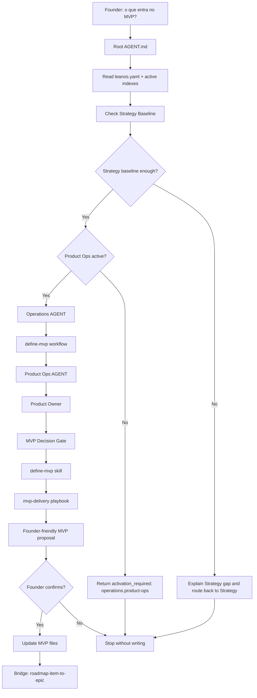

# Journey: Define MVP

## Human Overview

- **Trigger:** founder asks what should enter the first version, MVP or initial delivery.
- **Goal:** decide the smallest coherent MVP scope using fixed LeanOS criteria.
- **Starts at:** root `AGENT.md`.
- **Passes through:** Strategy gate first; then `activation_required: operations.product-ops` when Product Ops is not active; then `operations/workflows/define-mvp.workflow.md` after activation.
- **Ends with:** a founder-confirmed MVP scope proposal or a clear explanation of what is missing before MVP can be defined.
- **Does not do:** create Epics, Features, GitHub issues, branches, PRs, source code or design component specs.

## Flow Diagram



## Flow In Plain Words

The model starts at root `AGENT.md` because the founder speaks in natural language. It reads `leanos.yaml`, current phase and active indexes before routing.

If Strategy Baseline is weak, the model stops and names the missing Strategy input. If Product Ops is inactive, the model does not open `operations/` paths. It explains that MVP scope is delivery work and returns `activation_required: operations.product-ops` with a founder-friendly activation proposal.

Only after Product Ops is active does the journey enter `operations/workflows/define-mvp.workflow.md`. Product Ops leads the decision through the Product Owner role, `mvp-decision-gate.md`, `define-mvp.skill.md` and `mvp-delivery.playbook.md`.

## Founder Trigger

- "defina o MVP"
- "qual a primeira versao?"
- "o que entra no MVP?"
- "vamos definir a primeira entrega"
- "isso entra no MVP?"

## Start Condition

This journey starts when:

- there is at least a product idea, user/problem hypothesis or Strategy baseline;
- the founder wants to decide the first version scope;
- the request is not yet about Epic creation, Feature shaping or implementation.

If Strategy baseline is too weak, the model routes back to Strategy Product work before shaping MVP.

## Owner

- Department after activation: Operations
- Area after activation: Product Ops
- Workflow: `operations/workflows/define-mvp.workflow.md`
- Primary role: `operations/product-ops/roles/product-owner.role.md`
- Gate: `operations/product-ops/knowledge/mvp-decision-gate.md`
- Primary skill: `operations/product-ops/skills/define-mvp.skill.md`
- Primary playbook: `operations/product-ops/playbooks/mvp-delivery.playbook.md`

## Route Contract

When Product Ops is inactive:

```text
Root AGENT.md
-> leanos.yaml
-> active .leanos/index/*
-> Strategy Baseline check
-> activation_required: operations.product-ops
```

After Product Ops is active:

```text
Root AGENT.md
-> operations/AGENT.md
-> operations/workflows/define-mvp.workflow.md
-> operations/product-ops/AGENT.md
-> operations/product-ops/roles/product-owner.role.md
-> operations/product-ops/knowledge/mvp-decision-gate.md
-> operations/product-ops/skills/define-mvp.skill.md
-> operations/product-ops/playbooks/mvp-delivery.playbook.md
-> operations/product-ops/mvp/*
-> Output
```

## Rules

- The model must declare the route before executing.
- The model cannot skip directly from founder intent to MVP file writing.
- Product Ops owns the MVP decision, but Strategy Product context must be checked first.
- The model cannot create Epics, Features, GitHub issues, branches, PRs or code in this journey.
- If a required active route file does not exist, the model stops and reports the missing path.

## Completion Checklist

- [x] Root `AGENT.md` routes MVP language through natural intent routing.
- [x] Product Ops is required before MVP files are created.
- [x] Inactive Product Ops returns `activation_required`, not missing paths.
- [x] `operations/workflows/define-mvp.workflow.md` owns the MVP decision after activation.
- [x] MVP definition stops before Epic, Feature, GitHub, branch, PR or code work.
