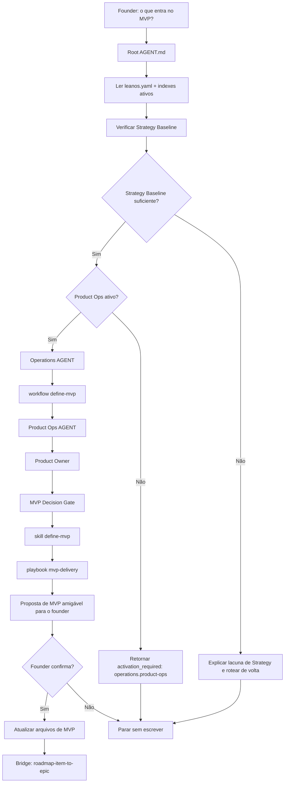

# Jornada: Definir MVP

## Visão Humana

- **Trigger:** founder pergunta o que deve entrar na primeira versão, MVP ou entrega inicial.
- **Objetivo:** decidir o menor escopo coerente de MVP usando critérios fixos do LeanOS.
- **Começa em:** `AGENT.md` raiz.
- **Passa por:** gate de Strategy primeiro; depois `activation_required: operations.product-ops` quando Product Ops não está ativo; depois `operations/workflows/define-mvp.workflow.md` após a ativação.
- **Termina com:** uma proposta de escopo de MVP confirmada pelo founder ou uma explicação clara do que falta antes de definir o MVP.
- **Não faz:** criar Epics, Features, issues do GitHub, branches, PRs, código fonte ou specs de componentes de design.

## Diagrama Do Fluxo



## Fluxo Em Linguagem Simples

O modelo começa no `AGENT.md` raiz porque o founder fala em linguagem natural. Ele lê `leanos.yaml`, fase atual e indexes ativos antes de rotear.

Se a Strategy Baseline estiver fraca, o modelo para e nomeia o input de Strategy ausente. Se Product Ops estiver inativo, o modelo não abre paths de `operations/`. Ele explica que escopo de MVP é trabalho de delivery e retorna `activation_required: operations.product-ops` com uma proposta de ativação amigável para o founder.

Somente depois que Product Ops está ativo a jornada entra em `operations/workflows/define-mvp.workflow.md`. Product Ops conduz a decisão por meio da role Product Owner, `mvp-decision-gate.md`, `define-mvp.skill.md` e `mvp-delivery.playbook.md`.

## Trigger Do Founder

- "defina o MVP"
- "qual a primeira versão?"
- "o que entra no MVP?"
- "vamos definir a primeira entrega"
- "isso entra no MVP?"

## Condição De Início

Esta jornada começa quando:

- existe pelo menos uma ideia de produto, hipótese de usuário/problema ou baseline de Strategy;
- o founder quer decidir o escopo da primeira versão;
- a solicitação ainda não é sobre criação de Epic, shaping de Feature ou implementação.

Se a baseline de Strategy estiver fraca demais, o modelo roteia de volta para trabalho de Strategy Product antes de moldar o MVP.

## Owner

- Departamento após ativação: Operations
- Área após ativação: Product Ops
- Workflow: `operations/workflows/define-mvp.workflow.md`
- Role primária: `operations/product-ops/roles/product-owner.role.md`
- Gate: `operations/product-ops/knowledge/mvp-decision-gate.md`
- Skill primária: `operations/product-ops/skills/define-mvp.skill.md`
- Playbook primário: `operations/product-ops/playbooks/mvp-delivery.playbook.md`

## Contrato De Rota

Quando Product Ops está inativo:

```text
Root AGENT.md
-> leanos.yaml
-> active .leanos/index/*
-> Strategy Baseline check
-> activation_required: operations.product-ops
```

Depois que Product Ops está ativo:

```text
Root AGENT.md
-> operations/AGENT.md
-> operations/workflows/define-mvp.workflow.md
-> operations/product-ops/AGENT.md
-> operations/product-ops/roles/product-owner.role.md
-> operations/product-ops/knowledge/mvp-decision-gate.md
-> operations/product-ops/skills/define-mvp.skill.md
-> operations/product-ops/playbooks/mvp-delivery.playbook.md
-> operations/product-ops/mvp/*
-> Output
```

## Regras

- O modelo deve declarar a rota antes de executar.
- O modelo não pode pular diretamente da intenção do founder para escrita de arquivos de MVP.
- Product Ops é dono da decisão de MVP, mas o contexto de Strategy Product deve ser verificado primeiro.
- O modelo não pode criar Epics, Features, issues do GitHub, branches, PRs ou código nesta jornada.
- Se um arquivo ativo obrigatório da rota não existir, o modelo para e reporta o path ausente.

## Checklist De Conclusão

- [x] O `AGENT.md` raiz roteia linguagem de MVP por meio de roteamento de intenção natural.
- [x] Product Ops é obrigatório antes de arquivos de MVP serem criados.
- [x] Product Ops inativo retorna `activation_required`, não paths ausentes.
- [x] `operations/workflows/define-mvp.workflow.md` é dono da decisão de MVP após ativação.
- [x] A definição de MVP para antes de trabalho de Epic, Feature, GitHub, branch, PR ou código.
