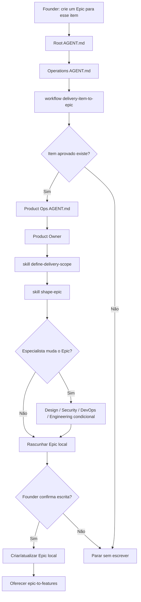

# Jornada: Delivery Item Para Epic

## Visão Humana

- **Trigger:** founder quer transformar um item aprovado de MVP backlog, roadmap, backlog ou delivery scope em trabalho executável.
- **Objetivo:** criar ou atualizar um Epic local que depois poderá ser quebrado em Features.
- **Começa em:** `AGENT.md` raiz, depois `operations/AGENT.md`.
- **Passa por:** `delivery-item-to-epic.workflow.md`, Product Ops, Product Owner, skills de delivery-scope e epic-shaping.
- **Termina com:** Epic local confirmado pelo founder ou decisão clara de manter, refinar, adiar ou rejeitar o item.
- **Não faz:** criar Features, escrever issues no GitHub, criar branch, escrever código ou abrir PR.

## Diagrama Do Fluxo



## Fluxo Em Linguagem Simples

Product Ops transforma um item aprovado em Epic local. A origem do item pode ser:

- MVP Backlog;
- Roadmap;
- backlog estratégico;
- delivery scope já confirmado;
- item atual do MVP em construção.

O workflow existe porque esta é uma mudança de estado: uma decisão deixa de ser candidato ou plano e vira unidade local de delivery. O Epic ainda não é Feature e ainda não é issue do GitHub.

## Owner

- Departamento: Operations
- Área: Product Ops
- Workflow: `operations/workflows/delivery-item-to-epic.workflow.md`
- Role primária: `operations/product-ops/roles/product-owner.role.md`
- Skills principais:
  - `operations/product-ops/skills/define-delivery-scope/SKILL.md`
  - `operations/product-ops/skills/shape-epic/SKILL.md`
- Template: `ai-standard/templates/product/epic-template.md`

## Contrato De Rota

```text
Root AGENT.md
-> operations/AGENT.md
-> operations/workflows/delivery-item-to-epic.workflow.md
-> operations/product-ops/AGENT.md
-> operations/product-ops/roles/product-owner.role.md
-> operations/product-ops/skills/define-delivery-scope/SKILL.md
-> operations/product-ops/skills/shape-epic/SKILL.md
-> ai-standard/templates/product/epic-template.md
-> operations/product-ops/epics/<epic-id>/
```

## Regras De Áreas Condicionais

- Design entra quando UX, UI, copy, acessibilidade, fluxo, tela ou componente podem mudar o Epic.
- Security entra quando dados, auth, permissões, privacidade, abuso, API, banco, compliance ou risco de código gerado por IA podem mudar o Epic.
- DevOps entra quando GitHub Project, sync, milestone, ambientes, deploy, observabilidade, config ou release readiness podem mudar o Epic.
- Engineering entra quando viabilidade, arquitetura, dependência, modelo de dados ou tamanho de implementação podem mudar o Epic.

## Condições De Parada

Pare sem escrever quando:

- o item aprovado não pode ser identificado;
- o item ainda é uma ideia solta;
- falta usuário, problema, outcome ou valor;
- o founder não confirma a escrita;
- a solicitação muda para Feature, GitHub sync, branch, código ou PR.

## Ponte De Continuação

Depois que o Epic local existe, ofereça a próxima jornada sem iniciá-la automaticamente:

```text
O Epic local está pronto.
Quer que eu quebre esse Epic em Features usando a Delivery Readiness Matrix?
```

Próxima rota: `epic-to-features`.

## Checklist De Validação Da Jornada

- [x] `operations/workflows/delivery-item-to-epic.workflow.md` existe.
- [x] A jornada aceita item de MVP backlog, roadmap, backlog ou delivery scope.
- [x] Product Ops é obrigatório antes de criar Epic.
- [x] O modelo não cria Features nesta jornada.
- [x] O modelo pede confirmação antes de escrever o Epic local.
- [x] A próxima rota após Epic confirmado é `epic-to-features`.
