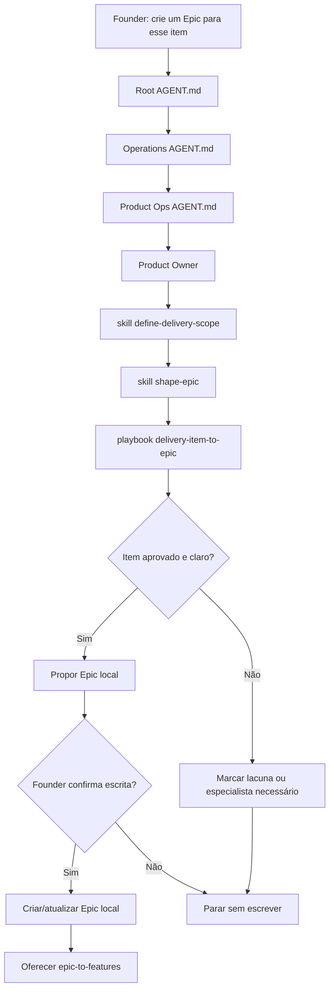

# Jornada: Delivery Item Para Epic

## Visão Humana

- **Trigger:** founder quer transformar um item aprovado de MVP backlog, roadmap, backlog ou delivery scope em Epic local.
- **Objetivo:** criar ou atualizar um Epic local antes de qualquer Feature, GitHub sync, branch ou código.
- **Começa em:** `AGENT.md` raiz, depois `operations/AGENT.md` e Product Ops.
- **Passa por:** Product Ops, Product Owner, skills `define-delivery-scope` e `shape-epic`, playbook `delivery-item-to-epic`.
- **Termina com:** Epic local confirmado pelo founder ou decisão de manter, refinar, adiar ou rejeitar o item.
- **Não faz:** criar Features, escrever issues no GitHub, criar branch, escrever código ou abrir PR.

## Diagrama Do Fluxo



## Fluxo Em Linguagem Simples

Esta jornada é playbook porque acontece dentro de Product Ops. Ela não coordena uma entrega de ponta a ponta; ela só transforma uma decisão aprovada em Epic local.

Se Design, Security, Engineering ou DevOps puderem mudar o Epic, Product Ops marca a necessidade de especialista e para ou pede ativação. Ele não inventa resposta de área inativa.

## Owner

- Departamento: Operations
- Área: Product Ops
- Playbook: `operations/product-ops/playbooks/delivery-item-to-epic.playbook.md`
- Role primária: `operations/product-ops/roles/product-owner.role.md`
- Skills:
  - `operations/product-ops/skills/define-delivery-scope/SKILL.md`
  - `operations/product-ops/skills/shape-epic/SKILL.md`
- Template: `ai-standard/templates/product/epic-template.md`

## Contrato De Rota

```text
Root AGENT.md
-> operations/AGENT.md
-> operations/product-ops/AGENT.md
-> operations/product-ops/roles/product-owner.role.md
-> operations/product-ops/skills/define-delivery-scope/SKILL.md
-> operations/product-ops/skills/shape-epic/SKILL.md
-> operations/product-ops/playbooks/delivery-item-to-epic.playbook.md
-> operations/product-ops/epics/<epic-id>/
```

## Regras

- Product Ops é obrigatório antes de criar Epic.
- O item precisa existir e estar aprovado para consideração de delivery.
- `scope_type`, milestone e release goal são campos do Epic, não um workflow separado.
- O modelo pede confirmação antes de escrever.
- A próxima rota, se o founder quiser continuar, é o playbook `epic-to-features`.

## Checklist De Validação

- [x] Não existe `operations/workflows/delivery-item-to-epic.workflow.md`.
- [x] Existe `operations/product-ops/playbooks/delivery-item-to-epic.playbook.md`.
- [x] A jornada aceita item de MVP backlog, roadmap, backlog ou delivery scope.
- [x] O modelo não cria Features nesta jornada.
- [x] O modelo pede confirmação antes de escrever o Epic local.
