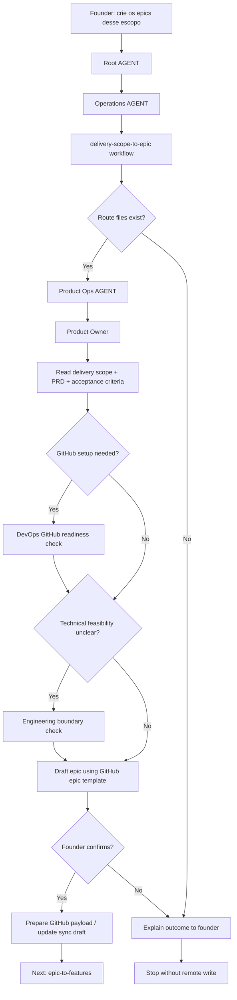

# Journey: Delivery Scope To Epic

This journey starts when a delivery scope is already confirmed and the founder wants to turn it into one or more GitHub-ready epics.

The purpose is not to create features, branches, PRs or code. The purpose is to transform a confirmed delivery scope into epic drafts that can be reviewed, confirmed and then synced to GitHub when the GitHub setup is ready.

## Human Overview

- **Trigger:** founder asks to create epics, send a delivery scope to GitHub, or prepare execution tracking.
- **Goal:** draft one or more epics from confirmed delivery scope.
- **Starts at:** Root `AGENT.md`, then `operations/AGENT.md`.
- **Passes through:** `delivery-scope-to-epic.workflow.md`, Product Ops, Product Owner, GitHub templates and conditional DevOps/Engineering checks.
- **Ends with:** founder-confirmed epic draft or a clear gap explaining why epic creation is premature.
- **Does not do:** create features, create branches, write code, open PRs or call GitHub API without confirmation.

## Flow Diagram



## Flow In Plain Words

The model starts at Root `AGENT.md` because the founder is speaking naturally. It enters Operations because turning scope into executable delivery work belongs to Operations. It reads `delivery-scope-to-epic.workflow.md` because this is a planning handoff from delivery scope to GitHub-tracked work. It enters Product Ops because Product Ops owns delivery scope and issue readiness. It uses Product Owner judgment to shape the epic. It asks DevOps only when GitHub Project setup, labels, milestones or sync state are involved. It asks Engineering only when the epic boundary needs feasibility review. It ends by asking the founder to confirm the epic draft before any remote write.

## Founder Trigger

Real phrases that can start this journey:

- "Crie os epics desse escopo."
- "Vamos mandar esse delivery scope para o GitHub."
- "Esse item aprovado vira qual epic?"
- "Crie o epic no GitHub Projects."
- "Vamos transformar esse escopo em trabalho rastreavel."
- "Prepara o epic desse milestone."

## Moment

This happens after `roadmap-item-to-delivery-scope` and before `epic-to-features`.

It can happen:

- immediately after a founder confirms a delivery scope;
- in a later session when the founder asks to operationalize a scope;
- after GitHub Project configuration exists;
- before any implementation issue, branch or code work starts.

## Human Goal

The founder wants to turn a confirmed delivery decision into a trackable execution unit.

In founder-friendly language:

> "We decided this belongs in the next delivery. Now I want it organized as an epic so we can track it, break it down and eventually implement it."

## Start Condition

This journey starts when:

- a delivery scope exists;
- `scope_type`, `milestone` and `release_goal` are known or explicitly being confirmed;
- the founder asks to create or prepare epics;
- the work is not yet split into features;
- implementation has not started.

## End Condition

This journey ends when:

- the model produces an epic draft with outcome, context, scope, non-goals, risks, milestone and readiness notes;
- missing GitHub setup or delivery context is clearly explained;
- the founder confirms or rejects the proposed epic draft;
- no features, branches, code or PRs have started.

## Owner

Department or area that owns the journey:

- Department: `operations/`
- Primary area: `operations/product-ops/`
- Supporting department: `strategy/`
- Conditional areas: `operations/devops/`, `operations/engineering/`, `operations/security/`, `operations/design/`
- Workflow: `operations/workflows/delivery-scope-to-epic.workflow.md`
- Command, if any: none required. Natural language should activate this route.

## Route Contract

The required route is:

```text
Root AGENT.md
-> operations/AGENT.md
-> operations/workflows/delivery-scope-to-epic.workflow.md
-> operations/product-ops/AGENT.md
-> operations/product-ops/roles/product-owner.role.md
-> operations/product-ops/knowledge/delivery-scope.md
-> operations/product-ops/knowledge/ready-to-develop.md
-> ai-standard/templates/github/github-epic-template.md
-> Output
```

Rules:

- The model cannot start this journey before delivery scope exists.
- The model must declare the route before executing.
- Product Ops owns the epic shape.
- DevOps enters only for GitHub Project, labels, milestones, tokens, sync state or API readiness.
- Engineering enters only when the epic boundary needs technical feasibility review.
- Design enters only when the epic affects UX, UI, copy, accessibility, screens, states or user flows.
- Security enters only when data, auth, permissions, privacy, abuse, API, database, secrets, compliance, infrastructure or AI-generated-code risk exists.
- The model must draft and ask for confirmation before any GitHub API write.
- The model must not create features in this journey.
- If a route file does not exist, the model stops and reports the missing path.

## What The Model Does In Practice

### Step 1 - Understand the founder planning request

The model opens:

`AGENT.md`

Why:

- Root `AGENT.md` says natural-language requests route through the Navigation Chain.
- The founder is asking for execution planning, not strategy ideation or coding.
- Root routing sends delivery and implementation preparation to Operations.

Navigation Evidence:

- `AGENT.md` points Operations requests to `operations/AGENT.md`.
- The founder asks to turn scope into epics, which is delivery planning.

What the model understands here:

- This is not a code request.
- This is not feature creation yet.
- This belongs to Operations.

Next step:

`operations/AGENT.md`

### Step 2 - Enter Operations and choose the workflow path

The model opens:

`operations/AGENT.md`

Why:

- Root AGENT selected Operations.
- Operations AGENT says multi-step delivery transitions use `workflows/README.md`.
- Turning delivery scope into epics is a transition between Product Ops and GitHub planning.

Navigation Evidence:

- `operations/AGENT.md` says workflows are used for multi-step decisions and transitions.
- Operations owns delivery scope, issue readiness, engineering, DevOps and security handoffs.

What the model understands here:

- It should not go directly to DevOps or Engineering.
- It should select the workflow first.

Next step:

`operations/workflows/README.md`

### Step 3 - Select Delivery Scope To Epic workflow

The model opens:

`operations/workflows/README.md`

Why:

- Operations AGENT instructed workflow selection.
- The founder asks to convert confirmed scope into epics.

Navigation Evidence:

- `operations/workflows/delivery-scope-to-epic.workflow.md` exists.
- The workflow purpose says it turns confirmed delivery scope into GitHub-ready epic drafts.

What the model understands here:

- This workflow is the owner of the transition.
- Product Ops is the required area.
- GitHub/DevOps is conditional.

Next step:

`operations/workflows/delivery-scope-to-epic.workflow.md`

### Step 4 - Read the workflow contract

The model opens:

`operations/workflows/delivery-scope-to-epic.workflow.md`

Why:

- The workflow defines the safe sequence for epic planning.
- The workflow says to stop before features, branches, code or PR work.

Navigation Evidence:

- The workflow requires Product Ops.
- The workflow says to confirm delivery scope exists and has `scope_type`, `milestone` and `release_goal`.
- The workflow says to ask for confirmation before GitHub API write.

What the model understands here:

- It must verify delivery scope before drafting the epic.
- It must use Product Ops.
- It must not write remotely without confirmation.

Next step:

`operations/product-ops/AGENT.md`

### Step 5 - Enter Product Ops

The model opens:

`operations/product-ops/AGENT.md`

Why:

- The workflow requires Product Ops.
- Product Ops owns delivery scope, epic shaping and issue readiness.

Navigation Evidence:

- Product Ops AGENT routes epic/scoping work to Product Owner.
- Product Ops has `knowledge/delivery-scope.md`, `knowledge/ready-to-develop.md` and epic/feature playbooks.

What the model understands here:

- Product Owner is the primary role.
- The epic must inherit delivery scope, not invent it.

Next step:

`operations/product-ops/roles/product-owner.role.md`

### Step 6 - Activate Product Owner

The model opens:

`operations/product-ops/roles/product-owner.role.md`

Why:

- Product Ops AGENT selected Product Owner for delivery scope and epic shaping.
- Product Owner is responsible for turning scope into coherent work.

Navigation Evidence:

- Product Owner role points to delivery scope, issue readiness, ready-to-develop and GitHub DRM context.
- Product Owner owns `shape-epic` and `write-feature-criteria`, but this journey uses epic shaping only.

What the model understands here:

- It should shape the epic, not create features yet.
- It should check readiness and missing criteria.

Next step:

`operations/product-ops/knowledge/delivery-scope.md`

### Step 7 - Verify delivery scope and readiness

The model opens:

- `operations/product-ops/knowledge/delivery-scope.md`
- `operations/product-ops/knowledge/ready-to-develop.md`
- `operations/product-ops/mvp/prd.md` when scope type is MVP
- `operations/product-ops/mvp/acceptance-criteria.md` when product behavior is affected
- `strategy/roadmap/knowledge/roadmap.md`
- `strategy/product/knowledge/brief.md`

Why:

- Product Owner role requires Product Ops and Strategy context.
- The epic must be derived from confirmed scope and product strategy.
- `ready-to-develop.md` prevents sending vague work into implementation.

Navigation Evidence:

- Product Ops knowledge folder contains delivery scope and readiness files.
- Roadmap and Product knowledge provide context and outcome.

What the model understands here:

- Whether the scope is ready to become epic.
- Which milestone/release goal applies.
- Which context is missing.

Next step:

GitHub epic template, or gap explanation.

### Step 8 - Draft the epic

The model opens:

`ai-standard/templates/github/github-epic-template.md`

Why:

- The output should be GitHub-ready and follow the framework template.
- The model must not invent issue structure from memory.

Navigation Evidence:

- AI Standard routes template use through `ai-standard/README.md`.
- GitHub templates define epic format.

What the model produces:

- epic title;
- outcome;
- strategic context;
- linked delivery scope;
- milestone;
- scope;
- non-goals;
- risks;
- readiness notes;
- Product Ops criteria;
- Design/Security/DevOps applicability;
- open questions.

Next step:

Conditional DevOps or Engineering review.

### Step 9 - Conditional DevOps check

The model enters DevOps only if:

- GitHub Project is not configured;
- labels, milestones, fields or sync state are unclear;
- a remote write is being prepared;
- the founder asks to create/update GitHub artifacts.

The model opens:

`operations/devops/AGENT.md`

Why:

- DevOps owns GitHub Project setup, CI/CD, environments and operational readiness.
- Product Ops should not pretend GitHub configuration is ready.

Navigation Evidence:

- DevOps area owns GitHub/project readiness knowledge and playbooks.
- `.github/leanos/project-sync.yaml` and `.github/leanos/sync-state.yaml` are configuration/state files, not secrets.

What the model understands here:

- Whether it can prepare a payload.
- Whether it should stop and ask the founder to configure GitHub first.

Next step:

Return to Product Ops epic draft.

### Step 10 - Conditional Engineering boundary check

The model enters Engineering only if:

- the epic is too broad;
- technical feasibility is unclear;
- the implementation boundary may be risky;
- dependencies affect how the epic should be sliced later.

The model opens:

`operations/engineering/AGENT.md`

Why:

- Engineering owns feasibility, code standards, implementation boundaries and tests.
- Product Ops should not decide technical slices alone when technical risk is visible.

Navigation Evidence:

- Engineering knowledge contains implementation rules, code standards, data guidelines and testing strategy.

What the model understands here:

- Whether the epic is coherent enough to later break into features.
- Whether technical risks should be called out before GitHub creation.

Next step:

Return to Product Ops epic draft.

### Step 11 - Ask for founder confirmation

The model asks in founder-friendly language:

```text
Esse escopo ja pode virar um epic.

Minha sugestao:
- criar um epic para <outcome>;
- usar o milestone <milestone>;
- manter fora do epic <non-goals>;
- marcar Design/Security/DevOps como <applicability>;
- deixar features para o proximo passo.

Quer que eu prepare esse epic para o GitHub?
```

Why:

- Remote GitHub write needs confirmation.
- The founder should understand the business decision before the technical payload.

Navigation Evidence:

- Workflow says to ask before GitHub API write.
- GitHub templates define structure, not permission to execute.

Next step:

If confirmed, prepare payload/draft. If not confirmed, explain outcome and stop.

### Step 12 - Handoff to Epic To Features

If the epic draft is confirmed, the model offers the next bridge:

```text
O epic draft esta pronto.
Quer que eu quebre esse epic em features usando a Delivery Readiness Matrix?
```

Why:

- `delivery-scope-to-epic` ends at epic draft.
- Feature creation is a separate journey.

Next route:

`epic-to-features`

## Active Roles

| Order | Role | When It Enters | Why It Enters | Route Evidence |
| --- | --- | --- | --- | --- |
| 1 | Product Owner | Always | Owns delivery scope and epic shape | `operations/product-ops/AGENT.md` |
| 2 | GitHub DevOps / DevOps Lead | Conditional | GitHub Project, labels, milestones, sync state or API readiness | `operations/devops/AGENT.md` |
| 3 | Senior Developer / Engineering Lead | Conditional | Epic boundary or technical feasibility needs review | `operations/engineering/AGENT.md` |
| 4 | Product Designer | Conditional | UX/UI/accessibility/screen/user-flow impact exists | `operations/design/AGENT.md` |
| 5 | Security Reviewer | Conditional | Data/auth/privacy/API/security risk exists | `operations/security/AGENT.md` |

## Active Skills

| Skill | Used By | Purpose | Route Evidence |
| --- | --- | --- | --- |
| `shape-epic` | Product Owner | Confirm outcome, scope boundary and non-goals | Product Owner role |
| `check-delivery-coherence` | Product Owner / Delivery Architect | Confirm scope matches strategy and acceptance criteria | Product Ops skills |
| DevOps GitHub readiness skill | DevOps | Validate project/labels/milestone readiness when needed | DevOps AGENT |
| Engineering planning/review skill | Engineering | Check feasibility and implementation boundary when needed | Engineering AGENT |

## Active Playbooks

| Playbook | Area | Role In The Journey | Route Evidence |
| --- | --- | --- | --- |
| `delivery-readiness` | Product Ops | Check whether scope is ready for execution planning | Product Ops playbooks |
| `roadmap-sync-prep` | Strategy Roadmap | Context for GitHub sync when roadmap state matters | Strategy Roadmap |
| `configure-github-project` or GitHub readiness playbook | DevOps | Conditional GitHub setup review | DevOps playbooks |

## Founder Questions

Founder-friendly questions:

- "Esse epic representa uma entrega real ou ainda e apenas uma ideia?"
- "Qual resultado esse epic precisa entregar?"
- "Esse epic pertence ao MVP, release, beta, experimento ou trabalho interno?"
- "Qual milestone deve receber esse epic?"
- "O que fica fora desse epic?"
- "Existe alguma parte de Design, Security ou DevOps que precisa entrar antes das features?"
- "Quer que eu prepare o draft para GitHub agora ou deixar como plano local?"

Do not ask as a rigid form. Ask only what is missing.

## Guided Conversation Points

Use guided choices when:

- `scope_type` is missing;
- `milestone` is unclear;
- the epic boundary is too broad;
- GitHub is not configured;
- Design/Security/DevOps applicability is unclear;
- founder needs to choose whether to create remote GitHub artifacts now or later.

## Output Shape

The final output should be founder-friendly first:

```text
O delivery scope ja pode virar epic.

Epic sugerido:
<title>

Resultado esperado:
<outcome>

Milestone:
<milestone>

Fora do escopo:
<non-goals>

Checks antes de features:
- Product Ops: ok / falta
- Design: aplicavel / nao aplicavel
- Security: aplicavel / nao aplicavel
- DevOps: aplicavel / nao aplicavel
- Engineering: ok / falta

Proximo passo:
<epic-to-features or GitHub setup>

Quer que eu prepare isso para o GitHub?
```

Only after that, list technical files inspected or payload details.

## Stop Conditions

Stop and explain the gap when:

- delivery scope does not exist;
- `scope_type`, `milestone` or `release_goal` are missing and the founder does not confirm them;
- product context is too weak to define an epic outcome;
- the GitHub target is required but not configured;
- the route file is missing;
- the founder does not confirm remote write;
- the request tries to jump to features, code, branch or PR before the epic exists.

## Continuation Bridge

At the end, offer one next step only.

Immediate bridge:

```text
O epic draft esta pronto.
Quer que eu quebre esse epic em features usando a Delivery Readiness Matrix?
```

Next route:

`epic-to-features`

Rules:

- Do not start `epic-to-features` automatically.
- Do not create features inside this journey.
- If the founder says yes, declare the new route before loading Product Ops epic-to-features assets.
- If the founder says no, explain the epic outcome and stop.
- If the founder returns later with "quebre o epic #123", restart from Root `AGENT.md`, route to Operations and load `epic-to-features`.

## Route Validation Checklist

Before considering this journey complete, verify:

- [ ] `operations/AGENT.md` exists.
- [ ] `operations/workflows/README.md` exists.
- [ ] `operations/workflows/delivery-scope-to-epic.workflow.md` exists.
- [ ] `operations/product-ops/AGENT.md` exists.
- [ ] `operations/product-ops/knowledge/delivery-scope.md` exists.
- [ ] `operations/product-ops/knowledge/ready-to-develop.md` exists.
- [ ] `operations/product-ops/roles/product-owner.role.md` exists.
- [ ] `ai-standard/templates/github/github-epic-template.md` exists.
- [ ] `.github/leanos/project-sync.yaml` exists when GitHub sync is requested.
- [ ] DevOps is conditional, not mandatory.
- [ ] Engineering is conditional, not mandatory.
- [ ] The workflow stops before features, branch, code and PR.
- [ ] The continuation bridge offers `epic-to-features` without starting it automatically.

## Notes For Framework Improvement

- If GitHub setup remains too vague, improve DevOps GitHub readiness assets before automating remote writes.
- If epic drafts vary too much, strengthen `ai-standard/templates/github/github-epic-template.md`.
- If this journey starts getting too many implementation checks, move them to `epic-to-features` or `feature-to-delivery-cycle`.
