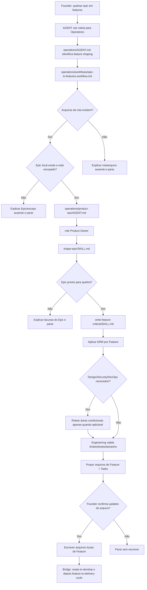

# Jornada: Epic Para Features

## Visão Humana

- **Trigger:** founder diz "quebre esse epic em features", "quais features precisamos?", "prepara esse epic para desenvolvimento".
- **Objetivo:** transformar um Epic local confirmado em arquivos de Feature com Tasks internas e critérios da Delivery Readiness Matrix.
- **Começa em:** `AGENT.md` raiz.
- **Passa por:** Operations, `epic-to-features.workflow.md`, Product Ops, Product Owner, skills/playbook de Product Ops e checks condicionais de Design, Security, DevOps e Engineering.
- **Termina com:** rascunhos de Feature locais propostos ao founder, ou uma lacuna clara explicando por que o Epic ainda não pode ser quebrado.
- **Não faz:** criação de branch, implementação de código, criação de PR ou GitHub sync sem confirmação explícita.

## Diagrama Do Fluxo



## Fluxo Em Linguagem Simples

O modelo começa no `AGENT.md` raiz porque o founder fala naturalmente. Ele entra em Operations porque converter um Epic em Features prontas para implementação é delivery shaping, não estratégia ou código. Ele lê `operations/workflows/epic-to-features.workflow.md` porque a solicitação coordena Product Ops, Engineering e review condicional de Design/Security/DevOps. Ele entra em Product Ops porque Product Ops é dono do shaping de Epic e Feature. Ele usa o julgamento do Product Owner, verifica o Epic com `shape-epic/SKILL.md`, rascunha Features por meio de `write-feature-criteria/SKILL.md` e só então pergunta ao founder se deve escrever os arquivos locais de Feature.

## Trigger Do Founder

- "quebre esse epic em features"
- "quais features precisamos para esse epic?"
- "prepara esse epic para desenvolvimento"
- "transforma esse epic em trabalho executável"
- "quebre o epic #123"

## Moment

Feature Shaping. Isso acontece depois de `roadmap-item-to-epic` e antes de `feature-to-delivery-cycle`.

## Condição De Início

Esta jornada começa quando:

- um Epic local existe em `operations/product-ops/epics/<epic-slug>/README.md`; ou
- o founder referencia um Epic do GitHub que primeiro deve ser mapeado para um Epic local; e
- o founder pede para quebrar o Epic em Features prontas para implementação.

## Condição De Fim

Esta jornada termina quando:

- arquivos de Feature são propostos e o founder confirma ou recusa a escrita;
- ou o modelo explica por que o Epic não tem outcome, escopo, non-goals, ownership ou readiness;
- ou o modelo mapeia uma lacuna de rota/arquivo e para.

## Owner

- Departamento: Operations
- Área: Product Ops
- Workflow: `operations/workflows/epic-to-features.workflow.md`
- Role primária: `operations/product-ops/roles/product-owner.role.md`
- Playbook primário: `operations/product-ops/playbooks/epic-to-features.playbook.md`

## Contrato De Rota

```text
AGENT.md
-> operations/AGENT.md
-> operations/workflows/epic-to-features.workflow.md
-> operations/product-ops/AGENT.md
-> operations/product-ops/roles/product-owner.role.md
-> operations/product-ops/skills/shape-epic/SKILL.md
-> operations/product-ops/skills/write-feature-criteria/SKILL.md
-> operations/product-ops/playbooks/epic-to-features.playbook.md
-> operations/product-ops/epics/<epic-slug>/<feature-slug>.md
```

Regras:

- O modelo deve declarar esta rota antes de executar.
- O modelo não pode pular Product Ops e ir direto para Engineering.
- O modelo deve carregar `operations/product-ops/epics/README.md`.
- O modelo deve usar templates locais de produto antes de templates do GitHub.
- Se um arquivo de rota não existir, o modelo para e reporta a lacuna.
- GitHub sync é opcional e separado da criação de Features.

## O Que O Modelo Faz Na Prática

### Etapa 1 - Confirmar Rota

O modelo abre:

`AGENT.md`

Por quê:

- O founder fez uma solicitação de delivery shaping em linguagem natural.
- O roteamento raiz deve escolher Operations, não Strategy nem código direto.

Evidência De Navegação:

- O `AGENT.md` raiz diz que a raiz escolhe o departamento owner.
- `operations/AGENT.md` é dono de delivery, readiness de implementação e product operations.

Próxima etapa:

`operations/AGENT.md`

### Etapa 2 - Carregar O Workflow De Operations

O modelo abre:

`operations/workflows/epic-to-features.workflow.md`

Por quê:

- Quebrar um Epic em Features é delivery shaping entre áreas.
- O workflow decide a ordem: Product Ops primeiro, validação de Engineering, Design/Security/DevOps condicionais.

Evidência De Navegação:

- `.leanos/index/workflows.yaml` deve apontar para o workflow.
- O workflow deve listar Product Ops e Engineering como áreas base.

Próxima etapa:

`operations/product-ops/AGENT.md`

### Etapa 3 - Carregar Product Ops

O modelo abre:

`operations/product-ops/AGENT.md`

Por quê:

- Product Ops é dono de Delivery Scope, Epic e Feature shaping.
- O lead da área escolhe Product Owner e as skills/playbook necessárias.

Evidência De Navegação:

- `operations/product-ops/area.yaml` lista Product Owner, `shape-epic`, `write-feature-criteria` e `epic-to-features`.
- `operations/product-ops/epics/README.md` define onde vivem Epics e Features locais.

Próxima etapa:

`operations/product-ops/roles/product-owner.role.md`

### Etapa 4 - Verificar Readiness Do Epic

O modelo abre:

`operations/product-ops/skills/shape-epic/SKILL.md`

Por quê:

- Criar Features é inseguro se o Epic não tem outcome, escopo, non-goals ou ownership.
- Esta skill diz ao modelo como verificar o Epic antes de fatiá-lo.

Evidência De Navegação:

- `shape-epic/SKILL.md` exige `work-taxonomy.md`, `ready-to-develop.md`, `epics/README.md` e `epic-template.md`.

Próxima etapa:

`operations/product-ops/skills/write-feature-criteria/SKILL.md`

### Etapa 5 - Rascunhar Features Com DRM

O modelo abre:

`operations/product-ops/skills/write-feature-criteria/SKILL.md`

Por quê:

- Esta skill aplica a Delivery Readiness Matrix em nível de Feature.
- Ela define Product Ops e Engineering como obrigatórios e Design/Security/DevOps como condicionais.
- Quando Design é aplicável, ela identifica se a Feature pode reutilizar um componente, adaptar um componente existente ou precisa de uma task futura de spec de componente.
- Ela não escreve a spec completa de componente durante esta jornada.

Evidência De Navegação:

- A skill aponta para `ai-standard/templates/product/feature-template.md`.
- O playbook aponta para a mesma DRM e para a pasta local de Epics.
- Specs de componente são tratadas depois por `operations/design/playbooks/component-readiness.playbook.md` quando uma Feature real precisar disso.

Próxima etapa:

`operations/product-ops/playbooks/epic-to-features.playbook.md`

### Etapa 6 - Review Condicional De Especialistas

O modelo roteia apenas se aplicável:

- Design: UX, UI, flow, copy, accessibility, screens, states or interaction.
- Security: data, auth, permissions, privacy, abuse, API, database, secrets, compliance, infrastructure or AI-generated-code risk.
- DevOps: environments, CI/CD, deploy, observability, config, GitHub sync or release readiness.
- Engineering: always validates boundaries, dependencies, tests and feature size.

Por quê:

- O workflow e o playbook definem essas dimensões como critérios condicionais.
- Dimensões não aplicáveis devem ser marcadas com uma razão.
- Se Design identificar uma spec de componente ausente, esta jornada adiciona uma task de Design à Feature em vez de pedir que Engineering code imediatamente.
- A spec completa de componente pertence ao caminho de component readiness, não ao fatiamento de Epic.

### Etapa 7 - Confirmação Do Founder

O modelo mostra uma proposta amigável para o founder:

```text
Esse epic pode ser quebrado em 3 features.

Minha proposta:
- [FEATURE: Customer Management] Create customer profile
- [FEATURE: Customer Management] Import customers from CSV
- [FEATURE: Customer Management] Detect duplicate contacts

Cada feature terá critérios de Product Ops e Engineering.
Design entra na primeira e segunda porque existe fluxo de tela.
Na importação por CSV, parece que precisaremos confirmar se já existe um componente de tabela/importação.
Se não existir, vou adicionar uma task de Design para component readiness antes da implementação.
Security entra na importação por CSV porque envolve dados de clientes.
DevOps não parece necessário agora, exceto se você quiser sincronizar com GitHub.

Quer que eu crie esses arquivos localmente dentro do epic?
```

Se o founder confirmar, o modelo pode escrever arquivos locais de Feature. Se não, ele explica o resultado e para.

## Roles Ativas

| Ordem | Role | Quando Entra | Por Que Entra | Evidência De Rota |
| --- | --- | --- | --- | --- |
| 1 | Product Owner | Sempre | É dono do shaping de Epic e Feature | `operations/product-ops/AGENT.md` |
| 2 | Senior Developer | Sempre para limites de implementação | Valida viabilidade, dependências e testes | regra condicional/base do workflow |
| 3 | Product Designer | Apenas para UX/UI/fluxo/copy/acessibilidade | Adiciona critérios de design | regra condicional do workflow |
| 4 | Security Reviewer | Apenas para risco de dados/auth/privacidade/security | Adiciona critérios de security | regra condicional do workflow |
| 5 | DevOps Engineer | Apenas para impacto de env/deploy/sync/release | Adiciona critérios operacionais | regra condicional do workflow |

## Skills Ativas

| Skill | Usada Por | Propósito | Evidência De Rota |
| --- | --- | --- | --- |
| `shape-epic` | Product Owner | Verificar outcome, escopo, non-goals e readiness do Epic | Role Product Owner |
| `write-feature-criteria` | Product Owner | Rascunhar Features com Tasks e DRM | Role Product Owner |

## Playbooks Ativos

| Playbook | Área | Papel Na Jornada | Evidência De Rota |
| --- | --- | --- | --- |
| `epic-to-features` | Product Ops | Executa Feature Shaping | Role Product Owner e workflow |
| `delivery-readiness` | Product Ops | Verifica readiness antes da implementação | Product Ops / Delivery Architect |
| Playbooks de Design | Design | Critérios condicionais de design | regra condicional do workflow |
| Playbooks de Security | Security | Critérios condicionais de security | regra condicional do workflow |

## Perguntas Ao Founder

- "Qual epic você quer quebrar em features?"
- "Esse epic ainda representa o resultado que você quer entregar?"
- "Alguma feature precisa de tela, fluxo, texto ou acessibilidade?"
- "Essa feature toca dados de cliente, login, permissão, API ou privacidade?"
- "Você quer criar os arquivos localmente agora ou apenas revisar a proposta?"

Pergunte apenas o que está faltando.

## Checkpoints De Confirmação

O modelo deve pedir confirmação antes de:

- criar arquivos de Feature;
- mudar o README do Epic;
- mudar escopo de delivery ou arquivos de MVP;
- sincronizar com GitHub;
- iniciar implementação de Engineering.

## Updates Internos De Arquivo Após Confirmação

Arquivos que podem ser criados ou atualizados:

- `operations/product-ops/epics/<epic-slug>/README.md`
- `operations/product-ops/epics/<epic-slug>/<feature-slug>.md`
- `operations/product-ops/knowledge/issue-readiness.md`
- `operations/product-ops/knowledge/issue-readiness.md`

## Ações Proibidas

Durante esta jornada, o modelo não pode:

- implementar código;
- criar uma branch;
- abrir um PR;
- chamar a API do GitHub diretamente;
- criar arquivos de Feature sem confirmação do founder;
- marcar Design, Security ou DevOps como não aplicável sem explicar por quê.

## Resultados Possíveis

- Arquivos de Feature criados localmente.
- Proposta de Feature mostrada, mas não escrita.
- Epic bloqueado porque outcome/escopo/non-goals estão ausentes.
- Review condicional de Design/Security/DevOps necessário antes da criação de Features.
- GitHub sync oferecido como etapa opcional posterior.

## Ponte De Continuação

Ponte imediata:

```text
As features foram definidas.
Quer que eu verifique se alguma delas já está pronta para desenvolvimento?
```

Triggers em sessão posterior:

- "vamos implementar essa feature"
- "essa feature está pronta para desenvolver?"
- "podemos iniciar o desenvolvimento?"
- "comece pela feature"

Próxima rota:

`feature-to-delivery-cycle`

Regras:

- Não inicie implementação automaticamente.
- Rode `ready-to-develop.md` primeiro.
- Se readiness estiver ausente, explique a lacuna e recomende a próxima rota LeanOS.

## Checklist De Validação Da Jornada

### Arquivos Existem

- [ ] `AGENT.md` existe.
- [ ] `operations/AGENT.md` existe.
- [ ] `operations/workflows/epic-to-features.workflow.md` existe.
- [ ] `operations/product-ops/AGENT.md` existe.
- [ ] `operations/product-ops/area.yaml` existe.
- [ ] `operations/product-ops/epics/README.md` existe.
- [ ] `operations/product-ops/roles/product-owner.role.md` existe.
- [ ] `operations/product-ops/skills/shape-epic/SKILL.md` existe.
- [ ] `operations/product-ops/skills/write-feature-criteria/SKILL.md` existe.
- [ ] `operations/product-ops/playbooks/epic-to-features.playbook.md` existe.
- [ ] `ai-standard/templates/product/epic-template.md` existe.
- [ ] `ai-standard/templates/product/feature-template.md` existe.

### Arquivos Apontam Uns Para Os Outros

- [ ] A raiz roteia para Operations.
- [ ] Operations roteia feature shaping por workflows ou Product Ops.
- [ ] Product Ops aponta para Product Owner.
- [ ] Product Owner aponta para `shape-epic`, `write-feature-criteria` e `epic-to-features`.
- [ ] O workflow aponta para regras condicionais de Design/Security/DevOps.
- [ ] `.leanos/index/workflows.yaml` inclui `epic-to-features`.

### Execução Da Jornada

- [ ] O modelo consegue explicar por que carregou cada arquivo.
- [ ] O modelo não pula Product Ops.
- [ ] O modelo aplica DRM antes de criar Features.
- [ ] O modelo pede confirmação antes de escrever.
- [ ] O modelo oferece `feature-to-delivery-cycle` apenas depois do check de readiness.
