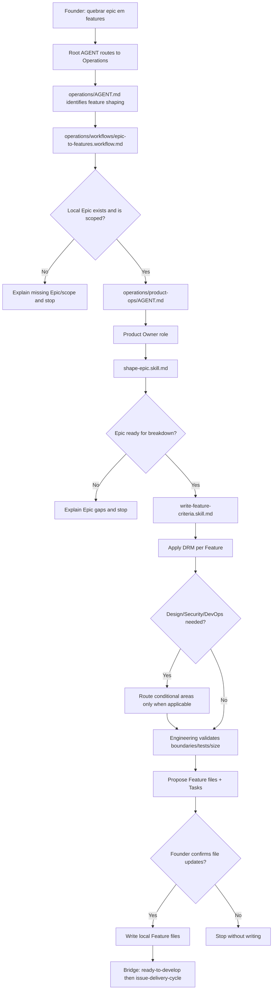

# Journey: Epic To Features

## Human Overview

- **Trigger:** founder says "quebre esse epic em features", "quais features precisamos?", "prepara esse epic para desenvolvimento".
- **Goal:** transform one confirmed local Epic into Feature files with internal Tasks and Delivery Readiness Matrix criteria.
- **Starts at:** Root `AGENT.md`.
- **Passes through:** Operations, `epic-to-features.workflow.md`, Product Ops, Product Owner, Product Ops skills/playbook and conditional Design, Security, DevOps and Engineering checks.
- **Ends with:** local Feature drafts proposed to the founder, or a clear gap explaining why the Epic cannot be broken down yet.
- **Does not do:** branch creation, code implementation, PR creation or GitHub sync without explicit confirmation.

## Flow Diagram



## Flow In Plain Words

The model starts at Root `AGENT.md` because the founder is speaking naturally. It enters Operations because converting an Epic into implementation-ready Features is delivery shaping, not strategy or code. It reads `operations/workflows/epic-to-features.workflow.md` because the request coordinates Product Ops, Engineering and conditional Design/Security/DevOps review. It enters Product Ops because Product Ops owns Epic and Feature shaping. It uses Product Owner judgment, verifies the Epic with `shape-epic.skill.md`, drafts Features through `write-feature-criteria.skill.md`, and only then asks the founder whether to write local Feature files.

## Founder Trigger

- "quebre esse epic em features"
- "quais features precisamos para esse epic?"
- "prepara esse epic para desenvolvimento"
- "transforma esse epic em trabalho executavel"
- "quebre o epic #123"

## Moment

Feature Shaping. This happens after `delivery-scope-to-epic` and before `issue-delivery-cycle`.

## Start Condition

This journey starts when:

- a local Epic exists under `operations/product-ops/epics/<epic-slug>/README.md`; or
- the founder references a GitHub Epic that must first be mapped to a local Epic; and
- the founder asks to break the Epic into implementation-ready Features.

## End Condition

This journey ends when:

- Feature files are proposed and the founder confirms or declines writing them;
- or the model explains why the Epic is missing outcome, scope, non-goals, ownership or readiness;
- or the model maps a missing route/file gap and stops.

## Owner

- Department: Operations
- Area: Product Ops
- Workflow: `operations/workflows/epic-to-features.workflow.md`
- Primary role: `operations/product-ops/roles/product-owner.role.md`
- Primary playbook: `operations/product-ops/playbooks/epic-to-features.playbook.md`

## Route Contract

```text
AGENT.md
-> operations/AGENT.md
-> operations/workflows/epic-to-features.workflow.md
-> operations/product-ops/AGENT.md
-> operations/product-ops/roles/product-owner.role.md
-> operations/product-ops/skills/shape-epic.skill.md
-> operations/product-ops/skills/write-feature-criteria.skill.md
-> operations/product-ops/playbooks/epic-to-features.playbook.md
-> operations/product-ops/epics/<epic-slug>/<feature-slug>.md
```

Rules:

- The model must declare this route before executing.
- The model cannot skip Product Ops and go directly to Engineering.
- The model must load `operations/product-ops/epics/README.md`.
- The model must use local product templates before GitHub templates.
- If a route file does not exist, the model stops and reports the gap.
- GitHub sync is optional and separate from Feature creation.

## What The Model Does In Practice

### Step 1 - Confirm Route

The model opens:

`AGENT.md`

Why:

- The founder gave a natural-language delivery shaping request.
- Root routing should choose Operations, not Strategy or direct code.

Navigation Evidence:

- Root `AGENT.md` says Root chooses the owning department.
- `operations/AGENT.md` owns delivery, implementation readiness and product operations.

Next step:

`operations/AGENT.md`

### Step 2 - Load Operations Workflow

The model opens:

`operations/workflows/epic-to-features.workflow.md`

Why:

- Breaking an Epic into Features is cross-area delivery shaping.
- The workflow decides the order: Product Ops first, Engineering validation, conditional Design/Security/DevOps.

Navigation Evidence:

- `.leanos/index/workflows.yaml` should point to the workflow.
- The workflow should list Product Ops and Engineering as base areas.

Next step:

`operations/product-ops/AGENT.md`

### Step 3 - Load Product Ops

The model opens:

`operations/product-ops/AGENT.md`

Why:

- Product Ops owns Delivery Scope, Epic and Feature shaping.
- The area lead chooses Product Owner and the required skills/playbook.

Navigation Evidence:

- `operations/product-ops/area.yaml` lists Product Owner, `shape-epic`, `write-feature-criteria` and `epic-to-features`.
- `operations/product-ops/epics/README.md` defines where local Epics and Features live.

Next step:

`operations/product-ops/roles/product-owner.role.md`

### Step 4 - Verify Epic Readiness

The model opens:

`operations/product-ops/skills/shape-epic.skill.md`

Why:

- Feature creation is unsafe if the Epic lacks outcome, scope, non-goals or ownership.
- This skill tells the model how to verify the Epic before slicing it.

Navigation Evidence:

- `shape-epic.skill.md` requires `work-taxonomy.md`, `ready-to-develop.md`, `epics/README.md` and `epic-template.md`.

Next step:

`operations/product-ops/skills/write-feature-criteria.skill.md`

### Step 5 - Draft Features With DRM

The model opens:

`operations/product-ops/skills/write-feature-criteria.skill.md`

Why:

- This skill applies the Feature-level Delivery Readiness Matrix.
- It defines Product Ops and Engineering as required and Design/Security/DevOps as conditional.

Navigation Evidence:

- The skill points to `ai-standard/templates/product/feature-template.md`.
- The playbook points to the same DRM and local Epics folder.

Next step:

`operations/product-ops/playbooks/epic-to-features.playbook.md`

### Step 6 - Conditional Specialist Review

The model routes only if applicable:

- Design: UX, UI, flow, copy, accessibility, screens, states or interaction.
- Security: data, auth, permissions, privacy, abuse, API, database, secrets, compliance, infrastructure or AI-generated-code risk.
- DevOps: environments, CI/CD, deploy, observability, config, GitHub sync or release readiness.
- Engineering: always validates boundaries, dependencies, tests and feature size.

Why:

- The workflow and playbook define these as conditional criteria.
- Non-applicable dimensions must be marked with a reason.

### Step 7 - Founder Confirmation

The model shows a founder-friendly proposal:

```text
Esse epic pode ser quebrado em 3 features.

Minha proposta:
- [FEATURE: Customer Management] Create customer profile
- [FEATURE: Customer Management] Import customers from CSV
- [FEATURE: Customer Management] Detect duplicate contacts

Cada feature tera criterios de Product Ops e Engineering.
Design entra na primeira e segunda porque existe fluxo de tela.
Security entra na importacao por CSV porque envolve dados de clientes.
DevOps nao parece necessario agora, exceto se voce quiser sincronizar com GitHub.

Quer que eu crie esses arquivos localmente dentro do epic?
```

If the founder confirms, the model may write local Feature files. If not, it explains the outcome and stops.

## Active Roles

| Order | Role | When It Enters | Why It Enters | Route Evidence |
| --- | --- | --- | --- | --- |
| 1 | Product Owner | Always | Owns Epic and Feature shaping | `operations/product-ops/AGENT.md` |
| 2 | Senior Developer | Always for implementation boundaries | Validates feasibility, dependencies and tests | workflow conditional/base rule |
| 3 | Product Designer | Only for UX/UI/flow/copy/accessibility | Adds design criteria | workflow conditional rule |
| 4 | Security Reviewer | Only for data/auth/privacy/security risk | Adds security criteria | workflow conditional rule |
| 5 | DevOps Engineer | Only for env/deploy/sync/release impact | Adds operational criteria | workflow conditional rule |

## Active Skills

| Skill | Used By | Purpose | Route Evidence |
| --- | --- | --- | --- |
| `shape-epic` | Product Owner | Verify Epic outcome, scope, non-goals and readiness | Product Owner role |
| `write-feature-criteria` | Product Owner | Draft Features with Tasks and DRM | Product Owner role |

## Active Playbooks

| Playbook | Area | Role In The Journey | Route Evidence |
| --- | --- | --- | --- |
| `epic-to-features` | Product Ops | Executes Feature Shaping | Product Owner role and workflow |
| `delivery-readiness` | Product Ops | Checks readiness before implementation | Product Ops / Delivery Architect |
| Design playbooks | Design | Conditional design criteria | conditional workflow rule |
| Security playbooks | Security | Conditional security criteria | conditional workflow rule |

## Founder Questions

- "Qual epic voce quer quebrar em features?"
- "Esse epic ainda representa o resultado que voce quer entregar?"
- "Alguma feature precisa de tela, fluxo, texto ou acessibilidade?"
- "Essa feature toca dados de cliente, login, permissao, API ou privacidade?"
- "Voce quer criar os arquivos localmente agora ou apenas revisar a proposta?"

Ask only what is missing.

## Confirmation Checkpoints

The model must ask for confirmation before:

- creating Feature files;
- changing the Epic README;
- changing delivery scope or MVP files;
- syncing with GitHub;
- starting Engineering implementation.

## Internal File Updates After Confirmation

Files that can be created or updated:

- `operations/product-ops/epics/<epic-slug>/README.md`
- `operations/product-ops/epics/<epic-slug>/<feature-slug>.md`
- `operations/product-ops/knowledge/issue-readiness.md`
- `operations/product-ops/knowledge/delivery-context.md`

## Forbidden Actions

During this journey, the model cannot:

- implement code;
- create a branch;
- open a PR;
- call GitHub API directly;
- create Feature files without founder confirmation;
- mark Design, Security or DevOps as not applicable without explaining why.

## Possible Outcomes

- Feature files created locally.
- Feature proposal shown but not written.
- Epic blocked because outcome/scope/non-goals are missing.
- Conditional Design/Security/DevOps review required before feature creation.
- GitHub sync offered as optional later step.

## Continuation Bridge

Immediate bridge:

```text
As features foram definidas.
Quer que eu verifique se alguma delas ja esta pronta para desenvolvimento?
```

Later-session triggers:

- "vamos implementar essa feature"
- "essa feature esta pronta para desenvolver?"
- "podemos iniciar o desenvolvimento?"
- "comece pela feature"

Next route:

`issue-delivery-cycle`

Rules:

- Do not automatically start implementation.
- Run `ready-to-develop.md` first.
- If readiness is missing, explain the gap and recommend the next LeanOS route.

## Journey Validation Checklist

### Files Exist

- [ ] `AGENT.md` exists.
- [ ] `operations/AGENT.md` exists.
- [ ] `operations/workflows/epic-to-features.workflow.md` exists.
- [ ] `operations/product-ops/AGENT.md` exists.
- [ ] `operations/product-ops/area.yaml` exists.
- [ ] `operations/product-ops/epics/README.md` exists.
- [ ] `operations/product-ops/roles/product-owner.role.md` exists.
- [ ] `operations/product-ops/skills/shape-epic.skill.md` exists.
- [ ] `operations/product-ops/skills/write-feature-criteria.skill.md` exists.
- [ ] `operations/product-ops/playbooks/epic-to-features.playbook.md` exists.
- [ ] `ai-standard/templates/product/epic-template.md` exists.
- [ ] `ai-standard/templates/product/feature-template.md` exists.

### Files Point To Each Other

- [ ] Root routes to Operations.
- [ ] Operations routes feature shaping through workflows or Product Ops.
- [ ] Product Ops points to Product Owner.
- [ ] Product Owner points to `shape-epic`, `write-feature-criteria` and `epic-to-features`.
- [ ] The workflow points to conditional Design/Security/DevOps rules.
- [ ] `.leanos/index/workflows.yaml` includes `epic-to-features`.

### Journey Execution

- [ ] The model can explain why it loaded each file.
- [ ] The model does not skip Product Ops.
- [ ] The model applies DRM before creating Features.
- [ ] The model asks for confirmation before writing.
- [ ] The model offers `issue-delivery-cycle` only after readiness check.
