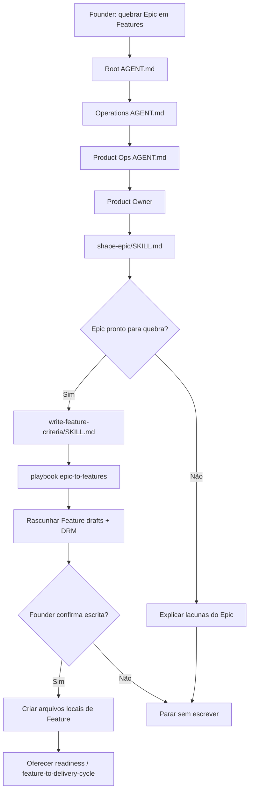

# Jornada: Epic Para Features

## Visão Humana

- **Trigger:** founder diz "quebre esse Epic em Features", "quais Features precisamos?" ou "prepara esse Epic para desenvolvimento".
- **Objetivo:** transformar um Epic local confirmado em Feature drafts com tasks internas e critérios da Delivery Readiness Matrix.
- **Começa em:** `AGENT.md` raiz, depois `operations/AGENT.md` e Product Ops.
- **Passa por:** Product Ops, Product Owner, skills `shape-epic` e `write-feature-criteria`, playbook `epic-to-features`.
- **Termina com:** arquivos locais de Feature propostos e escritos só após confirmação do founder.
- **Não faz:** implementação, branch, PR, GitHub sync remoto ou aprovação técnica de Engineering.

## Diagrama Do Fluxo



## Fluxo Em Linguagem Simples

Esta jornada é playbook porque Product Ops está apenas fatiando um Epic local em Feature drafts. Ela pode marcar critérios e lacunas de Design, Security, DevOps e Engineering, mas não coordena essas áreas nem inicia implementação.

O workflow começa depois, em `feature-to-delivery-cycle`, quando uma Feature já existe e o founder quer levar essa Feature para desenvolvimento.

## Owner

- Departamento: Operations
- Área: Product Ops
- Playbook: `operations/product-ops/playbooks/epic-to-features.playbook.md`
- Role primária: `operations/product-ops/roles/product-owner.role.md`
- Skills:
  - `operations/product-ops/skills/shape-epic/SKILL.md`
  - `operations/product-ops/skills/write-feature-criteria/SKILL.md`
- Templates:
  - `ai-standard/templates/product/epic-template.md`
  - `ai-standard/templates/product/feature-template.md`

## Contrato De Rota

```text
Root AGENT.md
-> operations/AGENT.md
-> operations/product-ops/AGENT.md
-> operations/product-ops/roles/product-owner.role.md
-> operations/product-ops/skills/shape-epic/SKILL.md
-> operations/product-ops/skills/write-feature-criteria/SKILL.md
-> operations/product-ops/playbooks/epic-to-features.playbook.md
-> operations/product-ops/epics/<epic-slug>/<feature-slug>.md
```

## Regras

- O Epic local precisa existir antes do playbook.
- Product Ops pode criar Feature drafts, não implementar.
- Design, Security, DevOps e Engineering entram como readiness criteria ou tarefas futuras quando aplicável.
- O modelo pede confirmação antes de escrever arquivos de Feature.
- A próxima rota, se o founder quiser desenvolver, é `feature-to-delivery-cycle`.

## Checklist De Validação

- [x] Não existe `operations/workflows/epic-to-features.workflow.md`.
- [x] Existe `operations/product-ops/playbooks/epic-to-features.playbook.md`.
- [x] O modelo não pula Product Ops.
- [x] O modelo aplica DRM antes de criar Features.
- [x] O modelo oferece `feature-to-delivery-cycle` apenas depois que Feature local existe.
