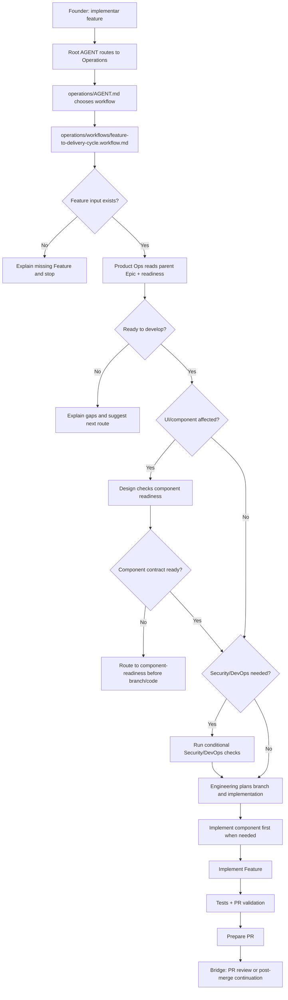

# Journey: Feature To Delivery Cycle

## Human Overview

- **Trigger:** founder says "vamos comecar essa feature", "implemente a feature", "implemente a issue #554" or similar.
- **Goal:** move one confirmed Feature from readiness check to branch, implementation, review and PR preparation.
- **Starts at:** Root `AGENT.md`.
- **Passes through:** Operations, `feature-to-delivery-cycle.workflow.md`, Product Ops readiness, conditional Design/Security/DevOps checks and Engineering implementation.
- **Ends with:** PR-ready work, or a founder-friendly explanation of what is missing before code can start.
- **Does not do:** start from a loose idea, roadmap item or unsplit Epic; bypass Product Ops; create UI components without Design readiness.

## Flow Diagram



## Flow In Plain Words

The model starts at Root `AGENT.md` because the founder is speaking naturally. It enters Operations because the request is about delivery and implementation. It reads `operations/workflows/feature-to-delivery-cycle.workflow.md` because the work crosses Product Ops, conditional Design/Security/DevOps and Engineering. It enters Product Ops first because a Feature must pass readiness before code. It enters Design only when the Feature touches UI, screens, flows, copy, accessibility or components. If a component spec is required but missing, the model routes to Design component readiness before any branch or code. Engineering starts only after readiness is satisfied or a non-applicable reason is explicit.

## Founder Trigger

- "vamos comecar essa feature"
- "implemente a feature de clientes"
- "implemente a issue #554"
- "podemos iniciar o desenvolvimento?"
- "essa feature ja pode ir para codigo?"

## Moment

Implementation. This happens after `epic-to-features` creates or confirms a Feature and before PR review or post-merge continuation.

## Start Condition

This journey starts when:

- a local Feature exists inside `operations/product-ops/epics/<epic-slug>/`; or
- a GitHub issue represents a Feature and can be mapped back to a local Epic/Feature; and
- the founder asks to start development or check if development can start.

## End Condition

This journey ends when:

- implementation is PR-ready;
- or the model explains why the Feature is not ready to develop;
- or a required route, role, skill, playbook, Design spec or readiness file is missing and the model stops before code.

## Owner

- Department: Operations
- Workflow: `operations/workflows/feature-to-delivery-cycle.workflow.md`
- First area: `operations/product-ops/`
- Implementation area: `operations/engineering/`
- Conditional areas: `operations/design/`, `operations/security/`, `operations/devops/`

## Route Contract

```text
AGENT.md
-> operations/AGENT.md
-> operations/workflows/feature-to-delivery-cycle.workflow.md
-> operations/product-ops/AGENT.md
-> operations/product-ops/knowledge/ready-to-develop.md
-> conditional area checks
-> operations/engineering/AGENT.md
-> operations/engineering/roles/senior-developer.role.md
-> operations/engineering/playbooks/branch-from-issue.playbook.md
-> operations/engineering/playbooks/issue-to-pr.playbook.md
-> operations/engineering/playbooks/pr-validation.playbook.md
```

Rules:

- The model must declare this route before executing.
- The model cannot skip Product Ops and go directly to Engineering.
- The model cannot start from a loose idea, roadmap item or unsplit Epic.
- If UI/component work is involved, the model must route Design before Engineering.
- If a required Design component spec is missing, the model routes to `operations/design/playbooks/component-readiness.playbook.md` before branch or code.
- If Design, Security or DevOps are not applicable, the model says why in the founder-facing summary.
- If Security or DevOps are not applicable, the model must state why.

## What The Model Does In Practice

### Step 1 - Route From Founder Intent

The model opens:

`AGENT.md`

Why:

- The founder request is natural language.
- Root `AGENT.md` chooses the owning department, not the final playbook.
- Implementation belongs to Operations.

Next step:

`operations/AGENT.md`

### Step 2 - Choose The Operations Workflow

The model opens:

`operations/AGENT.md`

Why:

- Department AGENTs choose the workflow or area.
- A Feature delivery request spans Product Ops, Engineering and conditional Design/Security/DevOps.

Next step:

`operations/workflows/feature-to-delivery-cycle.workflow.md`

### Step 3 - Confirm Feature Readiness

The model opens:

`operations/workflows/feature-to-delivery-cycle.workflow.md`

Then it enters:

`operations/product-ops/AGENT.md`

Why:

- The workflow says Product Ops enters first.
- Product Ops owns Feature readiness before implementation.

The model reads:

- `operations/product-ops/knowledge/ready-to-develop.md`
- the local Feature or mapped GitHub Feature issue
- parent Epic and delivery scope when available

If readiness fails, the model explains the gap and recommends the next route instead of coding.

### Step 4 - Run Conditional Design Readiness

The model enters Design only when the Feature touches UI, screens, flows, copy, accessibility, interaction or reusable components.

Design checks:

- existing Design foundation;
- component inventory when it exists;
- whether the Feature can reuse an existing component;
- whether a new component contract is needed.

If a new component is needed but the concrete component spec does not exist yet, the model routes to Design before branch or code and says:

```text
Ainda nao recomendo codar essa Feature.

Ela precisa de uma spec de Design para o componente novo antes da Engenharia implementar.
O proximo passo seguro e rodar component readiness, criar a spec do componente e atualizar o inventario de componentes.

Quer que eu conduza esse passo de Design agora?
```

### Step 5 - Run Conditional Security And DevOps Checks

Security enters only when the Feature touches data, auth, permissions, privacy, abuse, API, database, secrets, compliance, infrastructure or AI-generated-code risk.

DevOps enters only when the Feature touches environments, CI/CD, deploy, observability, config, GitHub sync or release readiness.

If either area is not applicable, the model records the reason in the founder-facing summary.

### Step 6 - Engineering Implementation

The model enters:

`operations/engineering/AGENT.md`

Why:

- Product Ops readiness is satisfied.
- Conditional readiness gaps are closed or explicitly not applicable.
- Engineering now owns branch, implementation, tests and PR preparation.

If a reusable component is part of the work and the Design spec is approved, Engineering runs `operations/engineering/playbooks/component-implementation.playbook.md`, implements the component first, validates states/accessibility/tests, and only then implements the screen or Feature that depends on it.

### Step 7 - PR Preparation

Engineering follows:

- `operations/engineering/playbooks/branch-from-issue.playbook.md`
- `operations/engineering/playbooks/issue-to-pr.playbook.md`
- `operations/engineering/playbooks/pr-validation.playbook.md`

The journey ends with PR-ready work or a clear explanation of remaining gaps.

## Active Roles

| Order | Role | When It Enters | Why It Enters | Route Evidence |
| --- | --- | --- | --- | --- |
| 1 | Product Owner | Always first | Confirms Feature readiness and delivery boundary | `operations/product-ops/AGENT.md` and `ready-to-develop.md` |
| 2 | Product Designer | Conditional | UI, flow, accessibility, copy or component readiness | `operations/design/AGENT.md` |
| 3 | Security Reviewer | Conditional | Data, auth, privacy, API, database, secrets or risk | `operations/security/AGENT.md` |
| 4 | DevOps Engineer | Conditional | Environment, CI/CD, deploy, observability or config | `operations/devops/AGENT.md` |
| 5 | Senior Developer | After readiness | Plans and implements the Feature | `operations/engineering/AGENT.md` |
| 6 | Test Engineer / PR Reviewer | Before PR | Validates tests and review readiness | Engineering roles/playbooks |

## Founder Questions

Ask only what is missing:

- "Essa Feature ja existe localmente ou esta em uma issue do GitHub?"
- "Essa tela/fluxo precisa de um componente novo ou podemos reaproveitar um existente?"
- "Voce quer que eu resolva a pendencia de Design antes de iniciar codigo?"
- "Posso criar a branch e iniciar a implementacao agora?"

## Confirmation Checkpoints

The model must ask for confirmation before:

- creating or changing local Feature files;
- creating component specs;
- creating branches;
- changing code;
- running external GitHub actions;
- opening or preparing a PR.

## Founder-facing Output

When ready:

```text
Essa Feature parece pronta para desenvolvimento.

O que ja esta claro:
- objetivo e criterio de aceite;
- Epic pai e escopo de entrega;
- Design/Security/DevOps estao prontos ou nao se aplicam;
- a branch pode ser criada com seguranca.

Posso criar a branch e iniciar o plano de implementacao?
```

When not ready:

```text
Ainda nao recomendo comecar pelo codigo.

O bloqueio principal e: <gap>.
Se codarmos agora, o risco e: <risk>.

O proximo passo seguro e: <next LeanOS route>.
Quer que eu conduza esse passo agora?
```

## Forbidden Actions

During this journey, the model cannot:

- implement from an unsplit Epic or loose idea;
- bypass `ready-to-develop.md`;
- create new user-facing components without Design readiness;
- ignore Security/DevOps when their triggers apply;
- open a PR without test/review summary;
- treat GitHub sync as proof of product readiness.

## Possible Outcomes

- Feature is ready and Engineering starts implementation.
- Feature is blocked by Product Ops readiness.
- Feature needs Design component readiness.
- Feature needs Security or DevOps review.
- Feature is implemented and PR-ready.

## Continuation Bridge

Immediate bridge after PR is ready:

```text
A implementacao esta pronta para revisao.
Quer que eu conduza a validacao do PR antes do merge?
```

Later-session triggers:

- "revise o PR"
- "esta pronto para merge?"
- "mergeado, vamos para a proxima"

Next route:

`review-pr` or `post-merge-continuation`

Rules:

- Do not automatically merge.
- Do not skip PR validation.
- If the founder says the PR was merged, restart from Root `AGENT.md` and route to post-merge continuation.

## Journey Validation Checklist

### Files Exist

- [ ] `AGENT.md` exists.
- [ ] `operations/AGENT.md` exists.
- [ ] `operations/workflows/feature-to-delivery-cycle.workflow.md` exists.
- [ ] `operations/product-ops/AGENT.md` exists.
- [ ] `operations/product-ops/knowledge/ready-to-develop.md` exists.
- [ ] `operations/engineering/AGENT.md` exists.
- [ ] Engineering roles, skills and playbooks exist.
- [ ] Conditional Design/Security/DevOps route files exist when those areas are active.

### Files Point To Each Other

- [ ] Root `AGENT.md` routes implementation requests to Operations.
- [ ] Operations `AGENT.md` routes delivery journeys to workflows.
- [ ] The workflow sends readiness to Product Ops first.
- [ ] `ready-to-develop.md` guards implementation.
- [ ] Design enters before Engineering when component readiness is needed.
- [ ] Engineering playbooks cover branch, implementation, tests and PR.

### Journey Execution

- [ ] The model can explain why each route is loaded.
- [ ] The model does not start coding before readiness.
- [ ] The model stops before code when component spec is missing.
- [ ] The model asks founder confirmation before writes, branch, code and PR.
- [ ] Founder-facing output explains gaps before technical paths.

## Notes For Framework Design

- Component readiness still needs its concrete inventory, template, skill and playbook assets.
- This journey should be revisited after `component-readiness.playbook.md` exists.
- GitHub issue language is allowed only as external tracking; the LeanOS unit of delivery is Feature.
