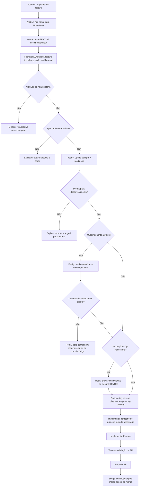

# Jornada: Feature Para Ciclo De Delivery

## Visão Humana

- **Trigger:** founder diz "vamos começar essa feature", "implemente a feature", "implemente a issue #554" ou algo similar.
- **Objetivo:** mover uma Feature confirmada do check de readiness para branch, implementação, review e preparação de PR.
- **Começa em:** `AGENT.md` raiz.
- **Passa por:** Operations, `feature-to-delivery-cycle.workflow.md`, readiness de Product Ops, checks condicionais de Design/Security/DevOps e implementação de Engineering.
- **Termina com:** trabalho pronto para PR, ou uma explicação amigável ao founder do que falta antes de código começar.
- **Não faz:** começar a partir de ideia solta, item de roadmap ou Epic não quebrado; contornar Product Ops; criar componentes de UI sem readiness de Design.

## Diagrama Do Fluxo



## Fluxo Em Linguagem Simples

O modelo começa no `AGENT.md` raiz porque o founder fala naturalmente. Ele entra em Operations porque a solicitação é sobre delivery e implementação. Ele lê `operations/workflows/feature-to-delivery-cycle.workflow.md` porque o trabalho cruza Product Ops, Design/Security/DevOps condicionais e Engineering. Ele entra em Product Ops primeiro porque uma Feature deve passar por readiness antes de código. Ele entra em Design apenas quando a Feature toca UI, telas, fluxos, copy, acessibilidade ou componentes. Se uma spec de componente é necessária mas está ausente, o modelo roteia para component readiness de Design antes de qualquer branch ou código. Engineering começa apenas depois que a readiness está satisfeita ou que uma razão de não aplicável está explícita.

## Trigger Do Founder

- "vamos começar essa feature"
- "implemente a feature de clientes"
- "implemente a issue #554"
- "podemos iniciar o desenvolvimento?"
- "essa feature já pode ir para código?"

## Moment

Implementação. Isso acontece depois que `epic-to-features` cria ou confirma uma Feature e antes do review de PR ou continuação pós-merge.

## Condição De Início

Esta jornada começa quando:

- uma Feature local existe dentro de `operations/product-ops/epics/<epic-slug>/`; ou
- uma issue do GitHub representa uma Feature e pode ser mapeada de volta para um Epic/Feature local; e
- o founder pede para iniciar desenvolvimento ou verificar se o desenvolvimento pode começar.

## Condição De Fim

Esta jornada termina quando:

- a implementação está pronta para PR;
- ou o modelo explica por que a Feature não está pronta para desenvolvimento;
- ou uma rota, role, skill, playbook, spec de Design ou arquivo de readiness obrigatório está ausente e o modelo para antes do código.

## Owner

- Departamento: Operations
- Workflow: `operations/workflows/feature-to-delivery-cycle.workflow.md`
- Primeira área: `operations/product-ops/`
- Área de implementação: `operations/engineering/`
- Áreas condicionais: `operations/design/`, `operations/security/`, `operations/devops/`

## Contrato De Rota

```text
AGENT.md
-> operations/AGENT.md
-> operations/workflows/feature-to-delivery-cycle.workflow.md
-> operations/product-ops/AGENT.md
-> operations/product-ops/knowledge/ready-to-develop.md
-> conditional area checks
-> operations/engineering/AGENT.md
-> operations/engineering/roles/senior-developer.role.md
-> operations/engineering/playbooks/engineering-delivery.playbook.md
-> operations/engineering/playbooks/branch-for-feature.playbook.md through engineering-delivery
-> operations/engineering/playbooks/prepare-pr.playbook.md through engineering-delivery
-> operations/engineering/playbooks/pr-validation.playbook.md through engineering-delivery
```

Regras:

- O modelo deve declarar esta rota antes de executar.
- O modelo não pode pular Product Ops e ir direto para Engineering.
- O modelo não pode começar a partir de uma ideia solta, item de roadmap ou Epic não quebrado.
- Se trabalho de UI/componente estiver envolvido, o modelo deve rotear Design antes de Engineering.
- Se uma spec obrigatória de componente de Design estiver ausente, o modelo roteia para `operations/design/playbooks/component-readiness.playbook.md` antes de branch ou código.
- Se Design, Security ou DevOps não forem aplicáveis, o modelo diz por quê no resumo voltado ao founder.
- Se Security ou DevOps não forem aplicáveis, o modelo deve declarar por quê.

## O Que O Modelo Faz Na Prática

### Etapa 1 - Rotear A Partir Da Intenção Do Founder

O modelo abre:

`AGENT.md`

Por quê:

- A solicitação do founder está em linguagem natural.
- O `AGENT.md` raiz escolhe o departamento owner, não o playbook final.
- Implementação pertence a Operations.

Próxima etapa:

`operations/AGENT.md`

### Etapa 2 - Escolher O Workflow De Operations

O modelo abre:

`operations/AGENT.md`

Por quê:

- AGENTs de departamento escolhem o workflow ou área.
- Uma solicitação de delivery de Feature atravessa Product Ops, Engineering e Design/Security/DevOps condicionais.

Próxima etapa:

`operations/workflows/feature-to-delivery-cycle.workflow.md`

### Etapa 3 - Confirmar Readiness Da Feature

O modelo abre:

`operations/workflows/feature-to-delivery-cycle.workflow.md`

Depois entra em:

`operations/product-ops/AGENT.md`

Por quê:

- O workflow diz que Product Ops entra primeiro.
- Product Ops é dono da readiness da Feature antes da implementação.

O modelo lê:

- `operations/product-ops/knowledge/ready-to-develop.md`
- the local Feature or mapped GitHub Feature issue
- parent Epic and delivery scope when available

Se a readiness falhar, o modelo explica a lacuna e recomenda a próxima rota em vez de codar.

### Etapa 4 - Rodar Readiness Condicional De Design

O modelo entra em Design apenas quando a Feature toca UI, telas, fluxos, copy, acessibilidade, interação ou componentes reutilizáveis.

Design verifica:

- foundation de Design existente;
- inventário de componentes quando existir;
- se a Feature pode reutilizar um componente existente;
- se um novo contrato de componente é necessário.

Se um novo componente é necessário mas a spec concreta de componente ainda não existe, o modelo roteia para Design antes de branch ou código e diz:

```text
Ainda não recomendo codar essa Feature.

Ela precisa de uma spec de Design para o componente novo antes da Engenharia implementar.
O próximo passo seguro é rodar component readiness, criar a spec do componente e atualizar o inventário de componentes.

Quer que eu conduza esse passo de Design agora?
```

### Etapa 5 - Rodar Checks Condicionais De Security E DevOps

Security entra apenas quando a Feature toca dados, auth, permissões, privacidade, abuso, API, banco de dados, secrets, compliance, infraestrutura ou risco de código gerado por IA.

DevOps entra apenas quando a Feature toca ambientes, CI/CD, deploy, observabilidade, config, GitHub sync ou readiness de release.

Se qualquer área não for aplicável, o modelo registra a razão no resumo voltado ao founder.

### Etapa 6 - Implementação De Engineering

O modelo entra em:

`operations/engineering/AGENT.md`

Por quê:

- A readiness de Product Ops está satisfeita.
- Lacunas condicionais de readiness foram fechadas ou marcadas explicitamente como não aplicáveis.
- Engineering agora é dono de branch, implementação, testes e preparação de PR.

Engineering carrega:

`operations/engineering/playbooks/engineering-delivery.playbook.md`

Por quê:

- Este playbook é a trilha interna de Engineering para branch, planejamento, implementação, testes, PR e validação de PR.
- Ele impede o modelo de pular diretamente de readiness para código ou PR.

Se um componente reutilizável faz parte do trabalho e a spec de Design está aprovada, Engineering roda `operations/engineering/playbooks/component-implementation.playbook.md` por meio de `engineering-delivery`, implementa o componente primeiro, valida estados/acessibilidade/testes e só então implementa a tela ou Feature que depende dele.

### Etapa 7 - Preparação De PR

Engineering segue:

- `operations/engineering/playbooks/branch-for-feature.playbook.md`
- `operations/engineering/playbooks/prepare-pr.playbook.md`
- `operations/engineering/playbooks/pr-validation.playbook.md`

A jornada termina com trabalho pronto para PR ou uma explicação clara das lacunas restantes.

## Roles Ativas

| Ordem | Role | Quando Entra | Por Que Entra | Evidência De Rota |
| --- | --- | --- | --- | --- |
| 1 | Product Owner | Sempre primeiro | Confirma readiness da Feature e limite de delivery | `operations/product-ops/AGENT.md` e `ready-to-develop.md` |
| 2 | Product Designer | Condicional | Readiness de UI, fluxo, acessibilidade, copy ou componente | `operations/design/AGENT.md` |
| 3 | Security Reviewer | Condicional | Dados, auth, privacidade, API, banco de dados, secrets ou risco | `operations/security/AGENT.md` |
| 4 | DevOps Engineer | Condicional | Ambiente, CI/CD, deploy, observabilidade ou config | `operations/devops/AGENT.md` |
| 5 | Senior Developer | Depois da readiness | Planeja e implementa a Feature | `operations/engineering/AGENT.md` |
| 6 | Test Engineer / PR Reviewer | Antes do PR | Valida testes e readiness de review | Roles/playbooks de Engineering |

## Perguntas Ao Founder

Pergunte apenas o que está faltando:

- "Essa Feature já existe localmente ou está em uma issue do GitHub?"
- "Essa tela/fluxo precisa de um componente novo ou podemos reaproveitar um existente?"
- "Você quer que eu resolva a pendência de Design antes de iniciar código?"
- "Posso criar a branch e iniciar a implementação agora?"

## Checkpoints De Confirmação

O modelo deve pedir confirmação antes de:

- criar ou alterar arquivos locais de Feature;
- criar specs de componente;
- criar branches;
- alterar código;
- executar ações externas no GitHub;
- abrir ou preparar um PR.

## Output Voltado Ao Founder

Quando pronta:

```text
Essa Feature parece pronta para desenvolvimento.

O que já está claro:
- objetivo e critério de aceite;
- Epic pai e escopo de entrega;
- Design/Security/DevOps estão prontos ou não se aplicam;
- a branch pode ser criada com segurança.

Posso criar a branch e iniciar o plano de implementação?
```

Quando não pronta:

```text
Ainda não recomendo começar pelo código.

O bloqueio principal é: <gap>.
Se codarmos agora, o risco é: <risk>.

O próximo passo seguro é: <next LeanOS route>.
Quer que eu conduza esse passo agora?
```

## Ações Proibidas

Durante esta jornada, o modelo não pode:

- implementar a partir de um Epic não quebrado ou ideia solta;
- contornar `ready-to-develop.md`;
- criar novos componentes voltados ao usuário sem readiness de Design;
- ignorar Security/DevOps quando seus triggers se aplicam;
- abrir um PR sem resumo de testes/review;
- tratar GitHub sync como prova de readiness de produto.

## Resultados Possíveis

- Feature está pronta e Engineering inicia implementação.
- Feature está bloqueada por readiness de Product Ops.
- Feature precisa de component readiness de Design.
- Feature precisa de review de Security ou DevOps.
- Feature está implementada e pronta para PR.

## Ponte De Continuação

Ponte imediata depois que o PR está pronto:

```text
A implementação está pronta para revisão.
Quer que eu conduza a validação do PR antes do merge?
```

Triggers em sessão posterior:

- "revise o PR"
- "está pronto para merge?"
- "mergeado, vamos para a próxima"

Próxima rota:

`post-merge-continuation`

Regras:

- Não faça merge automaticamente.
- Não pule a validação de PR; validação de PR faz parte deste workflow, não é um workflow obrigatório separado.
- Se o founder disser que o PR foi mergeado, reinicie pelo `AGENT.md` raiz e roteie para continuação pós-merge.

## Checklist De Validação Da Jornada

### Arquivos Existem

- [ ] `AGENT.md` existe.
- [ ] `operations/AGENT.md` existe.
- [ ] `operations/workflows/feature-to-delivery-cycle.workflow.md` existe.
- [ ] `operations/product-ops/AGENT.md` existe.
- [ ] `operations/product-ops/knowledge/ready-to-develop.md` existe.
- [ ] `operations/design/playbooks/component-readiness.playbook.md` existe.
- [ ] `operations/engineering/AGENT.md` existe.
- [ ] `operations/engineering/playbooks/engineering-delivery.playbook.md` existe.
- [ ] `operations/engineering/playbooks/branch-for-feature.playbook.md` existe.
- [ ] `operations/engineering/playbooks/prepare-pr.playbook.md` existe.
- [ ] `operations/engineering/playbooks/pr-validation.playbook.md` existe.
- [ ] Roles, skills e playbooks de Engineering existem.
- [ ] Arquivos de rota condicionais de Design/Security/DevOps existem quando essas áreas estão ativas.

### Arquivos Apontam Uns Para Os Outros

- [ ] `AGENT.md` raiz roteia solicitações de implementação para Operations.
- [ ] `AGENT.md` de Operations roteia jornadas de delivery para workflows.
- [ ] O workflow envia readiness para Product Ops primeiro.
- [ ] `ready-to-develop.md` protege a implementação.
- [ ] Design entra antes de Engineering quando component readiness é necessária.
- [ ] Playbooks de Engineering cobrem branch, implementação, testes e PR.

### Execução Da Jornada

- [ ] O modelo consegue explicar por que cada rota é carregada.
- [ ] O modelo não começa a codar antes de readiness.
- [ ] O modelo para antes de código quando a spec de componente está ausente.
- [ ] O modelo pede confirmação do founder antes de escritas, branch, código e PR.
- [ ] O output voltado ao founder explica lacunas antes de paths técnicos.

## Notas Para Design Do Framework

- Component readiness ainda precisa de inventário, template, skill e playbook concretos.
- Esta jornada deve ser revisitada depois que `component-readiness.playbook.md` existir.
- Linguagem de issue do GitHub é permitida apenas como tracking externo; a unidade de delivery do LeanOS é Feature.
