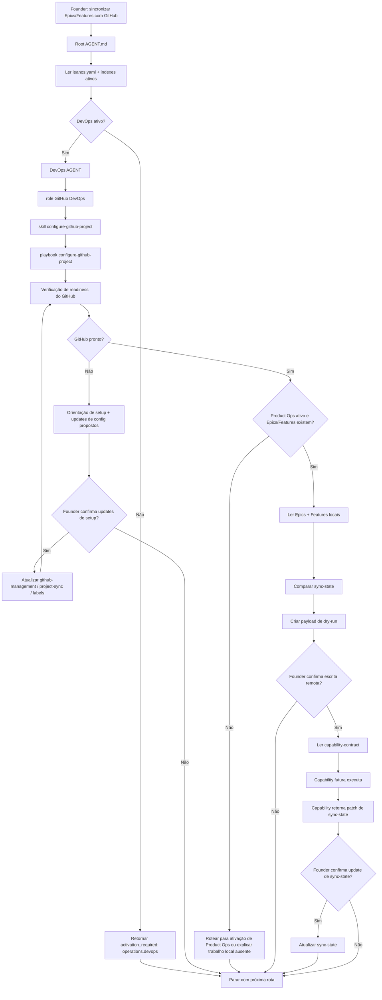

# Jornada: Sincronização Com GitHub

## Visão Humana

- **Trigger:** founder diz "sincronize com GitHub", "joga esses epics/features no GitHub Projects" ou "configura GitHub para o LeanOS".
- **Objetivo:** verificar readiness do GitHub, guiar o setup quando faltar algo e depois preparar um payload de dry-run para sincronizar Epics e Features locais.
- **Começa em:** `AGENT.md` raiz.
- **Passa por:** DevOps/GitHub DevOps, Product Ops, Strategy/Roadmap opcional, Security opcional e contrato de capability do GitHub.
- **Termina com:** orientação de setup, payload de dry-run aguardando confirmação ou handoff confirmado para uma capability/script futura.
- **Não faz:** chamar APIs do GitHub diretamente pelo raciocínio do modelo, escrever tokens, criar código, criar branches ou abrir PRs.

## Diagrama Do Fluxo



## Fluxo Em Linguagem Simples

O modelo começa no `AGENT.md` raiz porque o founder fala em linguagem natural. Ele lê `leanos.yaml` e indexes ativos antes de rotear. Se DevOps estiver inativo, o modelo não abre paths de DevOps; ele retorna `activation_required: operations.devops` com uma explicação orientada a setup.

Quando DevOps está ativo, a jornada começa com readiness do GitHub, não com sync. Se o setup estiver incompleto, GitHub DevOps guia o founder por owner, repository, Project, labels e fonte de token sem expor secrets. Somente depois que a readiness passa é que Product Ops lê Epics e Features locais e prepara um payload de dry-run.

O modelo nunca realiza escritas remotas no GitHub por conta própria. Ele prepara um payload, pede confirmação, lê `.github/leanos/capability-contract.md` e passa a execução para uma capability/script segura futura.

## Trigger Do Founder

- "sincronize os epics com GitHub"
- "cria as issues no GitHub Projects"
- "configura GitHub para o LeanOS"
- "essas features já podem ir para o GitHub?"

## Owner

- Área primária para setup: `operations/devops/`
- Role primária para setup: `operations/devops/roles/github-devops.role.md`
- Skill primária: `operations/devops/skills/configure-github-project/SKILL.md`
- Playbook primário: `operations/devops/playbooks/configure-github-project.playbook.md`
- Owner do trabalho de produto: `operations/product-ops/AGENT.md`
- Limite de capability: `.github/leanos/capability-contract.md`

## Contrato De Rota

Quando DevOps está inativo:

```text
Root AGENT.md
-> leanos.yaml
-> active .leanos/index/*
-> activation_required: operations.devops
```

Quando DevOps está ativo:

```text
Root AGENT.md
-> operations/devops/AGENT.md
-> operations/devops/roles/github-devops.role.md
-> operations/devops/skills/configure-github-project/SKILL.md
-> operations/devops/playbooks/configure-github-project.playbook.md
-> .github/leanos/setup-guide.md
-> .github/leanos/project-sync.yaml
-> .github/leanos/sync-state.yaml
-> .github/leanos/work-mapping.md
-> operations/product-ops/AGENT.md
-> operations/product-ops/epics/
-> .github/leanos/capability-contract.md
-> Output
```

## Regras

- O modelo deve declarar se está em modo setup ou modo de dry-run sync.
- O modelo não deve pedir que o founder cole um token no chat.
- O modelo não deve imprimir valores de token.
- O modelo não deve criar issues do GitHub para ideias brutas, notas de backlog ou Epics não quebrados.
- O modelo não deve tratar GitHub sync como prova de que uma Feature está pronta para desenvolvimento.
- O modelo deve parar antes de escrita remota, a menos que o founder confirme o dry-run.
- O modelo deve ler `.github/leanos/capability-contract.md` antes de descrever qualquer handoff de execução.

## Checklist De Conclusão

- [x] GitHub sync começa por intenção em linguagem natural no `AGENT.md` raiz.
- [x] A ativação de DevOps é obrigatória antes de paths de DevOps serem carregados.
- [x] Readiness vem antes do dry-run sync.
- [x] Epics/Features locais de Product Ops são a fonte da verdade para sync.
- [x] Escrita remota exige confirmação de dry-run e handoff de capability.
