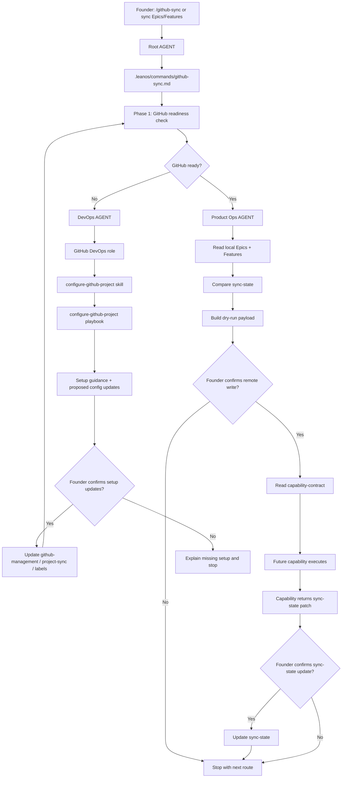

# Journey: GitHub Sync

## Human Overview

- **Trigger:** founder says "sincronize com GitHub", "joga esses epics/features no GitHub Projects", "configura GitHub para o LeanOS" or runs `/github-sync`.
- **Goal:** check GitHub readiness, guide setup when missing, then prepare a dry-run sync payload for local Epics and Features.
- **Starts at:** Root `AGENT.md` or `.leanos/commands/github-sync.md` when the slash command is used.
- **Passes through:** GitHub sync command, DevOps/GitHub DevOps, Product Ops, optional Strategy/Roadmap, optional Security and the GitHub capability contract.
- **Ends with:** setup guidance, a dry-run payload awaiting confirmation, or a confirmed handoff to a future capability/script.
- **Does not do:** call GitHub APIs directly from model reasoning, write tokens, create code, create branches or open PRs.

## Flow Diagram



## Flow In Plain Words

The model starts at Root `AGENT.md` because the founder may speak naturally, or directly at `.leanos/commands/github-sync.md` when the slash command is used. The command does not begin by reading every Epic. It first checks GitHub readiness. If setup is incomplete, it routes to DevOps and uses GitHub DevOps to guide the founder through owner, repository, Project, labels and token source without exposing secrets. Only after readiness passes does Product Ops read local Epics and Features and prepare a dry-run sync payload. If the founder confirms the dry-run, the model reads the capability contract and hands the approved payload to a future script/capability.

## Founder Trigger

- `/github-sync`
- "sincronize os epics com GitHub"
- "cria as issues no GitHub Projects"
- "configura GitHub para o LeanOS"
- "essas features já podem ir para o GitHub?"

## Moment

Optional tracking sync. This usually happens after `roadmap-item-to-epic` or `epic-to-features`, and before or alongside `feature-to-delivery-cycle`.

GitHub sync is useful, but it is not product readiness by itself.

## Start Condition

This journey starts when:

- the founder asks for GitHub setup or sync; and
- local Epics/Features exist, or the founder is explicitly configuring GitHub before work exists.

## End Condition

This journey ends when:

- GitHub setup gaps are explained and the founder has a clear next step;
- or setup files are proposed and confirmed;
- or a dry-run sync payload is produced and the founder confirms or declines;
- or a future capability reports remote writes and sync-state is proposed for update.

## Owner

- Command: `.leanos/commands/github-sync.md`
- Primary area for setup: `operations/devops/`
- Primary role for setup: `operations/devops/roles/github-devops.role.md`
- Primary skill: `operations/devops/skills/configure-github-project.skill.md`
- Primary playbook: `operations/devops/playbooks/configure-github-project.playbook.md`
- Product work owner: `operations/product-ops/AGENT.md`
- Capability boundary: `.github/leanos/capability-contract.md`

## Route Contract

```text
AGENT.md
-> .leanos/commands/github-sync.md
-> operations/devops/AGENT.md
-> operations/devops/roles/github-devops.role.md
-> operations/devops/skills/configure-github-project.skill.md
-> operations/devops/playbooks/configure-github-project.playbook.md
-> .github/leanos/setup-guide.md
-> .github/leanos/project-sync.yaml
-> .github/leanos/sync-state.yaml
-> .github/leanos/work-mapping.md
-> operations/product-ops/AGENT.md
-> operations/product-ops/epics/
-> .github/leanos/capability-contract.md
-> Output
```

## Route Evidence Checklist

- `.leanos/commands/github-sync.md` contains readiness, setup fallback, dry-run, confirmation and capability handoff phases.
- `operations/devops/AGENT.md` routes GitHub setup to GitHub DevOps.
- `operations/devops/roles/github-devops.role.md` loads setup guide, capability contract, project sync, sync state and labels.
- `operations/devops/skills/configure-github-project.skill.md` separates setup, token, Project, labels/milestones and dry-run readiness.
- `operations/devops/playbooks/configure-github-project.playbook.md` asks founder-friendly setup questions and prevents token leakage.
- `.github/leanos/setup-guide.md` explains owner/repo/Project/token/gh readiness.
- `.github/leanos/capability-contract.md` defines future GitHub execution boundaries.
- `operations/product-ops/epics/README.md` explains where local Epics and Features live.

## Rules

- The model must declare whether it is in setup mode or dry-run sync mode.
- The model must not ask the founder to paste a token into chat.
- The model must not print token values.
- The model must not create GitHub issues for raw ideas, backlog notes or unsplit Epics.
- The model must not treat GitHub sync as proof that a Feature is ready to develop.
- The model must stop before remote write unless the founder confirms the dry-run.
- The model must read `.github/leanos/capability-contract.md` before describing any execution handoff.

## What The Model Does In Practice

### Step 1 - Confirm Intent

The model identifies whether the founder wants:

- GitHub setup;
- GitHub readiness status;
- dry-run sync;
- or confirmed remote execution through a future capability.

Why:

- The same `/github-sync` entrypoint owns setup and sync.
- Readiness comes before payload.

### Step 2 - Load The Command

The model opens:

`.leanos/commands/github-sync.md`

Why:

- Slash command and natural-language intent must follow the same route.
- The command defines phases and stop conditions.

### Step 3 - Run Readiness

The model checks:

- `.github/leanos/project-sync.yaml`
- `.github/leanos/sync-state.yaml`
- `.github/leanos/work-mapping.md`
- `.github/leanos/labels.yaml`
- `.github/leanos/setup-guide.md`
- `.github/ISSUE_TEMPLATE/epic.yml`
- `.github/ISSUE_TEMPLATE/feature.yml`

Why:

- Missing setup means sync would be unsafe or confusing.

### Step 4 - Setup Fallback When Needed

If GitHub is incomplete, the model routes to:

`operations/devops/AGENT.md`

Then:

`roles/github-devops.role.md`

Then:

`skills/configure-github-project.skill.md`

Then:

`playbooks/configure-github-project.playbook.md`

Why:

- DevOps owns GitHub configuration and token safety.
- Product Ops should not decide repository/project setup.

### Step 5 - Read Product Work Only After Readiness

If GitHub is ready, the model reads:

`operations/product-ops/epics/`

Why:

- Local Epics and Features are the product source.
- GitHub is the remote tracking layer.

### Step 6 - Prepare Dry-Run

The model compares local Epics/Features with:

`.github/leanos/sync-state.yaml`

Then classifies each item:

- create;
- update;
- already synced;
- conflict;
- skip.

Why:

- The founder needs to see what would happen before any remote write.

### Step 7 - Confirmation

The model asks:

```text
GitHub está pronto para dry-run.

Eu encontrei:
- X Epics para criar/atualizar;
- Y Features para criar/atualizar;
- Z conflitos;
- N itens que não serão sincronizados.

Quer que eu prepare o payload aprovado para uma capability futura executar no GitHub?
```

Why:

- The founder should approve the sync intent before remote execution.

### Step 8 - Capability Handoff

If confirmed, the model reads:

`.github/leanos/capability-contract.md`

Why:

- The model must know the execution boundary before handing off.

Then it prepares an approved payload for a future capability/script.

## Output Shape

The model should return:

- GitHub readiness status;
- missing setup, if any;
- setup guidance, if needed;
- local Epics found;
- local Features found;
- dry-run summary;
- conflicts and skipped items;
- confirmation question;
- next route.

## Continuation Bridge

If sync succeeds:

- update sync-state only after confirmed capability result;
- continue to `feature-to-delivery-cycle` only when a Feature is ready to develop;
- continue to DevOps if GitHub setup remains incomplete;
- continue to Product Ops if local Epic/Feature structure is incomplete.
