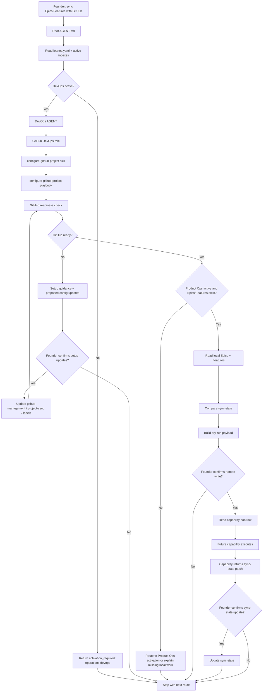

# Journey: GitHub Sync

## Human Overview

- **Trigger:** founder says "sincronize com GitHub", "joga esses epics/features no GitHub Projects" or "configura GitHub para o LeanOS".
- **Goal:** check GitHub readiness, guide setup when missing, then prepare a dry-run sync payload for local Epics and Features.
- **Starts at:** root `AGENT.md`.
- **Passes through:** DevOps/GitHub DevOps, Product Ops, optional Strategy/Roadmap, optional Security and the GitHub capability contract.
- **Ends with:** setup guidance, a dry-run payload awaiting confirmation, or a confirmed handoff to a future capability/script.
- **Does not do:** call GitHub APIs directly from model reasoning, write tokens, create code, create branches or open PRs.

## Flow Diagram



## Flow In Plain Words

The model starts at root `AGENT.md` because the founder speaks in natural language. It reads `leanos.yaml` and active indexes before routing. If DevOps is inactive, the model does not open DevOps paths; it returns `activation_required: operations.devops` with a setup-oriented explanation.

When DevOps is active, the journey starts with GitHub readiness, not with sync. If setup is incomplete, GitHub DevOps guides the founder through owner, repository, Project, labels and token source without exposing secrets. Only after readiness passes does Product Ops read local Epics and Features and prepare a dry-run payload.

The model never performs remote GitHub writes by itself. It prepares a payload, asks for confirmation, reads `.github/leanos/capability-contract.md`, and hands execution to a future safe capability/script.

## Founder Trigger

- "sincronize os epics com GitHub"
- "cria as issues no GitHub Projects"
- "configura GitHub para o LeanOS"
- "essas features ja podem ir para o GitHub?"

## Owner

- Primary area for setup: `operations/devops/`
- Primary role for setup: `operations/devops/roles/github-devops.role.md`
- Primary skill: `operations/devops/skills/configure-github-project.skill.md`
- Primary playbook: `operations/devops/playbooks/configure-github-project.playbook.md`
- Product work owner: `operations/product-ops/AGENT.md`
- Capability boundary: `.github/leanos/capability-contract.md`

## Route Contract

When DevOps is inactive:

```text
Root AGENT.md
-> leanos.yaml
-> active .leanos/index/*
-> activation_required: operations.devops
```

When DevOps is active:

```text
Root AGENT.md
-> operations/devops/AGENT.md
-> operations/devops/roles/github-devops.role.md
-> operations/devops/skills/configure-github-project.skill.md
-> operations/devops/playbooks/configure-github-project.playbook.md
-> .github/leanos/setup-guide.md
-> .github/leanos/project-sync.yaml
-> .github/leanos/sync-state.yaml
-> .github/leanos/work-mapping.md
-> operations/product-ops/AGENT.md
-> operations/product-ops/epics/
-> .github/leanos/capability-contract.md
-> Output
```

## Rules

- The model must declare whether it is in setup mode or dry-run sync mode.
- The model must not ask the founder to paste a token into chat.
- The model must not print token values.
- The model must not create GitHub issues for raw ideas, backlog notes or unsplit Epics.
- The model must not treat GitHub sync as proof that a Feature is ready to develop.
- The model must stop before remote write unless the founder confirms the dry-run.
- The model must read `.github/leanos/capability-contract.md` before describing any execution handoff.

## Completion Checklist

- [x] GitHub sync starts from natural-language intent in root `AGENT.md`.
- [x] DevOps activation is required before DevOps paths are loaded.
- [x] Readiness comes before dry-run sync.
- [x] Product Ops local Epics/Features are the source of truth for sync.
- [x] Remote write requires dry-run confirmation and capability handoff.
