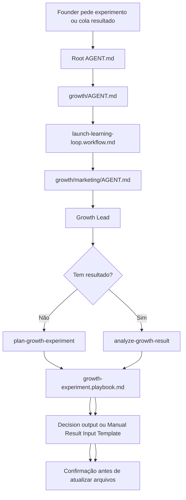

# Jornada: Growth Experiment Learning

## Visão Humana

- **Trigger:** o founder quer validar uma landing page, canal, campanha, oferta ou cola resultados manuais de um teste.
- **Objetivo:** transformar hipótese ou resultado em experimento registrado e decisão clara de Growth.
- **Começa em:** Growth.
- **Passa por:** `growth/workflows/launch-learning-loop.workflow.md`, Marketing, Growth Lead e playbook `growth-experiment`.
- **Termina com:** plano de experimento, Manual Result Input Template ou Decision output.
- **Não faz:** não chama APIs externas, não inventa telemetria e não cria Feature sem Product Ops.

## Diagrama Do Fluxo



## Fluxo Em Linguagem Simples

O modelo entra por Growth porque a intenção fala de validação de mercado, aquisição, landing page, campanha ou resultado de lançamento. O workflow `launch-learning-loop` obriga o modelo a usar `growth/marketing/knowledge/growth-experiments.md` ou feedback registrado antes de recomendar uma decisão. Marketing escolhe Growth Lead, que chama `plan-growth-experiment` quando o teste ainda será planejado ou `analyze-growth-result` quando o founder já colou resultados.

## Trigger Do Founder

- "vamos testar essa landing page"
- "planeje um experimento de aquisição"
- "cole aqui o resultado da campanha"
- "isso funcionou?"
- "o que fazemos depois desse teste?"
- "tenho visitantes, leads e gasto; analise"

## Momento

Depois de um ready-for-launch aprovado, depois de um lançamento executado ou quando o founder precisa validar mercado sem transformar a ideia imediatamente em Feature.

## Objetivo Humano

O founder quer evitar decisões de Growth baseadas em sensação. O LeanOS deve transformar hipótese, resultado manual ou feedback em um aprendizado registrado, com decisão e próxima rota.

## Condição De Início

Esta jornada começa quando:

- existe uma hipótese de canal, landing page, mensagem, oferta, onboarding ou venda assistida;
- ou existe resultado manual de experimento;
- ou existe feedback registrado que pode orientar decisão de Growth.

## Condição De Fim

Esta jornada termina quando:

- o experimento planejado tem Measurement plan e Manual Result Input Template;
- ou o resultado analisado tem Decision output;
- ou o modelo para porque falta evidência mínima.

## Owner

- Departamento: Growth
- Área: Marketing
- Workflow: `growth/workflows/launch-learning-loop.workflow.md`
- Playbook: `growth/marketing/playbooks/growth-experiment.playbook.md`

## Contrato De Rota

```text
Root AGENT.md
-> growth/AGENT.md
-> growth/workflows/launch-learning-loop.workflow.md
-> growth/marketing/AGENT.md
-> growth/marketing/roles/growth-lead.role.md
-> growth/marketing/knowledge/growth-experiments.md
-> growth/marketing/playbooks/growth-experiment.playbook.md
-> growth/marketing/skills/plan-growth-experiment/SKILL.md ou growth/marketing/skills/analyze-growth-result/SKILL.md
-> Output
```

Regras:

- O modelo não pode recomendar decisão de Growth sem experimento registrado ou feedback registrado.
- Quando falta resultado, a saída deve incluir Manual Result Input Template.
- Quando há resultado, a saída deve incluir Decision output.
- Se houver spend, Growth Finance entra antes de aprovar ou escalar gasto.
- Se a decisão virar trabalho de produto, Product Ops entra antes de Epic ou Feature.

## O Que O Modelo Faz Na Prática

### Etapa 1 - Detectar Intenção

O modelo abre:

`AGENT.md`

Por quê:

- O pedido fala de aquisição, validação de mercado, lançamento ou resultado.
- O root deve rotear para Growth quando a intenção é aprender com mercado ou cliente.

Próxima etapa:

`growth/AGENT.md`

### Etapa 2 - Carregar O Workflow

O modelo abre:

`growth/workflows/launch-learning-loop.workflow.md`

Por quê:

- O workflow coordena Marketing, Customer Experience e Finance quando o assunto é aprendizado pós-lançamento ou experimento.
- Ele exige evidência: experimento ou feedback registrado.

Próxima etapa:

`growth/marketing/AGENT.md`

### Etapa 3 - Entrar Em Marketing

O modelo abre:

`growth/marketing/roles/growth-lead.role.md`

Por quê:

- Growth Lead é a role que planeja lançamento, experimentos de aquisição e análise de resultado.
- A role aponta para `growth-experiment`, `plan-growth-experiment` e `analyze-growth-result`.

Próxima etapa:

`growth/marketing/knowledge/growth-experiments.md`

### Etapa 4 - Escolher Modo

O modelo abre:

`growth/marketing/playbooks/growth-experiment.playbook.md`

Por quê:

- O playbook define dois modos:
  - planejar experimento;
  - analisar resultado.

Se ainda não há resultado:

`growth/marketing/skills/plan-growth-experiment/SKILL.md`

Se já há resultado:

`growth/marketing/skills/analyze-growth-result/SKILL.md`

## Roles Ativas

| Ordem | Role | Quando Entra | Por Que Entra | Evidência De Rota |
| --- | --- | --- | --- | --- |
| 1 | `growth-lead` | Experimento, canal, landing page, campanha ou resultado | Marketing é owner do ledger de experimentos | `growth/marketing/roles/growth-lead.role.md` |
| 2 | `finance-operator` | Há spend, mídia paga, ferramenta paga ou decisão `scale_spend` | Finance é owner do Spend Ledger | `growth/finance/AGENT.md` |
| 3 | `cx-lead` | O aprendizado vem de feedback, suporte, call ou ticket | CX é owner de feedback de cliente | `growth/customer-experience/AGENT.md` |

## Skills Ativas

| Skill | Usada Por | Propósito | Evidência De Rota |
| --- | --- | --- | --- |
| `plan-growth-experiment` | Growth Lead | Criar Measurement plan e Manual Result Input Template | Role `growth-lead` aponta para ela |
| `analyze-growth-result` | Growth Lead | Calcular métricas e produzir Decision output | Role `growth-lead` aponta para ela |

## Playbooks Ativos

| Playbook | Área | Papel Na Jornada | Evidência De Rota |
| --- | --- | --- | --- |
| `growth-experiment` | `growth.marketing` | Decide se o modo é planejamento ou análise | Role `growth-lead` aponta para ele |

## Perguntas Ao Founder

- Qual hipótese você quer testar?
- Qual canal ou asset será usado?
- Qual métrica define sucesso ou falha?
- Você já tem visitantes, leads, calls, gasto ou objeções para colar?
- Há mídia paga, ferramenta paga ou custo variável envolvido?

## Output Voltado Ao Founder

Exemplo de planejamento:

```text
Rota: Growth -> Marketing -> Growth Lead -> growth-experiment.

Experimento proposto:
- Hipótese: se usarmos a promessa X para público Y, mais leads qualificados pedirão call.
- Canal: landing page + tráfego manual.
- Sinal de sucesso: 10 leads qualificados ou 3 calls em 7 dias.
- Fonte de medição: input manual do founder.

Cole os resultados depois usando o Manual Result Input Template.
Quer que eu registre esse experimento no Growth Experiment Ledger?
```

Exemplo de análise:

```text
Decision output: iterate_copy

O resultado gerou visitantes e leads, mas poucos leads qualificados.
Minha leitura é que há curiosidade, mas a promessa ainda não está filtrando o público certo.

Próximo passo recomendado:
- ajustar headline e qualificação do CTA;
- manter preço inalterado;
- rodar mais um teste antes de abrir item em Product Ops.

Quer que eu atualize o Experiment Register com essa decisão?
```

## Updates Internos De Arquivo Após Confirmação

- `growth/marketing/knowledge/growth-experiments.md`
- `growth/marketing/knowledge/landing-page.md` quando copy ou CTA mudarem
- `growth/marketing/knowledge/acquisition-channels.md` quando o canal mudar
- `growth/customer-experience/knowledge/customer-feedback.md` quando feedback for confirmado
- `growth/finance/knowledge/spend-ledger.md` quando houver spend

## Ações Proibidas

Durante esta jornada, o modelo não pode:

- inventar telemetria, conversões, receita, CAC ou feedback;
- chamar APIs externas de analytics, CRM, email, anúncios, pagamento ou suporte;
- escalar spend sem Growth Finance;
- criar Epic, Feature, GitHub issue, branch, código ou PR;
- tratar resultado sem fonte como decisão.

## Resultados Possíveis

A jornada pode terminar com:

- `continue`
- `iterate_copy`
- `iterate_pricing`
- `open_product_ops_item`
- `route_to_strategy`
- `scale_spend`
- `pause`

## Ponte De Continuação

Ponte imediata:

```text
Quer que eu registre esse experimento agora ou prefere executar primeiro e voltar com os resultados?
```

Triggers em sessão posterior:

- "analise o resultado do experimento"
- "o teste terminou"
- "temos números da landing page"
- "isso vira feature?"

Próxima rota:

- `growth/workflows/launch-learning-loop.workflow.md` para continuar aprendizado;
- `growth/finance/playbooks/spend-approval.playbook.md` quando houver gasto;
- `operations/product-ops/playbooks/delivery-item-to-epic.playbook.md` quando o aprendizado virar trabalho de produto;
- `strategy/product/playbooks/idea-calibration.playbook.md` quando mudar ICP, problema ou promessa.

## Checklist De Validação Da Jornada

- [x] `growth/marketing/knowledge/growth-experiments.md` existe no scaffold.
- [x] `growth-lead` aponta para `plan-growth-experiment`, `analyze-growth-result` e `growth-experiment`.
- [x] `growth-experiment.playbook.md` possui modo de planejamento e modo de análise.
- [x] `launch-learning-loop.workflow.md` exige experimento ou feedback registrado antes de decisão.
- [x] O input manual está documentado como Manual Result Input Template.
- [x] A validação automatizada `validateGrowthExperimentContract` cobre a jornada.

## Notas Para Design Do Framework

- Integrações reais com analytics, CRM ou ads devem ser capabilities futuras e opt-in.
- A v1 deve funcionar manualmente para founders sem stack de telemetria pronta.
- O Growth Experiment Ledger é fonte de aprendizado, não banco de leads nem ferramenta de BI.
