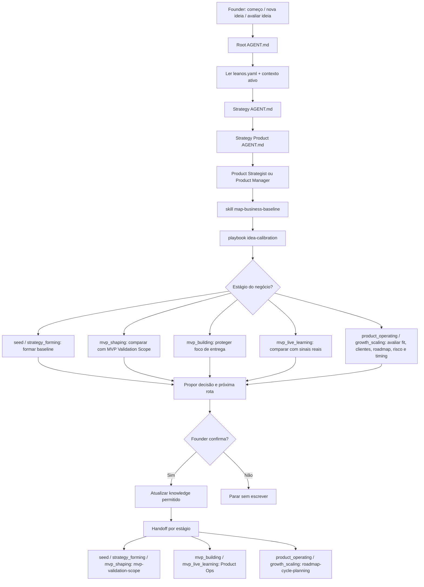

# Jornada: Idea Calibration

Esta jornada desenha como o LeanOS deve lidar com pedidos como:

```text
"Vamos começar."
"Tenho uma ideia."
"Quero avaliar essa ideia para meu produto."
"Isso faz sentido para o produto?"
```

O propósito é calibrar a ideia contra o estágio real do negócio antes de qualquer MVP, roadmap, Epic, Feature ou implementação.

## Visão Humana

- **Trigger:** founder quer começar, aprofundar uma ideia ou avaliar uma mudança.
- **Objetivo:** entender contexto, estágio, usuário, dor, valor, riscos e próximo caminho seguro.
- **Começa em:** `AGENT.md` raiz.
- **Passa por:** `strategy/AGENT.md`, `strategy/product/AGENT.md`, Product Strategist ou Product Manager, `map-business-baseline` e `idea-calibration.playbook.md`.
- **Termina com:** ideia calibrada, pergunta guiada, proposta de update em Strategy ou recomendação de próxima rota.
- **Não faz:** criar roadmap diretamente, definir delivery scope, criar Epic/Feature, ativar Engineering ou implementar.

## Diagrama Do Fluxo



## Fluxo Em Linguagem Simples

O Chief começa lendo o estado real do workspace. Ele não pergunta ao founder qual estágio escolher; ele infere a partir de `leanos.yaml`, arquivos ativos de Strategy e conversa.

Depois entra em Strategy Product e usa `map-business-baseline` como primeira skill. Essa skill identifica o estágio do negócio, o que já se sabe, as lacunas da Strategy Baseline e a menor pergunta útil.

O playbook `idea-calibration` conduz a conversa. Em um negócio no estágio `seed`, ele ajuda a descobrir usuário, dor e promessa. Em um produto já operando, ele avalia se a ideia combina com clientes, roadmap, riscos e timing. O mesmo playbook funciona para os dois casos porque o estágio muda o caminho interno.

## Contrato De Rota

```text
Root AGENT.md
-> leanos.yaml
-> active .leanos/index/*
-> strategy/AGENT.md
-> strategy/product/AGENT.md
-> strategy/product/roles/product-strategist.role.md ou product-manager.role.md
-> strategy/product/skills/map-business-baseline/SKILL.md
-> strategy/product/playbooks/idea-calibration.playbook.md
```

## Próximas Rotas Possíveis

- `strategy/product/playbooks/mvp-validation-scope.playbook.md`: quando o negócio está em `seed`, `strategy_forming` ou `mvp_shaping` e a ideia já está calibrada para analisar o menor MVP de validação.
- `activation_required: operations.product-ops`: quando o negócio está em `mvp_building` ou `mvp_live_learning` e a ideia afeta o MVP atual, backlog de entrega ou escopo executável.
- `strategy/roadmap/playbooks/roadmap-cycle-planning.playbook.md`: quando o negócio está em `product_operating` ou `growth_scaling`, ou quando o founder pede explicitamente ciclo, backlog ou priorização entre múltiplas frentes.
- Parar sem escrever: quando a ideia ainda está vaga, foi descartada ou o founder não confirmou updates.

## Regras De Parada

- Não faça pergunta genérica quando uma lacuna específica está visível.
- Não trate toda ideia nova como MVP em negócios que já estão construindo, validando, operando ou escalando.
- Não escreva knowledge sem confirmação.
- Não crie roadmap, Epic, Feature ou código a partir da calibragem.
- Não abra Product Ops, Engineering, Design, Security, DevOps ou Growth sem gate e confirmação.

## Checklist De Conclusão

- [x] O `AGENT.md` raiz roteia começo e ideias para Strategy.
- [x] Strategy Product tem `map-business-baseline`.
- [x] Strategy Product tem `idea-calibration.playbook.md`.
- [x] A jornada usa estágio do negócio antes de avaliar a ideia.
- [x] A jornada termina com decisão, pergunta guiada ou próxima rota confirmável.
