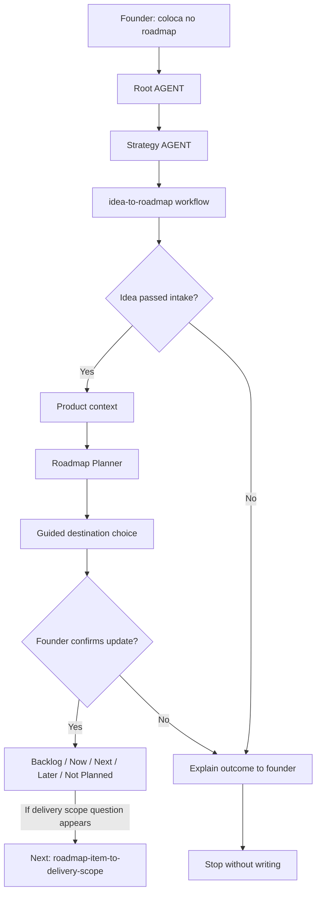

# Journey: Idea To Roadmap

This journey starts after `new-idea-intake` qualifies an idea and the founder confirms that the idea should be tracked as a roadmap or backlog candidate.

The purpose is not to decide delivery scope, create GitHub issues or start implementation. The purpose is to turn a qualified idea into a structured roadmap/backlog item with clear value, evidence, priority and timing.

## Human Overview

- **Trigger:** founder confirms that a qualified idea should be tracked in roadmap or backlog.
- **Goal:** classify the idea as Backlog, Now, Next, Later or Not Planned.
- **Starts at:** Root `AGENT.md`, then `strategy/AGENT.md`.
- **Passes through:** `idea-to-roadmap.workflow.md`, Product Strategist and Roadmap Planner.
- **Ends with:** a founder-confirmed roadmap/backlog update proposal.
- **Does not do:** mark as delivery scope, create GitHub issues, create branches or start implementation.

## Flow Diagram



## Flow In Plain Words

The model starts at Root `AGENT.md` because the founder is confirming a natural-language roadmap decision. It enters Strategy because roadmap/backlog belongs to Strategy, reads `idea-to-roadmap.workflow.md` because the idea already passed intake, checks Product context so the roadmap item keeps product fit, activates Roadmap Planner to classify timing, and ends by asking the founder to confirm where the item should live before any file update.

## Founder Trigger

Real phrases that can start this journey:

- "Sim, coloca isso no roadmap."
- "Quero guardar isso no backlog."
- "Vamos acompanhar essa ideia para depois."
- "Isso parece interessante, quando faria sentido entrar?"
- "Pode transformar essa ideia em item de roadmap."

## Moment

This happens after idea intake and before delivery scope or GitHub planning.

It can happen:

- after `new-idea-intake`;
- when a founder wants to track an idea without committing it to delivery;
- when an idea needs backlog or roadmap classification;
- when product direction changes but implementation should not start yet.

## Human Goal

The founder wants to avoid losing a promising idea, but also wants to avoid turning it into delivery scope or code too early.

In founder-friendly language:

> "I want this idea to be organized in the roadmap/backlog so we can revisit, prioritize or sequence it later."

## Start Condition

This journey starts when:

- a qualified idea already exists;
- `new-idea-intake` recommended roadmap/backlog tracking or the founder explicitly asks for it;
- the founder confirms that the idea should be promoted from intake to roadmap/backlog consideration.

## End Condition

This journey ends when:

- the model recommends where the item belongs: backlog, Now, Next, Later or Not Planned;
- the model proposes the exact roadmap/backlog update;
- the founder confirms or rejects the update;
- no delivery scope, GitHub issue or implementation work has started.

## Owner

Department or area that owns the journey:

- Department: `strategy/`
- Primary area: `strategy/roadmap/`
- Supporting area: `strategy/product/`
- Workflow: `strategy/workflows/idea-to-roadmap.workflow.md`
- Command, if any: none required. Natural language should activate this route after `new-idea-intake`.

## Route Contract

The required route is:

```text
Root AGENT.md
-> strategy/AGENT.md
-> strategy/workflows/idea-to-roadmap.workflow.md
-> strategy/product/AGENT.md
-> strategy/product/roles/product-strategist.role.md
-> strategy/product/playbooks/product-strategy.playbook.md
-> strategy/roadmap/AGENT.md
-> strategy/roadmap/roles/roadmap-planner.role.md
-> strategy/roadmap/skills/prioritize-backlog.skill.md
-> strategy/roadmap/playbooks/roadmap-cycle-planning.playbook.md
-> Output
```

Rules:

- The model cannot start this journey before the idea has passed intake or the founder explicitly asks for roadmap/backlog promotion.
- The model must declare the route before executing.
- Product enters first only to preserve the qualified idea context; it should not redo the entire intake unless context is missing.
- Roadmap owns the final classification and file update proposal.
- Product Ops/Delivery Scope does not own this journey.
- GitHub does not enter this journey.
- If a route file does not exist, the model stops and reports the missing path.

## What The Model Does In Practice

### Step 1 - Understand the founder confirmation

The model starts from:

`AGENT.md`

Why:

- Root `AGENT.md` says every routed LeanOS task starts with the Response Header.
- Root `AGENT.md` says natural-language requests should route through the Navigation Chain when no command clearly matches.
- The founder is asking to promote a qualified idea to roadmap/backlog, not to implement it.

Navigation Evidence:

- `AGENT.md` routes product strategy and roadmap requests to `strategy/AGENT.md`.
- The request contains roadmap/backlog intent, so Strategy is the owning department.

What the model understands here:

- This is a Strategy request.
- This is a roadmap/backlog decision, not delivery scope or Engineering work.
- The model should not create GitHub issues.

Next step:

`strategy/AGENT.md`

### Step 2 - Enter Strategy and select workflow routing

The model opens:

`strategy/AGENT.md`

Why:

- Root `AGENT.md` chose Strategy as the owning department.
- `strategy/AGENT.md` says founder journeys should open `workflows/README.md`.
- The request changes roadmap/backlog state, so it is a journey.

Navigation Evidence:

- `strategy/AGENT.md` lists Product and Roadmap as active areas.
- `strategy/AGENT.md` says workflows are for multi-step decisions or transitions.
- Strategy journey signals include changing product direction, priority or sequencing.

What the model understands here:

- Strategy owns the route.
- Workflow selection happens before entering Product or Roadmap.
- Product provides fit/context; Roadmap owns classification.

Next step:

`strategy/workflows/README.md`

### Step 3 - Select Idea To Roadmap workflow

The model opens:

`strategy/workflows/README.md`

Why:

- `strategy/AGENT.md` instructed workflow selection for Strategy journeys.
- The founder wants to promote a qualified idea into roadmap/backlog tracking.

Navigation Evidence:

- `strategy/workflows/README.md` lists `idea-to-roadmap.workflow.md`.
- `strategy/workflows/idea-to-roadmap.workflow.md` exists.
- `.leanos/index/workflows.yaml` includes `idea-to-roadmap`.

What the model understands here:

- `new-idea-intake` is complete.
- `idea-to-roadmap` is the correct next workflow.
- The workflow should not assume delivery scope, GitHub or implementation.

Next step:

`strategy/workflows/idea-to-roadmap.workflow.md`

### Step 4 - Read the workflow contract

The model opens:

`strategy/workflows/idea-to-roadmap.workflow.md`

Why:

- The workflow defines the specific sequence for promoting a qualified idea into roadmap/backlog.

Navigation Evidence:

- The workflow purpose says it promotes a qualified idea into a roadmap or backlog item without assuming delivery scope or GitHub execution.
- The workflow requires Product and Roadmap.
- The workflow sequence says to confirm the idea passed intake, read product strategy and roadmap context, classify the item and wait for confirmation before writing.

What the model understands here:

- Product is needed to preserve product fit and evidence.
- Roadmap is needed to classify timing and priority.
- Delivery scope and GitHub are explicitly out of scope.

Next step:

`strategy/product/AGENT.md`

### Step 5 - Re-enter Product only to preserve idea context

The model opens:

`strategy/product/AGENT.md`

Why:

- The workflow requires Product.
- Product owns product strategy, ICP, value proposition, positioning and business model coherence.
- The roadmap item should not be created without product-fit context.

Navigation Evidence:

- `strategy/product/AGENT.md` routes unclear strategy, ICP, value proposition and roadmap coherence risk to Product Strategist.
- `product-strategist.role.md` connects customer, problem, value proposition, roadmap and validation logic.

What the model understands here:

- Product Strategist should confirm or summarize the intake result.
- Product should not reopen the entire idea evaluation unless the intake summary is missing.

Next step:

`strategy/product/roles/product-strategist.role.md`

### Step 6 - Load Product Strategist context

The model opens:

`strategy/product/roles/product-strategist.role.md`

Why:

- Product AGENT routes product-fit and roadmap coherence work to Product Strategist.
- Product Strategist lists the minimum Product knowledge files to read.

Navigation Evidence:

- `product-strategist.role.md` reads `brief.md`, `icp.md`, `value-proposition.md`, `validation-notes.md` and Roadmap current cycle.
- It points to `product-strategy.playbook.md`.

What the model understands here:

- It should summarize the idea in Product terms.
- It should verify that the idea has user/problem/value context.
- It should surface evidence gaps before Roadmap classifies it.

Next step:

`strategy/product/playbooks/product-strategy.playbook.md`

### Step 7 - Use Product Strategy playbook for the handoff

The model opens:

`strategy/product/playbooks/product-strategy.playbook.md`

Why:

- Product Strategist points to this playbook.
- The playbook says to clarify ICP, problem and value proposition before touching roadmap or delivery scope.
- The playbook says to use guided conversation for roadmap-impacting changes.

Navigation Evidence:

- `product-strategy.playbook.md` includes `Guided Conversation`.
- It points to `ai-standard/foundation/guided-conversation.md`.
- It says to ask one decision question before any roadmap or delivery-scope handoff.

What the model understands here:

- It should ask only missing questions.
- It should not re-run intake unless the idea lacks enough context.
- It should explain the product fit before moving into Roadmap.

Next step:

`strategy/roadmap/AGENT.md`

### Step 8 - Enter Roadmap for classification

The model opens:

`strategy/roadmap/AGENT.md`

Why:

- The workflow requires Roadmap.
- Roadmap owns roadmap sequence, milestones, backlog and planning-cycle prioritization.
- Product has handed off a qualified idea.

Navigation Evidence:

- `strategy/roadmap/AGENT.md` says Roadmap owns planning, prioritization, cycle planning and GitHub sync preparation.
- `strategy/roadmap/AGENT.md` routes unclear roadmap order, backlog prioritization and cycle planning to Roadmap Planner.

What the model understands here:

- The correct role is Roadmap Planner.
- The task is classification and sequencing, not execution.

Next step:

`strategy/roadmap/roles/roadmap-planner.role.md`

### Step 9 - Activate Roadmap Planner

The model opens:

`strategy/roadmap/roles/roadmap-planner.role.md`

Why:

- Roadmap AGENT routes backlog prioritization and cycle planning to Roadmap Planner.
- Roadmap Planner lists the skills and playbooks used to classify and sequence work.

Navigation Evidence:

- `roadmap-planner.role.md` points to `prioritize-backlog.skill.md`.
- `roadmap-planner.role.md` points to `roadmap-cycle-planning.playbook.md`.
- It reads Roadmap, current cycle, backlog and Product brief.

What the model understands here:

- It should use `prioritize-backlog.skill.md` for candidate classification.
- It should use `roadmap-cycle-planning.playbook.md` for Now, Next, Later and Not Planned boundaries.
- The role currently references `operations/product-ops/mvp/scope.md`; this should be treated as optional delivery context for this journey, not permission to change MVP or any delivery scope.

Next step:

`strategy/roadmap/skills/prioritize-backlog.skill.md`

### Step 10 - Prioritize the candidate

The model opens:

`strategy/roadmap/skills/prioritize-backlog.skill.md`

Why:

- Roadmap Planner points to this skill.
- The skill says to use it when a new idea needs placement.

Navigation Evidence:

- `prioritize-backlog.skill.md` groups candidate work, scores outcome value/risk/effort/dependency and recommends keep, park, split or discard.
- It says not to use priority as permission to implement.
- It says not to remove backlog items without confirmation.

What the model understands here:

- The idea should be classified, not implemented.
- Large ideas should be flagged for future epic breakdown.
- Uncertainty should stay visible.

Next step:

`strategy/roadmap/playbooks/roadmap-cycle-planning.playbook.md`

### Step 11 - Use Roadmap Cycle Planning playbook

The model opens:

`strategy/roadmap/playbooks/roadmap-cycle-planning.playbook.md`

Why:

- Roadmap Planner points to this playbook.
- The playbook defines how to choose Now, Next, Later and Not Planned boundaries.

Navigation Evidence:

- `roadmap-cycle-planning.playbook.md` says to review product strategy, delivery scope, backlog candidates and define current cycle goal.
- It says to propose updates and wait for confirmation before writing.

What the model understands here:

- The output should be a roadmap/backlog placement proposal.
- Current cycle changes need explicit confirmation.
- Delivery scope still belongs to a later journey.

Next step:

Decision pause before file updates.

### Step 12 - Guided roadmap decision

The model pauses and asks the founder to choose a roadmap destination.

Why:

- Roadmap changes are durable decisions.
- `product-strategy.playbook.md` and `guided-conversation.md` require founder-friendly decision prompts.
- `roadmap-cycle-planning.playbook.md` says to propose updates and wait for confirmation before writing.

Founder-friendly options:

```text
Onde voce quer que essa ideia fique agora?

1. Backlog: guardar para avaliar depois
2. Now: considerar no ciclo atual
3. Next: considerar no proximo ciclo
4. Later: deixar como oportunidade futura
5. Not Planned: registrar que decidimos nao seguir agora
6. Nao sei, me ajude a decidir

Voce pode responder so com o numero ou do seu jeito.
```

What the model understands here:

- The founder owns the final roadmap decision.
- The model can recommend, but cannot silently commit.
- If the founder asks whether the item enters MVP, a release, an experiment or a milestone, the next journey is `roadmap-item-to-delivery-scope`, not this one.

Next step:

Founder-facing output and update proposal.

### Step 13 - Produce founder-friendly output

The model responds in plain language first.

Example:

```text
Minha leitura:
essa ideia esta alinhada com o problema principal e merece ser acompanhada, mas ainda nao parece urgente para o MVP atual.

Minha recomendacao:
- colocar como Backlog;
- registrar o valor esperado;
- marcar uma dependencia de evidencia;
- revisar quando o fluxo principal do MVP estiver mais claro.

Quer que eu registre isso no backlog do roadmap?
```

Why:

- The workflow says to propose roadmap or backlog updates and wait for confirmation before writing.
- Roadmap playbook says to propose updates before writing.
- Root AGENT requires confirmation before durable file changes.

Navigation Evidence:

- Roadmap skill defines candidate placement.
- Roadmap playbook defines the update proposal.
- Guided Conversation defines founder-friendly decision style.

## Active Roles

| Order | Role | When It Enters | Why It Enters | Route Evidence |
| --- | --- | --- | --- | --- |
| 1 | Product Strategist | Always | Preserves product-fit context from intake and checks product coherence before roadmap mutation. | `strategy/product/AGENT.md`, `product-strategist.role.md` |
| 2 | Roadmap Planner | Always after Product handoff | Classifies the idea into backlog, Now, Next, Later or Not Planned. | `strategy/roadmap/AGENT.md`, `roadmap-planner.role.md` |

## Active Skills

| Skill | Used By | Purpose | Route Evidence |
| --- | --- | --- | --- |
| `prioritize-backlog.skill.md` | Roadmap Planner | Classify candidate work by value, risk, evidence, effort and current-cycle fit. | `roadmap-planner.role.md` points to it. |
| `check-coherence.skill.md` | Product Strategist | Optional check if the idea conflicts with ICP, value proposition or current focus. | `product-strategist.role.md` points to it. |

## Active Playbooks

| Playbook | Area | Role In The Journey | Route Evidence |
| --- | --- | --- | --- |
| `product-strategy.playbook.md` | `strategy/product` | Product handoff and guided conversation before roadmap mutation. | `product-strategist.role.md` points to it. |
| `roadmap-cycle-planning.playbook.md` | `strategy/roadmap` | Roadmap/backlog classification and update proposal. | `roadmap-planner.role.md` points to it. |

## Founder Questions

Founder-friendly questions:

- Should this be tracked, or only remembered as a note?
- Is this for the current problem or a future opportunity?
- What user or business outcome should this create?
- What evidence do we already have?
- Does this belong in Backlog, Now, Next, Later or Not Planned?
- Should this stay out of MVP for now?

Do not ask as a rigid form. Ask only what is missing.

## Guided Conversation Points

| Step | Purpose | Source |
| --- | --- | --- |
| Step 7 | Confirm product-fit context before roadmap handoff. | `strategy/product/playbooks/product-strategy.playbook.md` |
| Step 12 | Choose roadmap/backlog destination. | `ai-standard/foundation/guided-conversation.md` |
| Confirmation | Confirm durable roadmap or backlog update. | `strategy/roadmap/playbooks/roadmap-cycle-planning.playbook.md` |

## Confirmation Checkpoints

The model must ask for confirmation before:

- adding the item to `strategy/roadmap/knowledge/backlog.md`;
- changing `strategy/roadmap/knowledge/roadmap.md`;
- changing `strategy/roadmap/knowledge/current-cycle.md`;
- tagging the item as Now, Next, Later or Not Planned;
- starting `roadmap-item-to-delivery-scope`;
- starting any GitHub sync or issue creation;
- touching implementation files.

## Founder-facing Output

The founder should see a recommendation and decision options before file paths.

Recommended format:

```text
Minha leitura:
<short roadmap interpretation>

Recomendacao:
- <Backlog / Now / Next / Later / Not Planned>

Por que:
- <reason 1>
- <reason 2>

Proximo passo:
<one suggested action>

Quer que eu registre isso no roadmap/backlog?
```

Only after this should the model show technical file updates.

## Internal File Updates After Confirmation

Files that can be updated if the founder confirms:

- `strategy/roadmap/knowledge/backlog.md`
- `strategy/roadmap/knowledge/roadmap.md`
- `strategy/roadmap/knowledge/current-cycle.md` only if the item affects the active cycle
- `strategy/product/knowledge/validation-notes.md` only if the roadmap decision reveals an evidence gap

Files that cannot be updated in this journey:

- `operations/product-ops/mvp/*`
- GitHub issues, projects or milestones
- source code

## Forbidden Actions

During this journey, the model cannot:

- mark the item as delivery scope;
- create GitHub epics, issues or milestones;
- create features;
- create branches or write code;
- modify Operations or Growth files;
- commit dates, milestones or scope without founder confirmation;
- treat backlog priority as permission to implement;
- remove roadmap/backlog items without confirmation.

## Possible Outcomes

The journey can end with:

- **Backlog**: track the idea as candidate work.
- **Now**: propose inclusion in the current roadmap cycle, not delivery scope yet.
- **Next**: track for the next planning cycle.
- **Later**: keep as future opportunity.
- **Not Planned**: record that it should not be pursued now.
- **Needs more intake**: return to `new-idea-intake` when product context is still too weak.

## Continuation Bridge

At the end of this journey, the model must offer one clear next-step bridge when the roadmap/backlog item is ready for delivery consideration.

Immediate bridge:

```text
Esse item agora esta organizado como roadmap/backlog.
Quer que eu avalie se ele deve entrar em uma entrega planejada, como MVP, release, experimento ou beta?
```

Later-session triggers:

- "isso entra no MVP?"
- "isso entra na proxima entrega?"
- "vamos planejar a entrega desse item"
- "vamos transformar esse item do roadmap em escopo"
- "qual milestone recebe esse item?"

Next route:

`roadmap-item-to-delivery-scope`

Rules:

- Do not start `roadmap-item-to-delivery-scope` automatically.
- If the founder says yes, declare the new route before loading Operations or Product Ops files.
- If the founder says no, explain the roadmap/backlog outcome and stop without writing anything else.
- If the founder returns in a later session with a matching trigger, restart from Root `AGENT.md`, route to Operations, and load `roadmap-item-to-delivery-scope`.

## Next Recommended Journey

After this journey, the next flow can be:

- `roadmap-item-to-delivery-scope` when the founder asks whether the roadmap item should enter MVP, a release, an experiment or another delivery scope.
- `roadmap-to-github-project` when the item is selected for delivery planning and GitHub sync.
- `new-idea-intake` when the idea needs more qualification.

## Journey Validation Checklist

Use this checklist to test whether the journey really applies the Navigation Chain.

### Files Exist

- [x] `AGENT.md` exists.
- [x] `strategy/AGENT.md` exists.
- [x] `strategy/workflows/README.md` exists.
- [x] `strategy/workflows/idea-to-roadmap.workflow.md` exists.
- [x] `strategy/product/AGENT.md` exists.
- [x] `strategy/product/roles/product-strategist.role.md` exists.
- [x] `strategy/product/playbooks/product-strategy.playbook.md` exists.
- [x] `strategy/roadmap/AGENT.md` exists.
- [x] `strategy/roadmap/roles/roadmap-planner.role.md` exists.
- [x] `strategy/roadmap/skills/prioritize-backlog.skill.md` exists.
- [x] `strategy/roadmap/playbooks/roadmap-cycle-planning.playbook.md` exists.
- [x] `strategy/roadmap/knowledge/backlog.md` exists.
- [x] `strategy/roadmap/knowledge/roadmap.md` exists.
- [x] `strategy/roadmap/knowledge/current-cycle.md` exists.
- [x] `.leanos/index/workflows.yaml` includes `idea-to-roadmap`.

### Files Point To Each Other

- [x] Root `AGENT.md` routes Strategy requests to `strategy/AGENT.md`.
- [x] `strategy/AGENT.md` routes journeys to `workflows/README.md`.
- [x] `strategy/workflows/README.md` lists `idea-to-roadmap.workflow.md`.
- [x] `idea-to-roadmap.workflow.md` requires Product and Roadmap.
- [x] Product AGENT routes product coherence to Product Strategist.
- [x] Product Strategist points to Product Strategy playbook.
- [x] Product Strategy playbook includes Guided Conversation.
- [x] Roadmap AGENT routes backlog prioritization to Roadmap Planner.
- [x] Roadmap Planner points to `prioritize-backlog.skill.md`.
- [x] Roadmap Planner points to `roadmap-cycle-planning.playbook.md`.

### Journey Execution

- [x] The model can explain the route before acting.
- [x] The model can say why each next file was loaded.
- [x] The model does not skip department or area.
- [x] The model does not load the whole workspace without need.
- [x] The model asks for confirmation before updating roadmap/backlog files.
- [x] The founder-facing output is understandable before technical paths appear.
- [x] Internal file updates are listed only after the human decision.
- [x] The continuation bridge offers `roadmap-item-to-delivery-scope` without starting it automatically.
- [x] Later-session triggers are listed for natural founder language.

### Conditional Areas

- [x] Product Ops/Delivery Scope does not enter this journey.
- [x] Design does not enter this journey.
- [x] Security does not enter this journey.
- [x] DevOps does not enter this journey.
- [x] GitHub sync does not enter this journey.

## Notes For Framework Design

- `roadmap-planner.role.md` and `create-roadmap.skill.md` currently reference `operations/product-ops/mvp/scope.md`.
- For this journey, MVP scope must be treated as optional delivery context, not a route owner and not permission to modify MVP or any delivery scope.
- Future scaffold improvement: make Roadmap Planner distinguish "roadmap candidate" from "delivery scope planning" so Strategy-only roadmap work does not depend on Product Ops files.
- The next journey to design is `roadmap-item-to-delivery-scope`.
