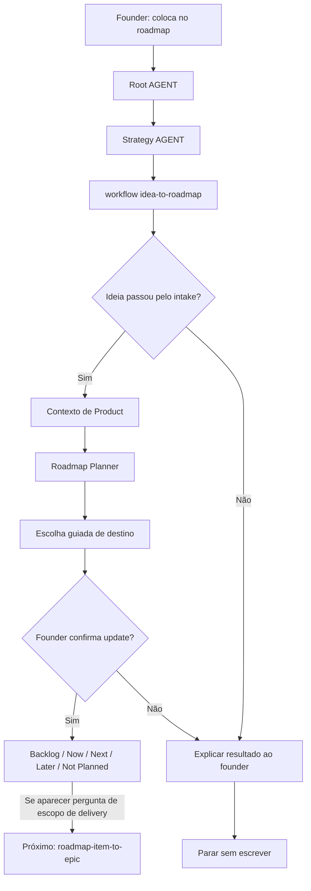

# Jornada: Ideia Para Roadmap

Esta jornada começa depois que `new-idea-intake` qualifica uma ideia e o founder confirma que a ideia deve ser acompanhada como candidata de roadmap ou backlog.

O propósito não é decidir escopo de delivery, criar issues no GitHub ou iniciar implementação. O propósito é transformar uma ideia qualificada em um item estruturado de roadmap/backlog com valor, evidência, prioridade e timing claros.

## Visão Humana

- **Trigger:** founder confirma que uma ideia qualificada deve ser acompanhada no roadmap ou backlog.
- **Objetivo:** classificar a ideia como Backlog, Now, Next, Later ou Not Planned.
- **Começa em:** `AGENT.md` raiz, depois `strategy/AGENT.md`.
- **Passa por:** `idea-to-roadmap.workflow.md`, Product Strategist e Roadmap Planner.
- **Termina com:** uma proposta de update de roadmap/backlog confirmada pelo founder.
- **Não faz:** marcar como escopo de delivery, criar issues no GitHub, criar branches ou iniciar implementação.

## Diagrama Do Fluxo



## Fluxo Em Linguagem Simples

O modelo começa no `AGENT.md` raiz porque o founder está confirmando uma decisão de roadmap em linguagem natural. Ele entra em Strategy porque roadmap/backlog pertence a Strategy, lê `idea-to-roadmap.workflow.md` porque a ideia já passou pelo intake, verifica contexto de Product para que o item de roadmap mantenha product fit, ativa Roadmap Planner para classificar timing e termina pedindo que o founder confirme onde o item deve ficar antes de qualquer update de arquivo.

## Trigger Do Founder

Frases reais que podem iniciar esta jornada:

- "Sim, coloca isso no roadmap."
- "Quero guardar isso no backlog."
- "Vamos acompanhar essa ideia para depois."
- "Isso parece interessante, quando faria sentido entrar?"
- "Pode transformar essa ideia em item de roadmap."

## Moment

Isso acontece depois do intake de ideia e antes de escopo de delivery ou planejamento de GitHub.

Pode acontecer:

- depois de `new-idea-intake`;
- quando um founder quer acompanhar uma ideia sem comprometê-la com delivery;
- quando uma ideia precisa de classificação de backlog ou roadmap;
- quando a direção de produto muda, mas a implementação ainda não deve começar.

## Objetivo Humano

O founder quer evitar perder uma ideia promissora, mas também quer evitar transformá-la em escopo de delivery ou código cedo demais.

Em linguagem amigável ao founder:

> "Quero que essa ideia fique organizada no roadmap/backlog para que possamos revisitar, priorizar ou sequenciar depois."

## Condição De Início

Esta jornada começa quando:

- uma ideia qualificada já existe;
- `new-idea-intake` recomendou acompanhamento em roadmap/backlog ou o founder pediu isso explicitamente;
- o founder confirma que a ideia deve ser promovida de intake para consideração de roadmap/backlog.

## Condição De Fim

Esta jornada termina quando:

- o modelo recomenda onde o item pertence: backlog, Now, Next, Later ou Not Planned;
- o modelo propõe o update exato de roadmap/backlog;
- o founder confirma ou rejeita o update;
- nenhum escopo de delivery, issue do GitHub ou trabalho de implementação foi iniciado.

## Owner

Departamento ou área dona da jornada:

- Departamento: `strategy/`
- Área primária: `strategy/roadmap/`
- Área de suporte: `strategy/product/`
- Workflow: `strategy/workflows/idea-to-roadmap.workflow.md`
- Comando, se houver: nenhum obrigatório. Linguagem natural deve ativar esta rota depois de `new-idea-intake`.

## Contrato De Rota

A rota obrigatória é:

```text
Root AGENT.md
-> strategy/AGENT.md
-> strategy/workflows/idea-to-roadmap.workflow.md
-> strategy/product/AGENT.md
-> strategy/product/roles/product-strategist.role.md
-> strategy/product/playbooks/product-strategy.playbook.md
-> strategy/roadmap/AGENT.md
-> strategy/roadmap/roles/roadmap-planner.role.md
-> strategy/roadmap/skills/prioritize-backlog/SKILL.md
-> strategy/roadmap/playbooks/roadmap-cycle-planning.playbook.md
-> Output
```

Regras:

- O modelo não pode iniciar esta jornada antes que a ideia tenha passado pelo intake ou que o founder peça explicitamente promoção para roadmap/backlog.
- O modelo deve declarar a rota antes de executar.
- Product entra primeiro apenas para preservar o contexto da ideia qualificada; não deve refazer o intake inteiro, a menos que falte contexto.
- Roadmap é dono da classificação final e da proposta de update de arquivo.
- Product Ops/Delivery Scope não é dono desta jornada.
- GitHub não entra nesta jornada.
- Se um arquivo de rota não existir, o modelo para e reporta o path ausente.

## O Que O Modelo Faz Na Prática

### Etapa 1 - Entender A Confirmação Do Founder

O modelo começa por:

`AGENT.md`

Por quê:

- O `AGENT.md` raiz diz que toda tarefa roteada do LeanOS começa com o Response Header.
- O `AGENT.md` raiz diz que solicitações em linguagem natural devem rotear pela Navigation Chain quando nenhum comando combina claramente.
- O founder está pedindo para promover uma ideia qualificada para roadmap/backlog, não para implementá-la.

Evidência De Navegação:

- `AGENT.md` roteia solicitações de product strategy e roadmap para `strategy/AGENT.md`.
- A solicitação contém intenção de roadmap/backlog, então Strategy é o departamento owner.

O que o modelo entende aqui:

- Esta é uma solicitação de Strategy.
- Esta é uma decisão de roadmap/backlog, não trabalho de escopo de delivery ou Engineering.
- O modelo não deve criar issues no GitHub.

Próxima etapa:

`strategy/AGENT.md`

### Etapa 2 - Entrar Em Strategy E Selecionar Roteamento De Workflow

O modelo abre:

`strategy/AGENT.md`

Por quê:

- O `AGENT.md` raiz escolheu Strategy como departamento owner.
- `strategy/AGENT.md` diz que jornadas do founder devem abrir `workflows/README.md`.
- A solicitação muda o estado de roadmap/backlog, então é uma jornada.

Evidência De Navegação:

- `strategy/AGENT.md` lista Product e Roadmap como áreas ativas.
- `strategy/AGENT.md` diz que workflows servem para decisões ou transições multi-step.
- Sinais de jornada de Strategy incluem mudar direção de produto, prioridade ou sequência.

O que o modelo entende aqui:

- Strategy é dona da rota.
- A seleção de workflow acontece antes de entrar em Product ou Roadmap.
- Product fornece fit/contexto; Roadmap é dono da classificação.

Próxima etapa:

`strategy/workflows/README.md`

### Etapa 3 - Selecionar O Workflow Idea To Roadmap

O modelo abre:

`strategy/workflows/README.md`

Por quê:

- `strategy/AGENT.md` instruiu seleção de workflow para jornadas de Strategy.
- O founder quer promover uma ideia qualificada para acompanhamento em roadmap/backlog.

Evidência De Navegação:

- `strategy/workflows/README.md` lista `idea-to-roadmap.workflow.md`.
- `strategy/workflows/idea-to-roadmap.workflow.md` existe.
- `.leanos/index/workflows.yaml` inclui `idea-to-roadmap`.

O que o modelo entende aqui:

- `new-idea-intake` está completo.
- `idea-to-roadmap` é o workflow correto seguinte.
- O workflow não deve assumir escopo de delivery, GitHub ou implementação.

Próxima etapa:

`strategy/workflows/idea-to-roadmap.workflow.md`

### Etapa 4 - Ler O Contrato Do Workflow

O modelo abre:

`strategy/workflows/idea-to-roadmap.workflow.md`

Por quê:

- O workflow define a sequência específica para promover uma ideia qualificada para roadmap/backlog.

Evidência De Navegação:

- O propósito do workflow diz que ele promove uma ideia qualificada para item de roadmap ou backlog sem assumir escopo de delivery ou execução no GitHub.
- O workflow exige Product e Roadmap.
- A sequência do workflow diz para confirmar que a ideia passou pelo intake, ler product strategy e contexto de roadmap, classificar o item e aguardar confirmação antes de escrever.

O que o modelo entende aqui:

- Product é necessário para preservar product fit e evidência.
- Roadmap é necessário para classificar timing e prioridade.
- Escopo de delivery e GitHub estão explicitamente fora de escopo.

Próxima etapa:

`strategy/product/AGENT.md`

### Etapa 5 - Reentrar Em Product Apenas Para Preservar Contexto Da Ideia

O modelo abre:

`strategy/product/AGENT.md`

Por quê:

- O workflow exige Product.
- Product é dono de product strategy, ICP, proposta de valor, posicionamento e coerência de modelo de negócio.
- O item de roadmap não deve ser criado sem contexto de product-fit.

Evidência De Navegação:

- `strategy/product/AGENT.md` roteia strategy incerta, ICP, proposta de valor e risco de coerência de roadmap para Product Strategist.
- `product-strategist.role.md` conecta cliente, problema, proposta de valor, roadmap e lógica de validação.

O que o modelo entende aqui:

- Product Strategist deve confirmar ou resumir o resultado do intake.
- Product não deve reabrir a avaliação inteira da ideia, a menos que o resumo de intake esteja ausente.

Próxima etapa:

`strategy/product/roles/product-strategist.role.md`

### Etapa 6 - Carregar Contexto De Product Strategist

O modelo abre:

`strategy/product/roles/product-strategist.role.md`

Por quê:

- O AGENT de Product roteia trabalho de product-fit e coerência de roadmap para Product Strategist.
- Product Strategist lista os arquivos mínimos de knowledge de Product a ler.

Evidência De Navegação:

- `product-strategist.role.md` lê `brief.md`, `icp.md`, `value-proposition.md`, `validation-notes.md` e o ciclo atual de Roadmap.
- Ele aponta para `product-strategy.playbook.md`.

O que o modelo entende aqui:

- Ele deve resumir a ideia em termos de Product.
- Ele deve verificar se a ideia tem contexto de usuário/problema/valor.
- Ele deve expor lacunas de evidência antes que Roadmap a classifique.

Próxima etapa:

`strategy/product/playbooks/product-strategy.playbook.md`

### Etapa 7 - Usar O Playbook De Product Strategy Para O Handoff

O modelo abre:

`strategy/product/playbooks/product-strategy.playbook.md`

Por quê:

- Product Strategist aponta para este playbook.
- O playbook diz para esclarecer ICP, problema e proposta de valor antes de tocar roadmap ou escopo de delivery.
- O playbook diz para usar conversa guiada para mudanças que impactam roadmap.

Evidência De Navegação:

- `product-strategy.playbook.md` inclui `Guided Conversation`.
- Ele aponta para `ai-standard/foundation/guided-conversation.md`.
- Ele diz para fazer uma pergunta de decisão antes de qualquer handoff de roadmap ou escopo de delivery.

O que o modelo entende aqui:

- Ele deve perguntar apenas o que está faltando.
- Ele não deve rodar o intake novamente, a menos que a ideia não tenha contexto suficiente.
- Ele deve explicar o product fit antes de seguir para Roadmap.

Próxima etapa:

`strategy/roadmap/AGENT.md`

### Etapa 8 - Entrar Em Roadmap Para Classificação

O modelo abre:

`strategy/roadmap/AGENT.md`

Por quê:

- O workflow exige Roadmap.
- Roadmap é dono de sequência de roadmap, milestones, backlog e priorização de planning-cycle.
- Product fez handoff de uma ideia qualificada.

Evidência De Navegação:

- `strategy/roadmap/AGENT.md` diz que Roadmap é dono de planejamento, priorização, cycle planning e preparação de GitHub sync.
- `strategy/roadmap/AGENT.md` roteia ordem de roadmap incerta, priorização de backlog e cycle planning para Roadmap Planner.

O que o modelo entende aqui:

- A role correta é Roadmap Planner.
- A tarefa é classificação e sequência, não execução.

Próxima etapa:

`strategy/roadmap/roles/roadmap-planner.role.md`

### Etapa 9 - Ativar Roadmap Planner

O modelo abre:

`strategy/roadmap/roles/roadmap-planner.role.md`

Por quê:

- O AGENT de Roadmap roteia priorização de backlog e cycle planning para Roadmap Planner.
- Roadmap Planner lista as skills e playbooks usados para classificar e sequenciar trabalho.

Evidência De Navegação:

- `roadmap-planner.role.md` aponta para `prioritize-backlog/SKILL.md`.
- `roadmap-planner.role.md` aponta para `roadmap-cycle-planning.playbook.md`.
- Ele lê Roadmap, ciclo atual, backlog e Product brief.

O que o modelo entende aqui:

- Ele deve usar `prioritize-backlog/SKILL.md` para classificação da candidata.
- Ele deve usar `roadmap-cycle-planning.playbook.md` para limites de Now, Next, Later e Not Planned.
- A role atualmente referencia `operations/product-ops/mvp/scope.md`; isso deve ser tratado como contexto opcional de delivery para esta jornada, não como permissão para mudar MVP ou qualquer escopo de delivery.

Próxima etapa:

`strategy/roadmap/skills/prioritize-backlog/SKILL.md`

### Etapa 10 - Priorizar A Candidata

O modelo abre:

`strategy/roadmap/skills/prioritize-backlog/SKILL.md`

Por quê:

- Roadmap Planner aponta para esta skill.
- A skill diz para usá-la quando uma nova ideia precisa de posicionamento.

Evidência De Navegação:

- `prioritize-backlog/SKILL.md` agrupa trabalho candidato, pontua valor de outcome/risco/esforço/dependência e recomenda manter, estacionar, quebrar ou descartar.
- Ela diz para não usar prioridade como permissão para implementar.
- Ela diz para não remover itens de backlog sem confirmação.

O que o modelo entende aqui:

- A ideia deve ser classificada, não implementada.
- Ideias grandes devem ser marcadas para futura quebra em Epic.
- Incerteza deve permanecer visível.

Próxima etapa:

`strategy/roadmap/playbooks/roadmap-cycle-planning.playbook.md`

### Etapa 11 - Usar O Playbook De Roadmap Cycle Planning

O modelo abre:

`strategy/roadmap/playbooks/roadmap-cycle-planning.playbook.md`

Por quê:

- Roadmap Planner aponta para este playbook.
- O playbook define como escolher limites de Now, Next, Later e Not Planned.

Evidência De Navegação:

- `roadmap-cycle-planning.playbook.md` diz para revisar product strategy, escopo de delivery, candidatos de backlog e definir o objetivo do ciclo atual.
- Ele diz para propor updates e aguardar confirmação antes de escrever.

O que o modelo entende aqui:

- O output deve ser uma proposta de posicionamento em roadmap/backlog.
- Mudanças no ciclo atual precisam de confirmação explícita.
- Escopo de delivery ainda pertence a uma jornada posterior.

Próxima etapa:

Pausa de decisão antes de updates de arquivo.

### Etapa 12 - Decisão Guiada De Roadmap

O modelo pausa e pede que o founder escolha um destino de roadmap.

Por quê:

- Mudanças de roadmap são decisões duráveis.
- `product-strategy.playbook.md` e `guided-conversation.md` exigem prompts de decisão amigáveis ao founder.
- `roadmap-cycle-planning.playbook.md` diz para propor updates e aguardar confirmação antes de escrever.

Opções amigáveis ao founder:

```text
Onde você quer que essa ideia fique agora?

1. Backlog: guardar para avaliar depois
2. Now: considerar no ciclo atual
3. Next: considerar no próximo ciclo
4. Later: deixar como oportunidade futura
5. Not Planned: registrar que decidimos não seguir agora
6. Não sei, me ajude a decidir

Você pode responder só com o número ou do seu jeito.
```

O que o modelo entende aqui:

- O founder é dono da decisão final de roadmap.
- O modelo pode recomendar, mas não pode comprometer silenciosamente.
- Se o founder perguntar se o item entra no MVP, em um release, experimento ou milestone, a próxima jornada é `roadmap-item-to-epic`, não esta.

Próxima etapa:

Output voltado ao founder e proposta de update.

### Etapa 13 - Produzir Output Amigável Ao Founder

O modelo responde primeiro em linguagem simples.

Example:

```text
Minha leitura:
essa ideia está alinhada com o problema principal e merece ser acompanhada, mas ainda não parece urgente para o MVP atual.

Minha recomendação:
- colocar como Backlog;
- registrar o valor esperado;
- marcar uma dependência de evidência;
- revisar quando o fluxo principal do MVP estiver mais claro.

Quer que eu registre isso no backlog do roadmap?
```

Por quê:

- O workflow diz para propor updates de roadmap ou backlog e aguardar confirmação antes de escrever.
- O playbook de Roadmap diz para propor updates antes de escrever.
- O AGENT raiz exige confirmação antes de mudanças duráveis de arquivo.

Evidência De Navegação:

- A skill de Roadmap define posicionamento de candidata.
- O playbook de Roadmap define a proposta de update.
- Guided Conversation define o estilo de decisão amigável ao founder.

## Roles Ativas

| Ordem | Role | Quando Entra | Por Que Entra | Evidência De Rota |
| --- | --- | --- | --- | --- |
| 1 | Product Strategist | Sempre | Preserva contexto de product-fit do intake e verifica coerência de produto antes de mutação de roadmap. | `strategy/product/AGENT.md`, `product-strategist.role.md` |
| 2 | Roadmap Planner | Sempre depois do handoff de Product | Classifica a ideia em backlog, Now, Next, Later ou Not Planned. | `strategy/roadmap/AGENT.md`, `roadmap-planner.role.md` |

## Skills Ativas

| Skill | Usada Por | Propósito | Evidência De Rota |
| --- | --- | --- | --- |
| `prioritize-backlog/SKILL.md` | Roadmap Planner | Classificar trabalho candidato por valor, risco, evidência, esforço e fit com ciclo atual. | `roadmap-planner.role.md` aponta para ela. |
| `check-coherence/SKILL.md` | Product Strategist | Check opcional se a ideia conflita com ICP, proposta de valor ou foco atual. | `product-strategist.role.md` aponta para ela. |

## Playbooks Ativos

| Playbook | Área | Papel Na Jornada | Evidência De Rota |
| --- | --- | --- | --- |
| `product-strategy.playbook.md` | `strategy/product` | Handoff de Product e conversa guiada antes de mutação de roadmap. | `product-strategist.role.md` aponta para ele. |
| `roadmap-cycle-planning.playbook.md` | `strategy/roadmap` | Classificação de roadmap/backlog e proposta de update. | `roadmap-planner.role.md` aponta para ele. |

## Perguntas Ao Founder

Perguntas amigáveis ao founder:

- Isso deve ser acompanhado ou apenas lembrado como nota?
- Isso é para o problema atual ou uma oportunidade futura?
- Que outcome de usuário ou negócio isso deve criar?
- Que evidência já temos?
- Isso pertence a Backlog, Now, Next, Later ou Not Planned?
- Isso deve ficar fora do MVP por enquanto?

Não pergunte como formulário rígido. Pergunte apenas o que está faltando.

## Pontos De Conversa Guiada

| Etapa | Propósito | Fonte |
| --- | --- | --- |
| Etapa 7 | Confirmar contexto de product-fit antes do handoff para roadmap. | `strategy/product/playbooks/product-strategy.playbook.md` |
| Etapa 12 | Escolher destino de roadmap/backlog. | `ai-standard/foundation/guided-conversation.md` |
| Confirmação | Confirmar update durável de roadmap ou backlog. | `strategy/roadmap/playbooks/roadmap-cycle-planning.playbook.md` |

## Checkpoints De Confirmação

O modelo deve pedir confirmação antes de:

- adicionar o item a `strategy/roadmap/knowledge/backlog.md`;
- alterar `strategy/roadmap/knowledge/roadmap.md`;
- alterar `strategy/roadmap/knowledge/current-cycle.md`;
- marcar o item como Now, Next, Later ou Not Planned;
- iniciar `roadmap-item-to-epic`;
- iniciar qualquer GitHub sync ou criação de issue;
- tocar arquivos de implementação.

## Output Voltado Ao Founder

O founder deve ver recomendação e opções de decisão antes de paths de arquivos.

Formato recomendado:

```text
Minha leitura:
<short roadmap interpretation>

Recomendação:
- <Backlog / Now / Next / Later / Not Planned>

Por que:
- <reason 1>
- <reason 2>

Próximo passo:
<one suggested action>

Quer que eu registre isso no roadmap/backlog?
```

Somente depois disso o modelo deve mostrar updates técnicos de arquivo.

## Updates Internos De Arquivo Após Confirmação

Arquivos que podem ser atualizados se o founder confirmar:

- `strategy/roadmap/knowledge/backlog.md`
- `strategy/roadmap/knowledge/roadmap.md`
- `strategy/roadmap/knowledge/current-cycle.md` apenas se o item afetar o ciclo ativo
- `strategy/product/knowledge/validation-notes.md` apenas se a decisão de roadmap revelar uma lacuna de evidência

Arquivos que não podem ser atualizados nesta jornada:

- `operations/product-ops/mvp/*`
- issues, projects ou milestones do GitHub
- código fonte

## Ações Proibidas

Durante esta jornada, o modelo não pode:

- marcar o item como escopo de delivery;
- criar epics, issues ou milestones no GitHub;
- criar features;
- criar branches ou escrever código;
- modificar arquivos de Operations ou Growth;
- comprometer datas, milestones ou escopo sem confirmação do founder;
- tratar prioridade de backlog como permissão para implementar;
- remover itens de roadmap/backlog sem confirmação.

## Resultados Possíveis

A jornada pode terminar com:

- **Backlog**: acompanhar a ideia como trabalho candidato.
- **Now**: propor inclusão no ciclo atual de roadmap, ainda não como escopo de delivery.
- **Next**: acompanhar para o próximo ciclo de planejamento.
- **Later**: manter como oportunidade futura.
- **Not Planned**: registrar que não deve ser perseguida agora.
- **Precisa de mais intake**: retornar para `new-idea-intake` quando o contexto de produto ainda estiver fraco demais.

## Ponte De Continuação

Ao fim desta jornada, o modelo deve oferecer uma ponte clara para o próximo passo quando o item de roadmap/backlog estiver pronto para consideração de delivery.

Ponte imediata:

```text
Esse item agora está organizado como roadmap/backlog.
Quer que eu avalie se ele deve entrar em uma entrega planejada, como MVP, release, experimento ou beta?
```

Triggers em sessão posterior:

- "isso entra no MVP?"
- "isso entra na próxima entrega?"
- "vamos planejar a entrega desse item"
- "vamos transformar esse item do roadmap em escopo"
- "qual milestone recebe esse item?"

Próxima rota:

`roadmap-item-to-epic`

Regras:

- Não inicie `roadmap-item-to-epic` automaticamente.
- Se o founder disser sim, declare a nova rota antes de carregar arquivos de Operations ou Product Ops.
- Se o founder disser não, explique o resultado de roadmap/backlog e pare sem escrever mais nada.
- Se o founder voltar em uma sessão posterior com um trigger compatível, reinicie pelo `AGENT.md` raiz, roteie para Operations e carregue `roadmap-item-to-epic`.

## Próxima Jornada Recomendada

Depois desta jornada, o próximo fluxo pode ser:

- `roadmap-item-to-epic` quando o founder pergunta se o item de roadmap deve entrar no MVP, em um release, experimento ou outro escopo de delivery.
- GitHub sync por readiness de DevOps/Product Ops quando Epics e Features locais confirmados devem ser espelhados no GitHub Projects.
- `new-idea-intake` quando a ideia precisa de mais qualificação.

## Checklist De Validação Da Jornada

Use este checklist para testar se a jornada realmente aplica a Navigation Chain.

### Arquivos Existem

- [x] `AGENT.md` existe.
- [x] `strategy/AGENT.md` existe.
- [x] `strategy/workflows/README.md` existe.
- [x] `strategy/workflows/idea-to-roadmap.workflow.md` existe.
- [x] `strategy/product/AGENT.md` existe.
- [x] `strategy/product/roles/product-strategist.role.md` existe.
- [x] `strategy/product/playbooks/product-strategy.playbook.md` existe.
- [x] `strategy/roadmap/AGENT.md` existe.
- [x] `strategy/roadmap/roles/roadmap-planner.role.md` existe.
- [x] `strategy/roadmap/skills/prioritize-backlog/SKILL.md` existe.
- [x] `strategy/roadmap/playbooks/roadmap-cycle-planning.playbook.md` existe.
- [x] `strategy/roadmap/knowledge/backlog.md` existe.
- [x] `strategy/roadmap/knowledge/roadmap.md` existe.
- [x] `strategy/roadmap/knowledge/current-cycle.md` existe.
- [x] `.leanos/index/workflows.yaml` inclui `idea-to-roadmap`.

### Arquivos Apontam Uns Para Os Outros

- [x] `AGENT.md` raiz roteia solicitações de Strategy para `strategy/AGENT.md`.
- [x] `strategy/AGENT.md` roteia jornadas para `workflows/README.md`.
- [x] `strategy/workflows/README.md` lista `idea-to-roadmap.workflow.md`.
- [x] `idea-to-roadmap.workflow.md` exige Product e Roadmap.
- [x] O AGENT de Product roteia coerência de produto para Product Strategist.
- [x] Product Strategist aponta para o playbook de Product Strategy.
- [x] O playbook de Product Strategy inclui Guided Conversation.
- [x] O AGENT de Roadmap roteia priorização de backlog para Roadmap Planner.
- [x] Roadmap Planner aponta para `prioritize-backlog/SKILL.md`.
- [x] Roadmap Planner aponta para `roadmap-cycle-planning.playbook.md`.

### Execução Da Jornada

- [x] O modelo consegue explicar a rota antes de agir.
- [x] O modelo consegue dizer por que cada próximo arquivo foi carregado.
- [x] O modelo não pula departamento ou área.
- [x] O modelo não carrega o workspace inteiro sem necessidade.
- [x] O modelo pede confirmação antes de atualizar arquivos de roadmap/backlog.
- [x] O output voltado ao founder é compreensível antes de paths técnicos aparecerem.
- [x] Updates internos de arquivo são listados apenas depois da decisão humana.
- [x] A ponte de continuação oferece `roadmap-item-to-epic` sem iniciá-lo automaticamente.
- [x] Triggers de sessão posterior estão listados em linguagem natural do founder.

### Áreas Condicionais

- [x] Product Ops/Delivery Scope não entra nesta jornada.
- [x] Design não entra nesta jornada.
- [x] Security não entra nesta jornada.
- [x] DevOps não entra nesta jornada.
- [x] GitHub sync não entra nesta jornada.

## Notas Para Design Do Framework

- `roadmap-planner.role.md` e `create-roadmap/SKILL.md` atualmente referenciam `operations/product-ops/mvp/scope.md`.
- Para esta jornada, escopo de MVP deve ser tratado como contexto opcional de delivery, não como owner de rota e não como permissão para modificar MVP ou qualquer escopo de delivery.
- Melhoria futura do scaffold: fazer Roadmap Planner distinguir "candidato de roadmap" de "planejamento de escopo de delivery" para que trabalho de roadmap somente de Strategy não dependa de arquivos de Product Ops.
- A próxima jornada a desenhar é `roadmap-item-to-epic`.
