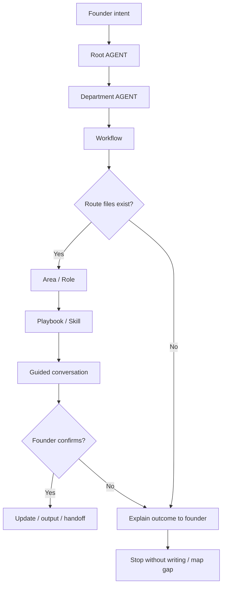

# Journey: <journey name>

Each step must explain cause and effect:

```text
The model does X because it read Y, and Y instructed or allowed X.
```

If the reason cannot be explained, the route is too implicit and should become a clearer AGENT, workflow, role, skill or playbook rule.

## Human Overview

Short version for the framework owner.

- **Trigger:** what the founder says.
- **Goal:** what this journey decides or produces.
- **Starts at:** first route owner.
- **Passes through:** key workflow, area, role or playbook.
- **Ends with:** final decision, output or handoff.
- **Does not do:** boundaries that prevent premature execution.

Keep this section short. The detailed execution contract lives below.

## Flow Diagram

Use a vertical Mermaid diagram for readability:



## Flow In Plain Words

One paragraph explaining the route:

> The model starts at Root AGENT because..., enters `<department>` because..., reads the workflow because..., activates `<role>` because..., and ends by asking the founder to confirm...

## Founder Trigger

Real phrases that can start this journey:

- "..."
- "..."
- "..."

## Moment

When this journey happens in the product/company lifecycle.

Examples:

- initial setup;
- first product definition;
- new idea or feature;
- roadmap;
- issue shaping;
- implementation;
- PR review;
- post-merge;
- launch/learning.

## Human Goal

Explain in simple language what the founder is trying to solve.

Example:

> The founder wants to understand whether a new idea makes sense before putting it into the roadmap or asking for implementation.

## Start Condition

This journey starts when:

- ...
- ...

## End Condition

This journey ends when:

- ...
- ...

## Owner

Department or area that owns the journey:

- Department:
- Area:
- Workflow:
- Command, if any:

## Route Contract

The required route is:

```text
Root AGENT.md
-> <department>/AGENT.md
-> <department>/workflows/<workflow>.workflow.md
-> <area>/AGENT.md or README.md
-> <area>/roles/<role>.role.md
-> <area>/skills/<skill>.skill.md
-> <area>/playbooks/<playbook>.playbook.md
-> Output
```

Rules:

- The model cannot skip directly to a role, skill or playbook.
- The model must declare the route before executing.
- If a route file does not exist, the model stops and reports the gap.
- If the workflow says an area is conditional, the model explains why it enters or does not enter.
- If the route needs to change, the model explains the change before continuing.

## What The Model Does In Practice

### Step 1 - <action>

The model opens:

`<file>`

Why:

- Which AGENT, workflow, command or playbook instructed this step.
- What the model understood from the founder intent.
- Why this is the correct next owner.

Navigation Evidence:

- `<file>` says...
- `<index or yaml>` confirms...

What the model understands here:

- ...
- ...

Next step:

`<file>`

### Step 2 - <action>

The model opens:

`<file>`

Why:

- ...

Navigation Evidence:

- The previous file points to this file.
- This file exists in the workspace.
- The README/YAML/index confirms that this asset belongs here.

What the model understands here:

- ...

Next step:

`<file>`

Repeat until the journey reaches output.

## Active Roles

| Order | Role | When It Enters | Why It Enters | Route Evidence |
| --- | --- | --- | --- | --- |
| 1 | `<role>` | ... | ... | `<area>/AGENT.md` or `<area>/area.yaml` |
| 2 | `<role>` | ... | ... | ... |

## Active Skills

| Skill | Used By | Purpose | Route Evidence |
| --- | --- | --- | --- |
| `<skill>` | `<role>` | ... | `<role>.role.md` points to it |

## Active Playbooks

| Playbook | Area | Role In The Journey | Route Evidence |
| --- | --- | --- | --- |
| `<playbook>` | `<area>` | ... | `<role>.role.md` or workflow points to it |

## Founder Questions

Founder-friendly questions:

- ...
- ...
- ...

Do not ask as a rigid form. Ask only what is missing.

## Guided Conversation Points

List where the journey uses guided choices without writing the full questionnaire here.

| Step | Purpose | Source |
| --- | --- | --- |
| Step ... | Choose between predictable paths | `<area>/playbooks/<playbook>.playbook.md` |
| Step ... | Confirm before durable updates | `<workflow or playbook>` |

Rules:

- Keep detailed guided questions in the owning playbook or command.
- Use `ai-standard/foundation/guided-conversation.md` as the global rule.
- Do not turn this journey document into a script.

## Confirmation Checkpoints

The model must ask for confirmation before:

- updating files;
- changing roadmap/backlog;
- creating issues;
- calling scripts/capabilities;
- implementing code;
- opening a PR.

## Founder-facing Output

What the model should show the founder in simple language.

Example:

```text
This idea seems promising, but it is not ready for the roadmap yet.

My recommendation:
- keep it as a future opportunity;
- register the main assumption;
- revisit it after we validate the current problem.

Do you want me to register this idea so we can track it later?
```

## Internal File Updates After Confirmation

Files that can be updated if the founder confirms:

- `<path>`
- `<path>`

## Forbidden Actions

During this journey, the model cannot:

- ...
- ...
- ...

## Possible Outcomes

The journey can end with:

- ...
- ...
- ...

## Continuation Bridge

At the end of this journey, the model must offer one clear next-step bridge when a safe next flow exists.

The bridge must be founder-friendly, not file/path-first.

Immediate bridge:

```text
<simple question that lets the founder continue now>
```

Later-session triggers:

- "<natural founder phrase>"
- "<natural founder phrase>"
- "<optional command or shortcut if one exists>"

Next route:

`<next-journey-or-workflow>`

Rules:

- Do not automatically start the next journey without founder confirmation.
- If the founder says yes, declare the new route before loading the next workflow.
- If the founder says no, explain the current outcome and stop without writing anything else.
- If the founder returns in a later session with a matching trigger, restart from Root `AGENT.md`, route normally, and load the next journey.

## Next Recommended Journey

After this journey, the next flow can be:

- `<journey>` when ...
- `<journey>` when ...

## Journey Validation Checklist

Use this checklist to test whether the journey really applies the Navigation Chain.

### Files Exist

- [ ] `AGENT.md` exists.
- [ ] `<department>/AGENT.md` exists.
- [ ] `<department>/workflows/<workflow>.workflow.md` exists when the journey uses a workflow.
- [ ] `<area>/AGENT.md` or `<area>/README.md` exists.
- [ ] `<area>/area.yaml` exists.
- [ ] Referenced roles exist.
- [ ] Referenced skills exist.
- [ ] Referenced playbooks exist.
- [ ] Referenced knowledge files exist.

### Files Point To Each Other

- [ ] Root `AGENT.md` routes correctly to the department.
- [ ] Department `AGENT.md` routes correctly to workflow or area.
- [ ] Workflow points to correct areas, AGENTs or playbooks.
- [ ] Area `AGENT.md` or README explains when to use each role.
- [ ] Role points to the correct skills and playbooks.
- [ ] Skills and playbooks do not depend on missing files.
- [ ] `.leanos/index/*` confirms the main paths.

### Journey Execution

- [ ] The model can explain the route before acting.
- [ ] The model can say why each next file was loaded.
- [ ] The model does not skip department or area.
- [ ] The model does not load the whole workspace without need.
- [ ] The model asks for confirmation before updating files.
- [ ] The founder-facing output is understandable before technical paths appear.
- [ ] Internal file updates are listed only after the human decision.
- [ ] The continuation bridge offers the next flow without starting it automatically.
- [ ] Later-session triggers are listed for natural founder language.

### Conditional Areas

- [ ] Conditional areas explain when they enter.
- [ ] Conditional areas explain when they do not enter.
- [ ] Design enters only for UX/UI/flow/accessibility/copy/interaction.
- [ ] Security enters only for data/auth/permissions/privacy/API/database/secrets/compliance/risk.
- [ ] DevOps enters only for environment/deploy/CI/CD/observability/config/release.

## Notes For Framework Design

Observations for improving the framework:

- What is still confusing.
- What may become a workflow.
- What may remain only a playbook.
- What depends on a future capability/script.
