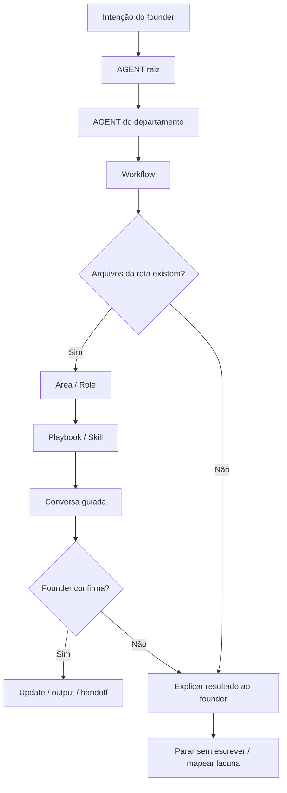

# Jornada: <nome da jornada>

Cada etapa deve explicar causa e efeito:

```text
O modelo faz X porque leu Y, e Y instruiu ou permitiu X.
```

Se a razão não puder ser explicada, a rota está implícita demais e deve virar uma regra mais clara em AGENT, workflow, role, skill ou playbook.

## Visão Humana

Versão curta para o dono do framework.

- **Trigger:** o que o founder diz.
- **Objetivo:** o que esta jornada decide ou produz.
- **Começa em:** primeiro owner da rota.
- **Passa por:** workflow, área, role ou playbook principal.
- **Termina com:** decisão final, output ou handoff.
- **Não faz:** limites que impedem execução prematura.

Mantenha esta seção curta. O contrato detalhado de execução fica abaixo.

## Diagrama Do Fluxo

Use um diagrama Mermaid vertical para facilitar a leitura:



## Fluxo Em Linguagem Simples

Um parágrafo explicando a rota:

> O modelo começa no AGENT raiz porque..., entra em `<department>` porque..., lê o workflow porque..., ativa `<role>` porque..., e termina pedindo confirmação ao founder...

## Trigger Do Founder

Frases reais que podem iniciar esta jornada:

- "..."
- "..."
- "..."

## Momento

Quando esta jornada acontece no ciclo de vida do produto/negócio.

Exemplos:

- setup inicial;
- primeira definição de produto;
- nova ideia ou feature;
- roadmap;
- shaping de issue;
- implementação;
- review de PR;
- pós-merge;
- lançamento/aprendizado.

## Objetivo Humano

Explique em linguagem simples o que o founder está tentando resolver.

Exemplo:

> O founder quer entender se uma nova ideia faz sentido antes de colocá-la no roadmap ou pedir implementação.

## Condição De Início

Esta jornada começa quando:

- ...
- ...

## Condição De Fim

Esta jornada termina quando:

- ...
- ...

## Owner

Departamento ou área dona da jornada:

- Departamento:
- Área:
- Workflow:
- Comando, se houver:

## Contrato De Rota

A rota obrigatória é:

```text
Root AGENT.md
-> <department>/AGENT.md
-> <department>/workflows/<workflow>.workflow.md
-> <area>/AGENT.md or README.md
-> <area>/roles/<role>.role.md
-> <area>/skills/<skill>.skill.md
-> <area>/playbooks/<playbook>.playbook.md
-> Output
```

Regras:

- O modelo não pode pular diretamente para uma role, skill ou playbook.
- O modelo deve declarar a rota antes de executar.
- Se um arquivo da rota não existir, o modelo para e reporta a lacuna.
- Se o workflow diz que uma área é condicional, o modelo explica por que ela entra ou não entra.
- Se a rota precisar mudar, o modelo explica a mudança antes de continuar.

## O Que O Modelo Faz Na Prática

### Etapa 1 - <ação>

O modelo abre:

`<file>`

Por quê:

- Qual AGENT, workflow, decisão de ativação ou playbook instruiu esta etapa.
- O que o modelo entendeu da intenção do founder.
- Por que este é o próximo owner correto.

Evidência De Navegação:

- `<file>` diz...
- `<index or yaml>` confirma...

O que o modelo entende aqui:

- ...
- ...

Próxima etapa:

`<file>`

### Etapa 2 - <ação>

O modelo abre:

`<file>`

Por quê:

- ...

Evidência De Navegação:

- O arquivo anterior aponta para este arquivo.
- Este arquivo existe no workspace.
- O README/YAML/index confirma que este asset pertence a este lugar.

O que o modelo entende aqui:

- ...

Próxima etapa:

`<file>`

Repita até a jornada chegar ao output.

## Roles Ativas

| Ordem | Role | Quando Entra | Por Que Entra | Evidência De Rota |
| --- | --- | --- | --- | --- |
| 1 | `<role>` | ... | ... | `<area>/AGENT.md` or `<area>/area.yaml` |
| 2 | `<role>` | ... | ... | ... |

## Skills Ativas

| Skill | Usada Por | Propósito | Evidência De Rota |
| --- | --- | --- | --- |
| `<skill>` | `<role>` | ... | `<role>.role.md` aponta para ela |

## Playbooks Ativos

| Playbook | Área | Papel Na Jornada | Evidência De Rota |
| --- | --- | --- | --- |
| `<playbook>` | `<area>` | ... | `<role>.role.md` ou workflow aponta para ele |

## Perguntas Ao Founder

Perguntas amigáveis para o founder:

- ...
- ...
- ...

Não pergunte como formulário rígido. Pergunte apenas o que está faltando.

## Pontos De Conversa Guiada

Liste onde a jornada usa escolhas guiadas sem escrever o questionário completo aqui.

| Etapa | Propósito | Fonte |
| --- | --- | --- |
| Etapa ... | Escolher entre caminhos previsíveis | `<area>/playbooks/<playbook>.playbook.md` |
| Etapa ... | Confirmar antes de updates duráveis | `<workflow or playbook>` |

Regras:

- Mantenha perguntas guiadas detalhadas no playbook ou comando dono.
- Use `ai-standard/foundation/guided-conversation.md` como regra global.
- Não transforme este documento de jornada em um script.

## Checkpoints De Confirmação

O modelo deve pedir confirmação antes de:

- atualizar arquivos;
- mudar roadmap/backlog;
- criar issues;
- chamar scripts/capabilities;
- implementar código;
- abrir um PR.

## Output Voltado Ao Founder

O que o modelo deve mostrar ao founder em linguagem simples.

Exemplo:

```text
Essa ideia parece promissora, mas ainda não está pronta para entrar no roadmap.

Minha recomendação:
- manter como oportunidade futura;
- registrar a principal premissa;
- revisitar depois de validar o problema atual.

Quer que eu registre essa ideia para acompanharmos depois?
```

## Updates Internos De Arquivo Após Confirmação

Arquivos que podem ser atualizados se o founder confirmar:

- `<path>`
- `<path>`

## Ações Proibidas

Durante esta jornada, o modelo não pode:

- ...
- ...
- ...

## Resultados Possíveis

A jornada pode terminar com:

- ...
- ...
- ...

## Ponte De Continuação

Ao fim desta jornada, o modelo deve oferecer uma ponte clara para o próximo passo quando existir um próximo fluxo seguro.

A ponte deve ser amigável para o founder, não file/path-first.

Ponte imediata:

```text
<pergunta simples que permite ao founder continuar agora>
```

Triggers em sessão posterior:

- "<frase natural do founder>"
- "<frase natural do founder>"
- "<comando ou atalho opcional, se existir>"

Próxima rota:

`<next-journey-or-workflow>`

Regras:

- Não inicie automaticamente a próxima jornada sem confirmação do founder.
- Se o founder disser sim, declare a nova rota antes de carregar o próximo workflow.
- Se o founder disser não, explique o resultado atual e pare sem escrever mais nada.
- Se o founder voltar em uma sessão posterior com um trigger compatível, reinicie pelo `AGENT.md` raiz, faça o roteamento normal e carregue a próxima jornada.

## Próxima Jornada Recomendada

Depois desta jornada, o próximo fluxo pode ser:

- `<journey>` quando ...
- `<journey>` quando ...

## Checklist De Validação Da Jornada

Use este checklist para testar se a jornada realmente aplica a Cadeia de Navegação.

### Arquivos Existem

- [ ] `AGENT.md` existe.
- [ ] `<department>/AGENT.md` existe.
- [ ] `<department>/workflows/<workflow>.workflow.md` existe quando a jornada usa um workflow.
- [ ] `<area>/AGENT.md` ou `<area>/README.md` existe.
- [ ] `<area>/area.yaml` existe.
- [ ] Roles referenciadas existem.
- [ ] Skills referenciadas existem.
- [ ] Playbooks referenciados existem.
- [ ] Arquivos de knowledge referenciados existem.

### Arquivos Apontam Uns Para Os Outros

- [ ] `AGENT.md` raiz roteia corretamente para o departamento.
- [ ] `AGENT.md` do departamento roteia corretamente para workflow ou área.
- [ ] Workflow aponta para áreas, AGENTs ou playbooks corretos.
- [ ] `AGENT.md` ou README da área explica quando usar cada role.
- [ ] Role aponta para as skills e playbooks corretos.
- [ ] Skills e playbooks não dependem de arquivos ausentes.
- [ ] `.leanos/index/*` confirma os paths principais.

### Execução Da Jornada

- [ ] O modelo consegue explicar a rota antes de agir.
- [ ] O modelo consegue dizer por que cada próximo arquivo foi carregado.
- [ ] O modelo não pula departamento ou área.
- [ ] O modelo não carrega o workspace inteiro sem necessidade.
- [ ] O modelo pede confirmação antes de atualizar arquivos.
- [ ] O output voltado ao founder é compreensível antes de paths técnicos aparecerem.
- [ ] Updates internos de arquivo são listados apenas depois da decisão humana.
- [ ] A ponte de continuação oferece o próximo fluxo sem iniciá-lo automaticamente.
- [ ] Triggers de sessões posteriores estão listados em linguagem natural do founder.

### Áreas Condicionais

- [ ] Áreas condicionais explicam quando entram.
- [ ] Áreas condicionais explicam quando não entram.
- [ ] Design entra apenas para UX/UI/fluxo/acessibilidade/copy/interação.
- [ ] Security entra apenas para dados/auth/permissões/privacidade/API/banco/secrets/compliance/risco.
- [ ] DevOps entra apenas para ambiente/deploy/CI/CD/observabilidade/config/release.

## Notas Para Design Do Framework

Observações para melhorar o framework:

- O que ainda está confuso.
- O que pode virar workflow.
- O que pode permanecer apenas como playbook.
- O que depende de uma capability/script futura.
