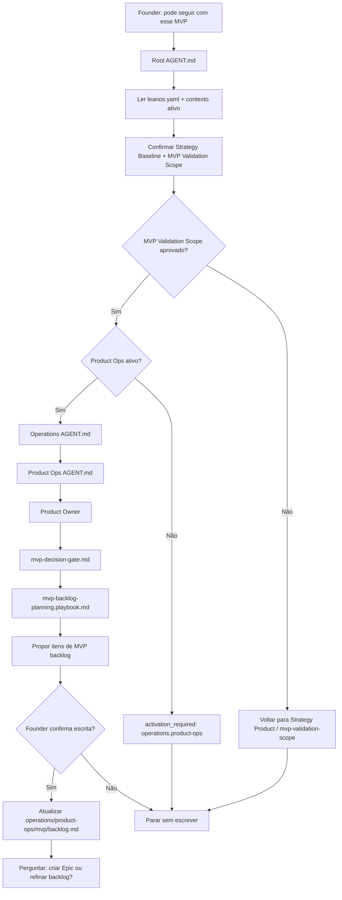

# Jornada: Planejar MVP Backlog

## Visão Humana

- **Trigger:** founder aprovou o MVP Validation Scope em Strategy e quer transformar aquilo em plano operacional de MVP.
- **Objetivo:** registrar itens claros em `operations/product-ops/mvp/backlog.md`, sem criar Epic, Feature, issue, branch ou código.
- **Começa em:** `AGENT.md` raiz, com leitura de `leanos.yaml` e contexto ativo.
- **Passa por:** Strategy Product para confirmar o MVP Validation Scope aprovado; depois `activation_required: operations.product-ops` se Product Ops ainda estiver inativo; depois Product Ops e playbook `mvp-backlog-planning`.
- **Termina com:** MVP backlog atualizado e uma pergunta explícita: transformar um item aprovado em Epic agora ou continuar refinando o backlog.
- **Não faz:** criar Epics automaticamente, quebrar Features, sincronizar GitHub, ativar Engineering ou implementar.

## Diagrama Do Fluxo



## Fluxo Em Linguagem Simples

Strategy Product define o que o MVP precisa validar. Product Ops só entra depois que o founder aprova essa definição e quer transformar a decisão em trabalho operacional.

O MVP Backlog é a primeira fonte operacional do MVP. Ele guarda os itens candidatos, aprovados, adiados ou dependentes de Design, Security, Engineering ou DevOps. Um item aprovado no MVP Backlog ainda não é Feature: antes, ele precisa virar Epic local por `delivery-item-to-epic`.

## Owner

- Departamento: Operations
- Área: Product Ops
- Role primária: `operations/product-ops/roles/product-owner.role.md`
- Gate: `operations/product-ops/knowledge/mvp-decision-gate.md`
- Playbook primário: `operations/product-ops/playbooks/mvp-backlog-planning.playbook.md`
- Fonte de verdade: `operations/product-ops/mvp/backlog.md`

## Contrato De Rota

Quando Product Ops está inativo:

```text
Root AGENT.md
-> leanos.yaml
-> Strategy Product / MVP Validation Scope check
-> activation_required: operations.product-ops
```

Depois que Product Ops está ativo:

```text
Root AGENT.md
-> operations/AGENT.md
-> operations/product-ops/AGENT.md
-> operations/product-ops/roles/product-owner.role.md
-> operations/product-ops/knowledge/mvp-decision-gate.md
-> operations/product-ops/playbooks/mvp-backlog-planning.playbook.md
-> operations/product-ops/mvp/backlog.md
```

## Regras

- O modelo deve declarar a rota antes de executar.
- O modelo deve confirmar que o MVP Validation Scope foi aprovado pelo founder.
- O modelo deve propor o MVP Backlog em linguagem amigável antes de escrever.
- Product Ops pode apontar riscos de Design, Security, Engineering e DevOps, mas não implementa esses riscos nesta jornada.
- Todo item aprovado para execução deve virar Epic local antes de Feature ou Engineering.
- Se o founder quiser ir para Epic, a próxima rota é `delivery-item-to-epic`.

## Checklist De Conclusão

- [x] A jornada não usa `define-mvp.workflow.md`.
- [x] A jornada não usa skill `define-mvp`.
- [x] A jornada não usa playbook `mvp-delivery`.
- [x] `operations/product-ops/mvp/backlog.md` é a fonte operacional do MVP.
- [x] A próxima pergunta depois da escrita é criar Epic ou continuar refinando backlog.
