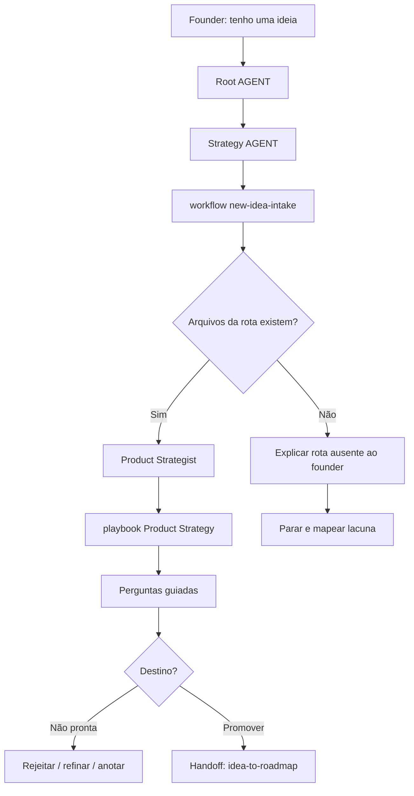

# Jornada: Intake De Nova Ideia

Esta jornada desenha como o LeanOS deve lidar com um founder dizendo:

```text
"Tenho uma ideia."
```

O propósito não é adicionar a ideia ao roadmap imediatamente. O propósito é entender, qualificar e decidir o próximo destino da ideia.

## Visão Humana

- **Trigger:** founder diz que tem uma ideia ou quer avaliar uma nova feature.
- **Objetivo:** entender se a ideia deve ser rejeitada, refinada, salva como nota ou promovida para consideração de roadmap.
- **Começa em:** `AGENT.md` raiz, depois `strategy/AGENT.md`.
- **Passa por:** `new-idea-intake.workflow.md`, Product Strategist e playbook de Product Strategy.
- **Termina com:** uma recomendação amigável ao founder e uma pausa de decisão.
- **Não faz:** adicionar ao roadmap automaticamente, definir MVP, criar issues no GitHub ou iniciar implementação.

## Diagrama Do Fluxo



## Fluxo Em Linguagem Simples

O modelo começa no `AGENT.md` raiz porque o founder fala em linguagem natural. Ele entra em Strategy porque a solicitação é sobre direção de produto, lê `new-idea-intake.workflow.md` porque esta é uma jornada de decisão, ativa Product porque a primeira pergunta é fit de produto e termina perguntando se a ideia deve ser descartada, refinada, salva como nota ou passada para `idea-to-roadmap`.

## Trigger Do Founder

Frases reais que podem iniciar esta jornada:

- "Tenho uma ideia."
- "E se a gente criasse..."
- "Quero avaliar uma feature nova."
- "Isso faz sentido para o produto?"
- "Tive uma ideia para o módulo de clientes."

## Moment

Isso acontece depois do setup inicial do LeanOS e pode acontecer repetidamente durante a vida do produto.

Pode acontecer:

- antes que o primeiro MVP esteja totalmente definido;
- enquanto o MVP está sendo moldado;
- depois que o produto já tem roadmap, issues ou código;
- depois de feedback de clientes, intuição do founder ou observação de mercado.

## Objetivo Humano

O founder quer saber se uma nova ideia merece atenção sem transformá-la acidentalmente em roadmap, escopo de delivery ou trabalho de implementação cedo demais.

Em linguagem amigável ao founder:

> "Quero saber se essa ideia vale ser guardada, validada, adicionada ao roadmap ou ignorada por enquanto."

## Condição De Início

Esta jornada começa quando:

- o founder propõe uma nova ideia, feature, módulo ou direção;
- o founder pergunta se uma ideia faz sentido;
- o founder pede julgamento de produto antes de roadmap ou implementação;
- a ideia ainda não é um item de roadmap aceito.

## Condição De Fim

Esta jornada termina quando o modelo dá uma recomendação clara e pede confirmação antes de qualquer update de arquivo.

A ideia pode terminar como:

- rejeitada por enquanto;
- estacionada como pergunta em aberto;
- registrada como nota de validação;
- movida para o backlog de produto;
- recomendada para `idea-to-roadmap`;
- recomendada para `roadmap-item-to-epic` apenas depois de já virar item de roadmap.

## Owner

Departamento ou área dona da jornada:

- Departamento: `strategy/`
- Área primária: `strategy/product/`
- Área de suporte: `strategy/roadmap/`
- Workflow desejado: `strategy/workflows/new-idea-intake.workflow.md`
- Comando, se houver: nenhum obrigatório. Linguagem natural deve ativar esta rota.

## Contrato De Rota

A rota obrigatória é:

```text
Root AGENT.md
-> strategy/AGENT.md
-> strategy/workflows/new-idea-intake.workflow.md
-> strategy/product/AGENT.md
-> strategy/product/roles/product-strategist.role.md
-> strategy/product/skills/evaluate-idea.skill.md
-> strategy/product/playbooks/product-strategy.playbook.md
-> strategy/roadmap/AGENT.md only if roadmap impact needs review
-> Output
```

Regras:

- O modelo não pode pular da ideia do founder diretamente para roadmap, MVP ou implementação.
- O modelo deve declarar a rota antes de avaliar a ideia.
- O modelo usa Product primeiro porque a primeira pergunta é fit de produto, não planejamento de delivery.
- Roadmap entra apenas quando a avaliação de Product diz que a ideia pode afetar sequência, backlog ou ciclo atual.
- Product Ops/Delivery Scope entra apenas em uma jornada posterior, `roadmap-item-to-epic`, depois que a ideia vira item de roadmap.
- Se `new-idea-intake.workflow.md` estiver ausente, o modelo deve reportar a lacuna em vez de inventar um workflow substituto.

## O Que O Modelo Faz Na Prática

### Etapa 1 - Entender A Intenção Do Founder

O modelo começa por:

`AGENT.md`

Por quê:

- O `AGENT.md` raiz diz que toda tarefa roteada do LeanOS começa com o Response Header.
- O `AGENT.md` raiz diz que solicitações em linguagem natural devem rotear pela Navigation Chain quando nenhum comando combina claramente.
- O founder não está pedindo código ou trabalho de GitHub; ele está pedindo julgamento de strategy/produto.

Evidência De Navegação:

- `AGENT.md` roteia negócio, estratégia de produto, roadmap, validação, ICP ou premissas para `strategy/AGENT.md`.
- A solicitação contém uma ideia de produto, então Strategy é o departamento owner.

O que o modelo entende aqui:

- Esta é uma solicitação de Strategy.
- Esta não é uma solicitação de implementação.
- O modelo ainda não deve adicionar nada ao roadmap.

Próxima etapa:

`strategy/AGENT.md`

### Etapa 2 - Entrar Em Strategy Antes De Escolher Um Workflow

O modelo abre:

`strategy/AGENT.md`

Por quê:

- O `AGENT.md` raiz escolheu Strategy como departamento owner.
- `strategy/AGENT.md` diz que jornadas do founder devem abrir `workflows/README.md`.
- `strategy/AGENT.md` define uma jornada como uma solicitação que muda estado, prioridade, escopo, handoff, roadmap, delivery, lançamento ou aprendizado.
- Uma nova ideia é uma jornada de decisão porque pode virar nota de validação, candidata de backlog, item de roadmap ou futura candidata de MVP.

Evidência De Navegação:

- `strategy/AGENT.md` lista Product e Roadmap como áreas ativas.
- `strategy/AGENT.md` lista avaliar uma nova ideia antes de roadmap ou MVP como sinal de jornada de Strategy.
- `strategy/AGENT.md` diz que workflows servem para decisões ou transições multi-step.

O que o modelo entende aqui:

- Strategy é dono do julgamento.
- Isto não é um update simples de arquivo de Product.
- Product deve avaliar a ideia primeiro.
- Roadmap deve entrar apenas se a ideia puder virar backlog ou trabalho de roadmap.

Próxima etapa:

`strategy/workflows/README.md`

### Etapa 3 - Selecionar O Workflow De Intake

O modelo abre:

`strategy/workflows/README.md`

Por quê:

- `strategy/AGENT.md` instruiu seleção de workflow porque esta é uma jornada de Strategy.
- O modelo precisa do workflow que avalia uma nova ideia antes de promoção.

Evidência De Navegação:

- Arquivo desejado: `strategy/workflows/new-idea-intake.workflow.md`.
- Arquivo separado: `strategy/workflows/idea-to-roadmap.workflow.md`.
- A separação importa porque intake decide o que deve acontecer em seguida; promoção para roadmap é uma decisão posterior.

O que o modelo entende aqui:

- O framework tem um workflow dedicado de intake.
- O modelo deve evitar tratar `idea-to-roadmap` como promoção automática para roadmap.

Próxima etapa:

`strategy/workflows/new-idea-intake.workflow.md`

Se este arquivo não existir, o modelo diz:

```text
Encontrei a área de workflows de Strategy, mas o workflow dedicado new-idea-intake ainda não foi gerado.
Devo parar aqui e reportar esta lacuna do framework em vez de inventar um workflow substituto.
```

### Etapa 4 - Rotear Para Product Para Avaliação De Product Fit

O modelo abre:

`strategy/product/AGENT.md`

Por quê:

- O workflow de intake deve dizer que Product avalia usuário, problema, ICP, valor e premissas primeiro.
- Product é dono da pergunta "essa ideia faz sentido para o produto?"
- Roadmap não pode decidir prioridade antes de Product entender valor e fit.

Evidência De Navegação:

- `strategy/product/AGENT.md` diz que Product é dono de estratégia de produto, ICP, proposta de valor, posicionamento e coerência de modelo de negócio.
- `strategy/product/AGENT.md` roteia strategy incerta, ICP, proposta de valor e coerência de roadmap para Product Strategist.

O que o modelo entende aqui:

- O primeiro especialista correto é Product Strategist.
- Product Manager pode entrar depois se a ideia precisar de escopo ou critérios de aceite.

Próxima etapa:

`strategy/product/roles/product-strategist.role.md`

### Etapa 5 - Ativar Product Strategist

O modelo abre:

`strategy/product/roles/product-strategist.role.md`

Por quê:

- O AGENT de Product roteia strategy incerta, fit de ICP/valor e risco de coerência de roadmap para Product Strategist.
- A ideia ainda não está escopada; ela precisa de avaliação estratégica primeiro.

Evidência De Navegação:

- `product-strategist.role.md` diz que conecta cliente, problema, proposta de valor, modelo de negócio, roadmap e lógica de validação.
- Ele lista `evaluate-idea.skill.md` como uma de suas skills.
- Ele lista `product-strategy.playbook.md` como seu playbook.

O que o modelo entende aqui:

- Ele deve ler apenas o knowledge necessário de Product.
- Ele deve usar `evaluate-idea.skill.md`.
- Ele deve usar `product-strategy.playbook.md` para sequência e estilo de output.

Próxima etapa:

`strategy/product/skills/evaluate-idea.skill.md`

### Etapa 6 - Avaliar A Ideia

O modelo abre:

`strategy/product/skills/evaluate-idea.skill.md`

Por quê:

- Product Strategist aponta para esta skill.
- A skill diz explicitamente para usá-la quando o founder propõe uma nova ideia, uma solicitação de feature pode mudar direção ou prioridade de roadmap precisa de julgamento de produto.

Evidência De Navegação:

- `evaluate-idea.skill.md` exige product brief, problema, proposta de valor e backlog de roadmap.
- Ela instrui o modelo a reafirmar a ideia, identificar usuário/problema, verificar fit, nomear premissas e recomendar aceitar, estacionar, validar ou rejeitar.
- Ela diz explicitamente para não adicionar ideias diretamente ao roadmap como trabalho comprometido.

O que o modelo entende aqui:

- A ideia deve ser julgada contra ICP, problema, valor e evidência.
- O output deve ser uma recomendação, não uma mutação de roadmap.
- O modelo deve perguntar apenas o que está faltando.

Próxima etapa:

`strategy/product/playbooks/product-strategy.playbook.md`

### Etapa 7 - Usar O Playbook De Product Strategy

O modelo abre:

`strategy/product/playbooks/product-strategy.playbook.md`

Por quê:

- Product Strategist aponta para este playbook.
- O playbook fornece a sequência prática para trabalho de product strategy.
- Ele diz para separar decisões, premissas e perguntas em aberto.

Evidência De Navegação:

- `product-strategy.playbook.md` diz para esclarecer ICP, problema e proposta de valor antes de tocar roadmap ou escopo de delivery.
- Ele diz para propor updates de arquivo e aguardar confirmação antes de escrever.

O que o modelo entende aqui:

- Ele não deve pular para MVP ou código.
- Ele deve produzir primeiro uma recomendação amigável ao founder.
- Ele deve propor updates apenas depois de explicar a recomendação.

Próxima etapa:

Pausa de decisão antes de qualquer handoff para Roadmap.

### Etapa 8 - Pausa De Decisão Antes Do Roadmap

O modelo ainda não abre uma nova área.

Em vez disso, ele pausa e fala com o founder em linguagem simples.

Por quê:

- `product-strategy.playbook.md` diz para propor updates e aguardar confirmação antes de escrever.
- `evaluate-idea.skill.md` diz para não adicionar ideias diretamente ao roadmap como trabalho comprometido.
- `new-idea-intake` é uma jornada de intake, não uma jornada de mutação de roadmap.
- O founder deve decidir se a ideia deve ser rejeitada, refinada, acompanhada ou promovida.

Evidência De Navegação:

- Product Strategy concluiu a avaliação inicial.
- O workflow separado `strategy/workflows/idea-to-roadmap.workflow.md` existe para promoção a roadmap.
- O `AGENT.md` raiz diz para perguntar antes de modificar arquivos de knowledge, decisão ou framework.

O que o modelo entende aqui:

- Ele deve explicar a avaliação antes de nomear arquivos.
- Ele não deve abrir Roadmap automaticamente.
- Ele deve perguntar ao founder qual destino faz sentido.

Prompts amigáveis ao founder:

- "Essa ideia parece alinhada com o produto, mas ainda não parece pronta para MVP. Quer que eu trate como candidata ao roadmap?"
- "Essa ideia parece interessante, mas depende de uma hipótese forte. Quer que eu registre como ponto para validar depois?"
- "Essa ideia parece fora do foco atual. Quer refinar, guardar para depois ou descartar por enquanto?"
- "Essa ideia parece forte o suficiente para virar item de roadmap. Quer que eu siga para a etapa de roadmap?"
- "Quer que eu apenas registre essa ideia como nota, sem mexer no roadmap agora?"

Próxima etapa:

- Pare aqui se o founder rejeitar, estacionar ou quiser apenas uma nota.
- Inicie `idea-to-roadmap` apenas se o founder confirmar promoção para roadmap/backlog.

### Etapa 9 - Handoff Opcional Para Idea To Roadmap

O modelo inicia uma nova jornada apenas se o founder confirmar.

Próximo workflow:

`strategy/workflows/idea-to-roadmap.workflow.md`

Somente quando:

- o founder diz que a ideia deve entrar no roadmap ou backlog;
- o founder quer acompanhar timing, prioridade ou sequência;
- o founder pede explicitamente para "colocar no roadmap", "guardar no backlog" ou "acompanhar para depois".

Por quê:

- `new-idea-intake` produziu uma avaliação e recomendação.
- `idea-to-roadmap` é o workflow correto para transformar uma ideia qualificada em item estruturado de roadmap/backlog.
- Roadmap é dono de backlog, ciclo atual e sequência.

Evidência De Navegação:

- `strategy/workflows/idea-to-roadmap.workflow.md` é separado de `new-idea-intake.workflow.md`.
- `strategy/roadmap/AGENT.md` diz que Roadmap é dono de planejamento, priorização, cycle planning e preparação para GitHub sync.
- `roadmap-planner.role.md` lê roadmap, ciclo atual, backlog e Product brief.

O que o modelo entende aqui:

- A jornada atual de intake está completa.
- A próxima jornada pode classificar a ideia como backlog, Now, Next, Later ou Not Planned.
- Isso ainda não significa que o item é MVP.
- GitHub ainda não está envolvido.

Próxima etapa:

Declare a nova rota para `idea-to-roadmap` antes de carregar arquivos de Roadmap.

### Etapa 10 - Produzir Recomendação Amigável Ao Founder

O modelo responde primeiro em linguagem simples.

Example:

```text
Entendi a ideia.

Ela parece alinhada com o problema que estamos tentando resolver, mas ainda depende de uma hipótese forte: usuários realmente precisam dessa capacidade antes do fluxo principal do MVP.

Minha recomendação:
- não colocar isso direto no MVP agora;
- guardar como oportunidade de roadmap;
- registrar a hipótese que precisa ser validada;
- revisar depois que o fluxo principal estiver mais claro.

Você quer que eu siga para a etapa de roadmap e registre isso como candidata para depois?
```

Por quê:

- Product Strategy diz para propor updates e aguardar confirmação.
- `evaluate-idea.skill.md` diz para não adicionar ideias diretamente ao roadmap como trabalho comprometido.
- O `AGENT.md` raiz diz para perguntar antes de modificar arquivos de knowledge, decisão ou framework.

Evidência De Navegação:

- A skill de Product fornece categorias de decisão.
- O playbook de Product define comportamento de proposta antes da escrita.
- A rota de Roadmap entra apenas pelo próximo workflow, depois de confirmação do founder.

## Roles Ativas

| Ordem | Role | Quando Entra | Por Que Entra | Evidência De Rota |
| --- | --- | --- | --- | --- |
| 1 | Product Strategist | Sempre | Avalia a ideia contra ICP, problema, proposta de valor, premissas e coerência de produto. | `strategy/product/AGENT.md`, `product-strategist.role.md` |
| 2 | Product Manager | Follow-up condicional | Entra apenas se o founder pedir shaping de escopo ou critérios de aceite depois que a ideia passar pelo intake. | `strategy/product/AGENT.md`, `product-manager.role.md` |
| Próxima jornada | Roadmap Planner | Não ativo durante o intake | Entra apenas depois que o founder confirma `idea-to-roadmap`. | `strategy/workflows/idea-to-roadmap.workflow.md`, `strategy/roadmap/AGENT.md` |

## Skills Ativas

| Skill | Usada Por | Propósito | Evidência De Rota |
| --- | --- | --- | --- |
| `evaluate-idea.skill.md` | Product Strategist | Julgar valor para usuário, evidência, impacto no MVP e impacto no roadmap. | `product-strategist.role.md` aponta para ela. |
| `check-coherence.skill.md` | Product Strategist | Verificar se a ideia conflita com ICP, proposta de valor ou foco atual. | `product-strategist.role.md` aponta para ela. |
| `prioritize-backlog.skill.md` | Roadmap Planner | Não usada durante o intake; usada apenas se a próxima jornada promover a ideia para backlog ou roadmap. | `roadmap-planner.role.md` aponta para ela. |

## Playbooks Ativos

| Playbook | Área | Papel Na Jornada | Evidência De Rota |
| --- | --- | --- | --- |
| `product-strategy.playbook.md` | `strategy/product` | Sequência operacional principal para avaliar e comunicar a ideia. | `product-strategist.role.md` aponta para ele. |
| `roadmap-cycle-planning.playbook.md` | `strategy/roadmap` | Não usado durante o intake; usado pela próxima jornada se o founder confirmar promoção para roadmap. | `roadmap-planner.role.md` aponta para ele. |

## Perguntas Ao Founder

Perguntas amigáveis ao founder:

- Quem isso ajudaria primeiro?
- Que problema isso resolveria para essa pessoa?
- Por que isso importa agora?
- O que aconteceria se não construirmos isso?
- Isso apoia o MVP atual ou distrai dele?
- Temos evidência, feedback ou apenas intuição?
- Isso é obrigatório, melhoria posterior ou apenas algo interessante de ter?

Não pergunte como formulário rígido. Pergunte apenas o que está faltando.

## Pontos De Conversa Guiada

| Etapa | Propósito | Fonte |
| --- | --- | --- |
| Etapa 6 | Perguntar apenas contexto de product-fit ausente antes de avaliar a ideia. | `strategy/product/skills/evaluate-idea.skill.md` |
| Etapa 8 | Ajudar o founder a escolher o destino da ideia antes de qualquer handoff para roadmap. | `strategy/product/playbooks/product-strategy.playbook.md` |
| Confirmação | Confirmar se deve registrar uma nota ou iniciar `idea-to-roadmap`. | `ai-standard/foundation/guided-conversation.md` |

Opções detalhadas pertencem ao playbook de Product Strategy e ao padrão global de conversa guiada, não a este documento de jornada.

## Checkpoints De Confirmação

O modelo deve pedir confirmação antes de:

- registrar a ideia em `strategy/product/knowledge/validation-notes.md`;
- adicionar a ideia em `strategy/roadmap/knowledge/backlog.md`;
- alterar `strategy/roadmap/knowledge/roadmap.md`;
- marcar a ideia como candidata a escopo de delivery;
- iniciar `idea-to-roadmap`;
- iniciar `roadmap-item-to-epic`;
- criar issues, epics, branches ou código.

## Output Voltado Ao Founder

O founder deve ver uma decisão clara, não apenas paths de arquivos.

Formato recomendado:

```text
Minha leitura:
<short evaluation>

Recomendação:
- <keep / reject / validate / backlog / roadmap candidate>

Por que:
- <reason 1>
- <reason 2>

Próximo passo sugerido:
<one action>

Você quer que eu registre essa ideia para acompanharmos depois?
```

Somente depois disso o modelo deve mostrar updates técnicos de arquivo, se necessário.

## Updates Internos De Arquivo Após Confirmação

Arquivos que podem ser atualizados se o founder confirmar:

- `strategy/product/knowledge/validation-notes.md`
- nenhum arquivo de roadmap durante intake por padrão
- `strategy/roadmap/knowledge/backlog.md` apenas depois de iniciar `idea-to-roadmap`
- `strategy/roadmap/knowledge/current-cycle.md` apenas dentro de `idea-to-roadmap`, quando impacto no ciclo for explicitamente confirmado
- `strategy/roadmap/knowledge/roadmap.md` apenas por meio de `idea-to-roadmap`, não durante intake

## Ações Proibidas

Durante esta jornada, o modelo não pode:

- adicionar a ideia diretamente ao escopo de delivery;
- criar issues ou epics no GitHub;
- criar branches de implementação;
- escrever código;
- modificar `operations/engineering/`;
- modificar roles, skills, playbooks, workflows, commands ou `ai-standard/`;
- tratar entusiasmo do founder como evidência de validação;
- pular Product e ir direto para Roadmap.

## Resultados Possíveis

A jornada pode terminar com:

- **Rejeitar por enquanto**: a ideia não está alinhada ou não é útil o suficiente.
- **Estacionar**: a ideia é interessante, mas ainda não é acionável.
- **Nota de validação**: a ideia expõe uma premissa que vale acompanhar.
- **Candidata de backlog**: a ideia pode ser útil depois.
- **Candidata de roadmap**: a ideia é forte o suficiente para seguir para `idea-to-roadmap`.
- **Candidata a escopo de delivery**: apenas depois da consideração de roadmap, a próxima jornada pode avaliar se isso pertence ao MVP, a um release, a um experimento ou a outro escopo de delivery.

## Ponte De Continuação

Ao fim desta jornada, o modelo deve oferecer uma ponte clara para o próximo passo quando a ideia for forte o suficiente para ser acompanhada.

Ponte imediata:

```text
Essa ideia parece forte o bastante para ser acompanhada.
Quer que eu transforme isso em um item de roadmap ou backlog para decidirmos prioridade e momento?
```

Triggers em sessão posterior:

- "vamos colocar aquela ideia no roadmap"
- "quero salvar essa ideia no backlog"
- "vamos priorizar a ideia que discutimos"
- "essa ideia merece entrar no produto?"

Próxima rota:

`idea-to-roadmap`

Regras:

- Não inicie `idea-to-roadmap` automaticamente.
- Se o founder disser sim, declare a nova rota antes de carregar arquivos de Roadmap.
- Se o founder disser não, explique o resultado atual e pare sem escrever mais nada.
- Se o founder voltar em uma sessão posterior com um trigger compatível, reinicie pelo `AGENT.md` raiz, roteie para Strategy e carregue `idea-to-roadmap`.

## Próxima Jornada Recomendada

Depois desta jornada, o próximo fluxo pode ser:

- `idea-to-roadmap` quando a ideia deve virar item de roadmap/backlog.
- `roadmap-item-to-epic` quando um item existente de roadmap pode entrar no MVP, em um release, experimento ou outro escopo de delivery.
- Definição de MVP pelo `AGENT.md` raiz quando o próprio MVP ainda está indefinido.
- `start-leanos` quando o workspace não tem baseline de strategy suficiente.

## Checklist De Validação Da Jornada

Use este checklist para testar se a jornada realmente aplica a Navigation Chain.

### Arquivos Existem

- [x] `AGENT.md` existe.
- [x] `strategy/AGENT.md` existe.
- [x] `strategy/workflows/new-idea-intake.workflow.md` existe.
- [x] `strategy/workflows/idea-to-roadmap.workflow.md` existe como workflow posterior de promoção para roadmap.
- [x] `strategy/product/AGENT.md` existe.
- [x] `strategy/product/area.yaml` existe.
- [x] `strategy/product/roles/product-strategist.role.md` existe.
- [x] `strategy/product/skills/evaluate-idea.skill.md` existe.
- [x] `strategy/product/playbooks/product-strategy.playbook.md` existe.
- [x] `strategy/product/knowledge/validation-notes.md` existe.
- [x] `strategy/roadmap/AGENT.md` existe.
- [x] `strategy/roadmap/roles/roadmap-planner.role.md` existe.
- [x] `strategy/roadmap/playbooks/roadmap-cycle-planning.playbook.md` existe.

### Arquivos Apontam Uns Para Os Outros

- [x] `AGENT.md` raiz roteia solicitações de Strategy para `strategy/AGENT.md`.
- [x] `strategy/AGENT.md` roteia solicitações de Strategy entre áreas para `workflows/README.md`.
- [x] `strategy/workflows/README.md` aponta para `new-idea-intake.workflow.md`.
- [x] `strategy/product/AGENT.md` roteia ambiguidade de product strategy para Product Strategist.
- [x] Product Strategist aponta para `evaluate-idea.skill.md`.
- [x] Product Strategist aponta para `product-strategy.playbook.md`.
- [x] `evaluate-idea.skill.md` diz para não adicionar ideias diretamente ao roadmap como trabalho comprometido.
- [x] Roadmap Planner aponta para assets de priorização de roadmap.

### Execução Da Jornada

- [x] O modelo consegue explicar a rota antes de agir.
- [x] O modelo consegue dizer por que cada próximo arquivo foi carregado.
- [x] O modelo não pula departamento ou área.
- [x] O modelo não carrega o workspace inteiro sem necessidade.
- [x] O modelo pede confirmação antes de atualizar arquivos.
- [x] O output voltado ao founder é compreensível antes de paths técnicos aparecerem.
- [x] Updates internos de arquivo são listados apenas depois da decisão humana.
- [x] A ponte de continuação oferece `idea-to-roadmap` sem iniciá-lo automaticamente.
- [x] Triggers de sessão posterior estão listados em linguagem natural do founder.

### Áreas Condicionais

- [x] Roadmap explica quando entra.
- [x] Product Ops/Delivery Scope não faz parte desta jornada.
- [x] Design não entra durante intake, a menos que a ideia seja especificamente pesquisa de UX/design; mesmo assim deve ser um follow-up.
- [x] Security não entra durante intake, a menos que a ideia seja fundamentalmente sobre dados, auth, permissões, privacidade, API, banco de dados, secrets, compliance ou risco.
- [x] DevOps não entra durante intake.

## Notas Para Design Do Framework

- Mantenha `new-idea-intake.workflow.md` como o workflow de intake.
- Mantenha `idea-to-roadmap.workflow.md` como um workflow separado de promoção, não como workflow de intake.
- Considere adicionar um `idea-intake.playbook.md` específico apenas se Product Strategy ficar amplo demais.
- Mantenha o output amigável ao founder: pergunte sobre registrar a ideia, não sobre "atualizar arquivos", até depois da decisão humana.
