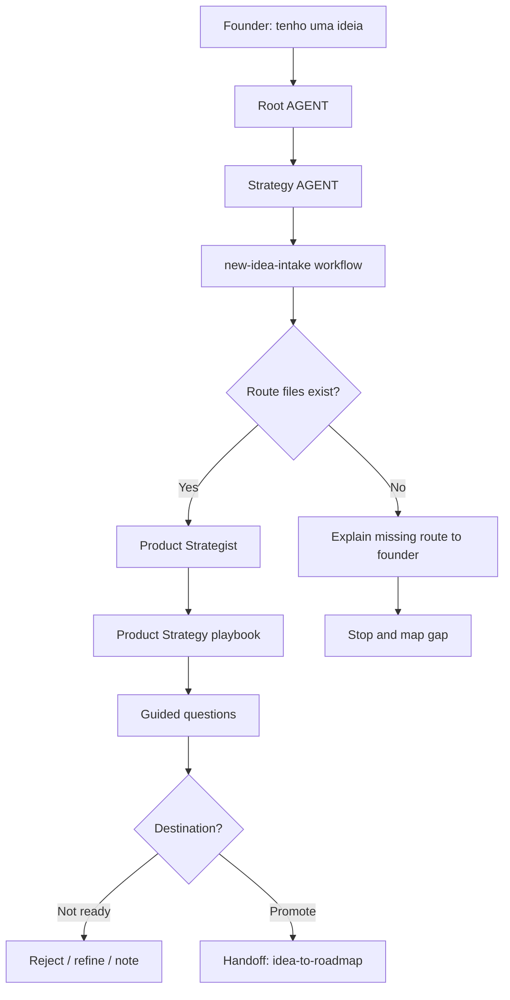

# Journey: New Idea Intake

This journey designs how LeanOS should handle a founder saying:

```text
"I have an idea."
```

The purpose is not to add the idea to the roadmap immediately. The purpose is to understand, qualify and decide the next destination of the idea.

## Human Overview

- **Trigger:** founder says they have an idea or wants to evaluate a new feature.
- **Goal:** understand whether the idea should be rejected, refined, saved as a note or promoted to roadmap consideration.
- **Starts at:** Root `AGENT.md`, then `strategy/AGENT.md`.
- **Passes through:** `new-idea-intake.workflow.md`, Product Strategist and Product Strategy playbook.
- **Ends with:** a founder-friendly recommendation and a decision pause.
- **Does not do:** add to roadmap automatically, define MVP, create GitHub issues or start implementation.

## Flow Diagram



## Flow In Plain Words

The model starts at Root `AGENT.md` because the founder is speaking in natural language. It enters Strategy because the request is about product direction, reads `new-idea-intake.workflow.md` because this is a decision journey, activates Product because the first question is product fit, and ends by asking whether the idea should be discarded, refined, saved as a note or handed off to `idea-to-roadmap`.

## Founder Trigger

Real phrases that can start this journey:

- "Tenho uma ideia."
- "E se a gente criasse..."
- "Quero avaliar uma feature nova."
- "Isso faz sentido para o produto?"
- "Tive uma ideia para o modulo de clientes."

## Moment

This happens after the initial LeanOS setup and can happen repeatedly during the life of the product.

It can happen:

- before the first MVP is fully defined;
- while the MVP is being shaped;
- after the product already has roadmap, issues or code;
- after customer feedback, founder intuition or market observation.

## Human Goal

The founder wants to know whether a new idea deserves attention without accidentally turning it into roadmap, delivery scope or implementation work too early.

In founder-friendly language:

> "I want to know if this idea is worth keeping, validating, adding to the roadmap or ignoring for now."

## Start Condition

This journey starts when:

- the founder proposes a new idea, feature, module or direction;
- the founder asks whether an idea makes sense;
- the founder asks for product judgment before roadmap or implementation;
- the idea is not yet an accepted roadmap item.

## End Condition

This journey ends when the model gives a clear recommendation and asks for confirmation before any file update.

The idea can end as:

- rejected for now;
- parked as an open question;
- registered as a validation note;
- moved to product backlog;
- recommended for `idea-to-roadmap`;
- recommended for `roadmap-item-to-epic` only after it already becomes a roadmap item.

## Owner

Department or area that owns the journey:

- Department: `strategy/`
- Primary area: `strategy/product/`
- Supporting area: `strategy/roadmap/`
- Desired workflow: `strategy/workflows/new-idea-intake.workflow.md`
- Command, if any: none required. Natural language should activate this route.

## Route Contract

The required route is:

```text
Root AGENT.md
-> strategy/AGENT.md
-> strategy/workflows/new-idea-intake.workflow.md
-> strategy/product/AGENT.md
-> strategy/product/roles/product-strategist.role.md
-> strategy/product/skills/evaluate-idea.skill.md
-> strategy/product/playbooks/product-strategy.playbook.md
-> strategy/roadmap/AGENT.md only if roadmap impact needs review
-> Output
```

Rules:

- The model cannot jump from the founder idea directly to roadmap, MVP or implementation.
- The model must declare the route before evaluating the idea.
- The model uses Product first because the first question is product fit, not delivery planning.
- Roadmap enters only when the Product evaluation says the idea may affect sequencing, backlog or current cycle.
- Product Ops/Delivery Scope enters only in a later journey, `roadmap-item-to-epic`, after the idea becomes a roadmap item.
- If `new-idea-intake.workflow.md` is missing, the model should report the gap instead of inventing a replacement workflow.

## What The Model Does In Practice

### Step 1 - Understand the founder intent

The model starts from:

`AGENT.md`

Why:

- Root `AGENT.md` says every routed LeanOS task starts with the Response Header.
- Root `AGENT.md` says natural-language requests should route through the Navigation Chain when no command clearly matches.
- The founder is not asking for code or GitHub work; they are asking for strategy/product judgment.

Navigation Evidence:

- `AGENT.md` routes business, product strategy, roadmap, validation, ICP or assumptions to `strategy/AGENT.md`.
- The request contains a product idea, so Strategy is the owning department.

What the model understands here:

- This is a Strategy request.
- This is not an implementation request.
- The model should not add anything to the roadmap yet.

Next step:

`strategy/AGENT.md`

### Step 2 - Enter Strategy before choosing a workflow

The model opens:

`strategy/AGENT.md`

Why:

- Root `AGENT.md` chose Strategy as the owning department.
- `strategy/AGENT.md` says founder journeys should open `workflows/README.md`.
- `strategy/AGENT.md` defines a journey as a request that changes state, priority, scope, handoff, roadmap, delivery, launch or learning.
- A new idea is a decision journey because it may become a validation note, backlog candidate, roadmap item or future MVP candidate.

Navigation Evidence:

- `strategy/AGENT.md` lists Product and Roadmap as active areas.
- `strategy/AGENT.md` lists evaluating a new idea before roadmap or MVP as a Strategy journey signal.
- `strategy/AGENT.md` says workflows are for multi-step decisions or transitions.

What the model understands here:

- Strategy owns the judgment.
- This is not a simple Product file update.
- Product should evaluate the idea first.
- Roadmap should enter only if the idea may become backlog or roadmap work.

Next step:

`strategy/workflows/README.md`

### Step 3 - Select the intake workflow

The model opens:

`strategy/workflows/README.md`

Why:

- `strategy/AGENT.md` instructed workflow selection because this is a Strategy journey.
- The model needs the workflow that evaluates a new idea before promotion.

Navigation Evidence:

- Desired file: `strategy/workflows/new-idea-intake.workflow.md`.
- Separate file: `strategy/workflows/idea-to-roadmap.workflow.md`.
- The split matters because intake decides what should happen next; roadmap promotion is a later decision.

What the model understands here:

- The framework has a dedicated intake workflow.
- The model should avoid treating `idea-to-roadmap` as automatic roadmap promotion.

Next step:

`strategy/workflows/new-idea-intake.workflow.md`

If this file does not exist, the model says:

```text
I found the Strategy workflow area, but the dedicated new-idea-intake workflow is not generated yet.
I should stop here and report this framework gap instead of inventing a replacement workflow.
```

### Step 4 - Route to Product for product-fit evaluation

The model opens:

`strategy/product/AGENT.md`

Why:

- The intake workflow should say Product evaluates user, problem, ICP, value and assumptions first.
- Product owns the question "does this idea make sense for the product?"
- Roadmap cannot decide priority before Product understands value and fit.

Navigation Evidence:

- `strategy/product/AGENT.md` says Product owns product strategy, ICP, value proposition, positioning and business model coherence.
- `strategy/product/AGENT.md` routes unclear strategy, ICP, value proposition and roadmap coherence to Product Strategist.

What the model understands here:

- The correct first specialist is Product Strategist.
- Product Manager may enter later if the idea needs scope or acceptance criteria.

Next step:

`strategy/product/roles/product-strategist.role.md`

### Step 5 - Activate Product Strategist

The model opens:

`strategy/product/roles/product-strategist.role.md`

Why:

- Product AGENT routes unclear strategy, ICP/value fit and roadmap coherence risk to Product Strategist.
- The idea is not yet scoped; it needs strategic evaluation first.

Navigation Evidence:

- `product-strategist.role.md` says it connects customer, problem, value proposition, business model, roadmap and validation logic.
- It lists `evaluate-idea.skill.md` as one of its skills.
- It lists `product-strategy.playbook.md` as its playbook.

What the model understands here:

- It should read only the necessary Product knowledge.
- It should use `evaluate-idea.skill.md`.
- It should use `product-strategy.playbook.md` for the sequence and output style.

Next step:

`strategy/product/skills/evaluate-idea.skill.md`

### Step 6 - Evaluate the idea

The model opens:

`strategy/product/skills/evaluate-idea.skill.md`

Why:

- Product Strategist points to this skill.
- The skill explicitly says to use it when the founder proposes a new idea, a feature request may change direction, or roadmap priority needs product judgment.

Navigation Evidence:

- `evaluate-idea.skill.md` requires product brief, problem, value proposition and roadmap backlog.
- It instructs the model to restate the idea, identify user/problem, check fit, name assumptions and recommend accept, park, validate or reject.
- It explicitly says not to add ideas directly to roadmap as committed work.

What the model understands here:

- The idea must be judged against ICP, problem, value and evidence.
- The output should be a recommendation, not a roadmap mutation.
- The model should ask only missing questions.

Next step:

`strategy/product/playbooks/product-strategy.playbook.md`

### Step 7 - Use the Product Strategy playbook

The model opens:

`strategy/product/playbooks/product-strategy.playbook.md`

Why:

- Product Strategist points to this playbook.
- The playbook gives the practical sequence for product strategy work.
- It says to separate decisions, assumptions and open questions.

Navigation Evidence:

- `product-strategy.playbook.md` says to clarify ICP, problem and value proposition before touching roadmap or delivery scope.
- It says to propose file updates and wait for confirmation before writing.

What the model understands here:

- It should not jump to MVP or code.
- It should produce a founder-friendly recommendation first.
- It should propose updates only after explaining the recommendation.

Next step:

Decision pause before any roadmap handoff.

### Step 8 - Decision Pause Before Roadmap

The model does not open a new area yet.

Instead, it pauses and talks to the founder in plain language.

Why:

- `product-strategy.playbook.md` says to propose updates and wait for confirmation before writing.
- `evaluate-idea.skill.md` says not to add ideas directly to roadmap as committed work.
- `new-idea-intake` is an intake journey, not a roadmap mutation journey.
- The founder must decide whether the idea should be rejected, refined, tracked or promoted.

Navigation Evidence:

- Product Strategy has completed the initial evaluation.
- The separate workflow `strategy/workflows/idea-to-roadmap.workflow.md` exists for roadmap promotion.
- Root `AGENT.md` says to ask before modifying knowledge, decision or framework files.

What the model understands here:

- It should explain the evaluation before naming files.
- It should not open Roadmap automatically.
- It should ask the founder what destination makes sense.

Founder-friendly prompts:

- "Essa ideia parece alinhada com o produto, mas ainda nao parece pronta para MVP. Quer que eu trate como candidata ao roadmap?"
- "Essa ideia parece interessante, mas depende de uma hipotese forte. Quer que eu registre como ponto para validar depois?"
- "Essa ideia parece fora do foco atual. Quer refinar, guardar para depois ou descartar por enquanto?"
- "Essa ideia parece forte o suficiente para virar item de roadmap. Quer que eu siga para a etapa de roadmap?"
- "Quer que eu apenas registre essa ideia como nota, sem mexer no roadmap agora?"

Next step:

- Stop here if the founder rejects, parks or only wants a note.
- Start `idea-to-roadmap` only if the founder confirms roadmap/backlog promotion.

### Step 9 - Optional Handoff To Idea To Roadmap

The model starts a new journey only if the founder confirms.

Next workflow:

`strategy/workflows/idea-to-roadmap.workflow.md`

Only when:

- the founder says the idea should enter roadmap or backlog;
- the founder wants to track timing, priority or sequencing;
- the founder explicitly asks to "colocar no roadmap", "guardar no backlog" or "acompanhar para depois".

Why:

- `new-idea-intake` produced an evaluation and recommendation.
- `idea-to-roadmap` is the correct workflow for turning a qualified idea into a structured roadmap/backlog item.
- Roadmap owns backlog, current cycle and sequencing.

Navigation Evidence:

- `strategy/workflows/idea-to-roadmap.workflow.md` is separate from `new-idea-intake.workflow.md`.
- `strategy/roadmap/AGENT.md` says Roadmap owns planning, prioritization, cycle planning and GitHub sync preparation.
- `roadmap-planner.role.md` reads roadmap, current cycle, backlog and Product brief.

What the model understands here:

- The current intake journey is complete.
- The next journey can classify the idea as backlog, Now, Next, Later or Not Planned.
- This still does not mean the item is MVP.
- GitHub is not involved yet.

Next step:

Declare the new route for `idea-to-roadmap` before loading Roadmap files.

### Step 10 - Produce founder-friendly recommendation

The model responds in plain language first.

Example:

```text
Entendi a ideia.

Ela parece alinhada com o problema que estamos tentando resolver, mas ainda depende de uma hipótese forte: usuários realmente precisam dessa capacidade antes do fluxo principal do MVP.

Minha recomendação:
- não colocar isso direto no MVP agora;
- guardar como oportunidade de roadmap;
- registrar a hipótese que precisa ser validada;
- revisar depois que o fluxo principal estiver mais claro.

Você quer que eu siga para a etapa de roadmap e registre isso como candidata para depois?
```

Why:

- Product Strategy says to propose updates and wait for confirmation.
- `evaluate-idea.skill.md` says not to add ideas directly to roadmap as committed work.
- Root `AGENT.md` says to ask before modifying knowledge, decision or framework files.

Navigation Evidence:

- Product skill gives decision categories.
- Product playbook gives proposal-before-write behavior.
- Roadmap route enters only through the next workflow, after founder confirmation.

## Active Roles

| Order | Role | When It Enters | Why It Enters | Route Evidence |
| --- | --- | --- | --- | --- |
| 1 | Product Strategist | Always | Evaluates idea against ICP, problem, value proposition, assumptions and product coherence. | `strategy/product/AGENT.md`, `product-strategist.role.md` |
| 2 | Product Manager | Conditional follow-up | Enters only if the founder asks to shape scope or acceptance criteria after the idea passes intake. | `strategy/product/AGENT.md`, `product-manager.role.md` |
| Next journey | Roadmap Planner | Not active during intake | Enters only after the founder confirms `idea-to-roadmap`. | `strategy/workflows/idea-to-roadmap.workflow.md`, `strategy/roadmap/AGENT.md` |

## Active Skills

| Skill | Used By | Purpose | Route Evidence |
| --- | --- | --- | --- |
| `evaluate-idea.skill.md` | Product Strategist | Judge user value, evidence, MVP impact and roadmap impact. | `product-strategist.role.md` points to it. |
| `check-coherence.skill.md` | Product Strategist | Check if the idea conflicts with ICP, value proposition or current focus. | `product-strategist.role.md` points to it. |
| `prioritize-backlog.skill.md` | Roadmap Planner | Not used during intake; used only if the next journey promotes the idea to backlog or roadmap. | `roadmap-planner.role.md` points to it. |

## Active Playbooks

| Playbook | Area | Role In The Journey | Route Evidence |
| --- | --- | --- | --- |
| `product-strategy.playbook.md` | `strategy/product` | Main operating sequence for evaluating and communicating the idea. | `product-strategist.role.md` points to it. |
| `roadmap-cycle-planning.playbook.md` | `strategy/roadmap` | Not used during intake; used by the next journey if the founder confirms roadmap promotion. | `roadmap-planner.role.md` points to it. |

## Founder Questions

Founder-friendly questions:

- Who would this help first?
- What problem would it solve for that person?
- Why does this matter now?
- What would happen if we do not build it?
- Does this support the current MVP or distract from it?
- Do we have evidence, feedback or only intuition?
- Is this a must-have, a later improvement or just a nice-to-have?

Do not ask as a rigid form. Ask only what is missing.

## Guided Conversation Points

| Step | Purpose | Source |
| --- | --- | --- |
| Step 6 | Ask only missing product-fit context before evaluating the idea. | `strategy/product/skills/evaluate-idea.skill.md` |
| Step 8 | Help the founder choose the idea destination before any roadmap handoff. | `strategy/product/playbooks/product-strategy.playbook.md` |
| Confirmation | Confirm whether to record a note or start `idea-to-roadmap`. | `ai-standard/foundation/guided-conversation.md` |

Detailed options belong in the Product Strategy playbook and the global guided conversation standard, not in this journey document.

## Confirmation Checkpoints

The model must ask for confirmation before:

- registering the idea in `strategy/product/knowledge/validation-notes.md`;
- adding the idea to `strategy/roadmap/knowledge/backlog.md`;
- changing `strategy/roadmap/knowledge/roadmap.md`;
- marking the idea as delivery scope candidate;
- starting `idea-to-roadmap`;
- starting `roadmap-item-to-epic`;
- creating issues, epics, branches or code.

## Founder-facing Output

The founder should see a clear decision, not only file paths.

Recommended format:

```text
Minha leitura:
<short evaluation>

Recomendacao:
- <keep / reject / validate / backlog / roadmap candidate>

Por que:
- <reason 1>
- <reason 2>

Proximo passo sugerido:
<one action>

Voce quer que eu registre essa ideia para acompanharmos depois?
```

Only after this should the model show technical file updates, if needed.

## Internal File Updates After Confirmation

Files that can be updated if the founder confirms:

- `strategy/product/knowledge/validation-notes.md`
- no roadmap file during intake by default
- `strategy/roadmap/knowledge/backlog.md` only after starting `idea-to-roadmap`
- `strategy/roadmap/knowledge/current-cycle.md` only inside `idea-to-roadmap` when cycle impact is explicitly confirmed
- `strategy/roadmap/knowledge/roadmap.md` only through `idea-to-roadmap`, not during intake

## Forbidden Actions

During this journey, the model cannot:

- add the idea directly to delivery scope;
- create GitHub issues or epics;
- create implementation branches;
- write code;
- modify `operations/engineering/`;
- modify roles, skills, playbooks, workflows, commands or `ai-standard/`;
- treat founder excitement as validation evidence;
- skip Product and go straight to Roadmap.

## Possible Outcomes

The journey can end with:

- **Reject for now**: the idea is not aligned or not useful enough.
- **Park**: the idea is interesting but not actionable.
- **Validation note**: the idea exposes an assumption worth tracking.
- **Backlog candidate**: the idea may be useful later.
- **Roadmap candidate**: the idea is strong enough to move to `idea-to-roadmap`.
- **Delivery scope candidate**: only after roadmap consideration, the next journey may evaluate whether this belongs to MVP, a release, an experiment or another delivery scope.

## Continuation Bridge

At the end of this journey, the model must offer one clear next-step bridge when the idea is strong enough to be tracked.

Immediate bridge:

```text
Essa ideia parece forte o bastante para ser acompanhada.
Quer que eu transforme isso em um item de roadmap ou backlog para decidirmos prioridade e momento?
```

Later-session triggers:

- "vamos colocar aquela ideia no roadmap"
- "quero salvar essa ideia no backlog"
- "vamos priorizar a ideia que discutimos"
- "essa ideia merece entrar no produto?"

Next route:

`idea-to-roadmap`

Rules:

- Do not start `idea-to-roadmap` automatically.
- If the founder says yes, declare the new route before loading Roadmap files.
- If the founder says no, explain the current outcome and stop without writing anything else.
- If the founder returns in a later session with a matching trigger, restart from Root `AGENT.md`, route to Strategy, and load `idea-to-roadmap`.

## Next Recommended Journey

After this journey, the next flow can be:

- `idea-to-roadmap` when the idea should become a roadmap/backlog item.
- `roadmap-item-to-epic` when an existing roadmap item may enter MVP, a release, an experiment or another delivery scope.
- `/shape-mvp` when the MVP itself is still undefined.
- `start-leanos` when the workspace does not have enough strategy baseline.

## Journey Validation Checklist

Use this checklist to test whether the journey really applies the Navigation Chain.

### Files Exist

- [x] `AGENT.md` exists.
- [x] `strategy/AGENT.md` exists.
- [x] `strategy/workflows/new-idea-intake.workflow.md` exists.
- [x] `strategy/workflows/idea-to-roadmap.workflow.md` exists as the later roadmap promotion workflow.
- [x] `strategy/product/AGENT.md` exists.
- [x] `strategy/product/area.yaml` exists.
- [x] `strategy/product/roles/product-strategist.role.md` exists.
- [x] `strategy/product/skills/evaluate-idea.skill.md` exists.
- [x] `strategy/product/playbooks/product-strategy.playbook.md` exists.
- [x] `strategy/product/knowledge/validation-notes.md` exists.
- [x] `strategy/roadmap/AGENT.md` exists.
- [x] `strategy/roadmap/roles/roadmap-planner.role.md` exists.
- [x] `strategy/roadmap/playbooks/roadmap-cycle-planning.playbook.md` exists.

### Files Point To Each Other

- [x] Root `AGENT.md` routes Strategy requests to `strategy/AGENT.md`.
- [x] `strategy/AGENT.md` routes cross-area Strategy requests to `workflows/README.md`.
- [x] `strategy/workflows/README.md` points to `new-idea-intake.workflow.md`.
- [x] `strategy/product/AGENT.md` routes product strategy ambiguity to Product Strategist.
- [x] Product Strategist points to `evaluate-idea.skill.md`.
- [x] Product Strategist points to `product-strategy.playbook.md`.
- [x] `evaluate-idea.skill.md` says not to add ideas directly to roadmap as committed work.
- [x] Roadmap Planner points to roadmap prioritization assets.

### Journey Execution

- [x] The model can explain the route before acting.
- [x] The model can say why each next file was loaded.
- [x] The model does not skip department or area.
- [x] The model does not load the whole workspace without need.
- [x] The model asks for confirmation before updating files.
- [x] The founder-facing output is understandable before technical paths appear.
- [x] Internal file updates are listed only after the human decision.
- [x] The continuation bridge offers `idea-to-roadmap` without starting it automatically.
- [x] Later-session triggers are listed for natural founder language.

### Conditional Areas

- [x] Roadmap explains when it enters.
- [x] Product Ops/Delivery Scope is not part of this journey.
- [x] Design does not enter during intake unless the idea is specifically UX/design research, and even then it should be a follow-up.
- [x] Security does not enter during intake unless the idea is fundamentally about data, auth, permissions, privacy, API, database, secrets, compliance or risk.
- [x] DevOps does not enter during intake.

## Notes For Framework Design

- Keep `new-idea-intake.workflow.md` as the intake workflow.
- Keep `idea-to-roadmap.workflow.md` as a separate promotion workflow, not the intake workflow.
- Consider adding a specific `idea-intake.playbook.md` only if Product Strategy becomes too broad.
- Keep the output founder-friendly: ask about recording the idea, not "updating files", until after the human decision.
