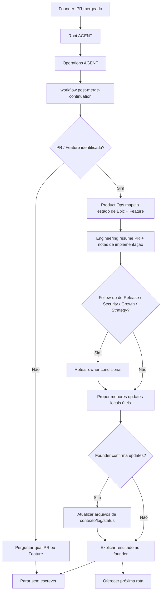

# Jornada: Continuação Pós-Merge

## Visão Humana

- **Trigger:** founder diz "mergeado", "o PR foi mergeado", "vamos para a próxima feature" ou algo similar.
- **Objetivo:** fechar o loop depois do merge, atualizar o menor contexto útil e escolher a próxima rota segura.
- **Começa em:** `AGENT.md` raiz, depois `operations/AGENT.md`.
- **Passa por:** `post-merge-continuation.workflow.md`, Product Ops, Engineering e follow-up condicional de DevOps/Security/Growth/Strategy.
- **Termina com:** proposta de status atualizado de Feature/Epic ou log de Engineering, resumo amigável da entrega enviada e uma ponte para o próximo passo.
- **Não faz:** escrever código, criar branches, abrir PRs, fazer deploy, mudar prioridade do roadmap ou iniciar automaticamente a próxima Feature.

## Diagrama Do Fluxo



## Fluxo Em Linguagem Simples

O modelo começa no `AGENT.md` raiz porque o founder fala naturalmente. Ele entra em Operations porque um merge é uma transição de estado de delivery, não uma nova decisão de estratégia por padrão. Ele lê `operations/workflows/post-merge-continuation.workflow.md` porque a tarefa pode tocar status de Product Ops, notas de Engineering, readiness de release, follow-up de security, aprendizado de cliente ou impacto no roadmap. Product Ops entra primeiro para mapear o trabalho mergeado de volta ao Epic e à Feature. Engineering entra para resumir o que foi implementado e validado. DevOps, Security, Growth ou Strategy entram apenas quando o follow-up deles é relevante.

## Trigger Do Founder

- "mergeado, vamos para a próxima"
- "o PR foi mergeado"
- "terminamos essa feature"
- "o que fazemos depois do merge?"
- "atualiza o contexto depois do merge"
- "qual a próxima feature?"

## Moment

Pós-merge. Isso acontece depois que um PR ou Feature foi mergeado e antes da próxima entrega de Feature, etapa de release/deploy, revisão de roadmap ou learning loop.

## Condição De Início

Esta jornada começa quando:

- o founder confirma que um PR ou Feature foi mergeado;
- ou o modelo consegue identificar um PR mergeado, Feature local ou issue de Feature no GitHub;
- e o founder pergunta o que atualizar ou o que fazer em seguida.

## Condição De Fim

Esta jornada termina quando:

- o merge é resumido em linguagem amigável para o founder;
- os menores updates úteis de contexto/status são propostos e opcionalmente aplicados;
- o modelo oferece a próxima rota;
- ou o modelo não consegue identificar o PR/Feature mergeado e para antes de escrever.

## Owner

- Departamento: Operations
- Workflow: `operations/workflows/post-merge-continuation.workflow.md`
- Primeira área: `operations/product-ops/`
- Área de suporte: `operations/engineering/`
- Áreas condicionais: `operations/devops/`, `operations/security/`, `growth/customer-experience/`, `strategy/roadmap/`

## Contrato De Rota

```text
AGENT.md
-> operations/AGENT.md
-> operations/workflows/post-merge-continuation.workflow.md
-> operations/product-ops/AGENT.md
-> operations/product-ops/roles/product-owner.role.md
-> operations/engineering/AGENT.md
-> operations/engineering/roles/pr-reviewer.role.md
-> conditional owner when needed
-> Output / next route
```

Regras:

- O modelo deve declarar esta rota antes de executar.
- Product Ops é dono do estado de Feature/Epic depois do merge.
- Engineering apoia o resumo de implementação e PR.
- DevOps entra apenas para follow-up de release, deploy, ambiente, rollback ou observabilidade.
- Security entra apenas para auth, permissões, dados, privacidade, pagamentos, APIs ou risco de abuso.
- Growth entra apenas para aprendizado de cliente, suporte, onboarding ou feedback de lançamento.
- Strategy/Roadmap entra apenas se decisões de prioridade de roadmap, milestone ou escopo de delivery mudaram.
- O modelo não pode iniciar a próxima Feature automaticamente.
- Se um arquivo de rota não existir, o modelo para e reporta o path ausente.

## O Que O Modelo Faz Na Prática

### Etapa 1 - Reconhecer Intenção Pós-Merge

O modelo abre:

`AGENT.md`

Por quê:

- O founder diz algo como "mergeado" ou "vamos para a próxima".
- O roteamento raiz envia transições de estado de delivery para Operations.

Evidência De Navegação:

- O `AGENT.md` raiz roteia delivery e trabalho pós-implementação para `operations/AGENT.md`.

Próxima etapa:

`operations/AGENT.md`

### Etapa 2 - Escolher O Workflow

O modelo abre:

`operations/AGENT.md`

Por quê:

- A solicitação não é apenas trabalho de Engineering. Ela pode atualizar status de Feature, logs de Engineering, release notes, follow-up de security ou learning loops.
- As regras do departamento dizem que jornadas multi-step usam `workflows/README.md` e o menor workflow compatível.

Evidência De Navegação:

- `operations/workflows/README.md` lista `post-merge-continuation.workflow.md`.

Próxima etapa:

`operations/workflows/post-merge-continuation.workflow.md`

### Etapa 3 - Confirmar O Trabalho Mergeado

O modelo abre:

`operations/workflows/post-merge-continuation.workflow.md`

Por quê:

- O workflow diz para identificar o PR mergeado, Feature local ou issue de Feature no GitHub antes de escrever.

Evidência De Navegação:

- As condições de parada do workflow impedem updates quando o trabalho mergeado não pode ser identificado.

Próxima etapa:

`operations/product-ops/AGENT.md`

### Etapa 4 - Mapear Estado Da Feature E Do Epic

O modelo abre:

`operations/product-ops/AGENT.md`

Por quê:

- Product Ops é dono de status local de Epic/Feature e readiness de issue.

Evidência De Navegação:

- A rota de navegação do workflow aponta para Product Ops antes de Engineering.
- Arquivos de Product Ops incluem `epics/` e `knowledge/issue-readiness.md`.

Próxima etapa:

`operations/engineering/AGENT.md`

### Etapa 5 - Resumir Resultado De Engineering

O modelo abre:

`operations/engineering/AGENT.md`

Por quê:

- Engineering é dono de notas de PR, notas de implementação, testes e evidências de review.

Evidência De Navegação:

- A rota do workflow inclui Engineering depois de Product Ops.
- O knowledge de Engineering inclui `pr-log.md` e `implementation-notes.md`.

Próxima etapa:

owner condicional ou proposta de output.

### Etapa 6 - Rotear Follow-Up Condicional

O modelo abre apenas o owner necessário:

- `operations/devops/AGENT.md` for release/deploy/observability;
- `operations/security/AGENT.md` for security-sensitive changes;
- `growth/AGENT.md` for learning, support or launch feedback;
- `strategy/AGENT.md` for roadmap or milestone changes.

Por quê:

- O workflow declara essas áreas como condicionais, então o modelo deve explicar por que cada uma entra ou não entra.

Evidência De Navegação:

- As Áreas Condicionais no workflow definem quando cada owner entra.

Próxima etapa:

confirmação do founder.

### Etapa 7 - Propor Updates E Próxima Rota

O modelo pergunta ao founder antes de escrever:

```text
Essa feature foi mergeada e parece fechar o escopo combinado.

Posso atualizar o status da feature e registrar o resumo da entrega?
Depois disso, podemos seguir por um destes caminhos:
1. preparar release/deploy;
2. iniciar a próxima feature do mesmo Epic;
3. revisar prioridade no roadmap;
4. capturar aprendizado com usuários.
```

Por quê:

- O workflow exige confirmação antes de updates locais ou próxima rota.

Evidência De Navegação:

- Confirmation Gates definem onde o modelo deve parar.
- A Ponte de Continuação define próximas rotas seguras.

## Roles Ativas

| Ordem | Role | Quando Entra | Por Que Entra | Evidência De Rota |
| --- | --- | --- | --- | --- |
| 1 | Product Owner | Depois que o merge é identificado | É dono de status de Feature/Epic e readiness de issue | `operations/product-ops/AGENT.md` |
| 2 | PR Reviewer ou Senior Developer | Depois que Product Ops mapeia a Feature | Resume implementação, testes e evidência de PR | `operations/engineering/AGENT.md` |
| 3 | Release Manager | Apenas quando release/deploy é necessário | É dono de follow-up de release e deployment | `operations/devops/AGENT.md` |
| 4 | Security Reviewer | Apenas quando existe impacto sensível de security | É dono de follow-up de security | `operations/security/AGENT.md` |
| 5 | CX Lead | Apenas quando aprendizado/suporte/feedback de lançamento importa | É dono do customer learning loop | `growth/AGENT.md` |
| 6 | Roadmap Planner | Apenas quando prioridade de roadmap ou milestone mudou | É dono de follow-up de roadmap | `strategy/roadmap/AGENT.md` |

## Playbooks Ativos

| Playbook | Quando Entra | Propósito |
| --- | --- | --- |
| `release-operations.playbook.md` | Follow-up de release, deploy ou observabilidade é necessário | Preparar operações de release com segurança |
| `ai-generated-code-security-review.playbook.md` ou playbook de security review | Existem mudanças sensíveis de security | Verificar follow-up de security pós-merge |
| `customer-learning-loop.playbook.md` | Aprendizado de cliente ou feedback de suporte deve ser capturado | Transformar trabalho enviado em aprendizado |
| `feature-to-delivery-cycle.workflow.md` | Founder escolhe a próxima Feature | Reiniciar delivery pela readiness, não pelo código |

## Checklist De Conclusão

- [ ] PR ou Feature mergeado identificado.
- [ ] Estado de Feature/Epic mapeado.
- [ ] Trabalho entregue resumido para o founder.
- [ ] Proposta de update de Product Ops preparada.
- [ ] Proposta de notas/log de Engineering preparada quando útil.
- [ ] Aplicabilidade de DevOps explicada.
- [ ] Aplicabilidade de Security explicada.
- [ ] Aplicabilidade de Growth/CX explicada.
- [ ] Aplicabilidade de Strategy/Roadmap explicada.
- [ ] Founder confirmou qualquer escrita.
- [ ] Uma próxima rota oferecida.
