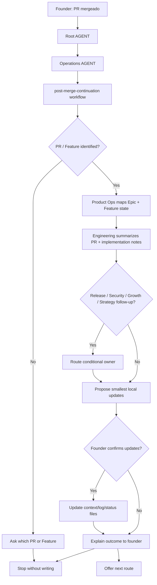

# Journey: Post Merge Continuation

## Human Overview

- **Trigger:** founder says "mergeado", "o PR foi mergeado", "vamos para a proxima feature" or similar.
- **Goal:** close the loop after merge, update the smallest useful context and choose the next safe route.
- **Starts at:** Root `AGENT.md`, then `operations/AGENT.md`.
- **Passes through:** `post-merge-continuation.workflow.md`, Product Ops, Engineering and conditional DevOps/Security/Growth/Strategy follow-up.
- **Ends with:** updated Feature/Epic status or Engineering log proposal, a founder-friendly shipped summary and one next-step bridge.
- **Does not do:** write code, create branches, open PRs, deploy, change roadmap priority or start the next Feature automatically.

## Flow Diagram



## Flow In Plain Words

The model starts at Root `AGENT.md` because the founder speaks naturally. It enters Operations because a merge is a delivery-state transition, not a new strategy decision by default. It reads `operations/workflows/post-merge-continuation.workflow.md` because the task can touch Product Ops status, Engineering notes, release readiness, security follow-up, customer learning or roadmap impact. Product Ops enters first to map the merged work back to the Epic and Feature. Engineering enters to summarize what was implemented and what was validated. DevOps, Security, Growth or Strategy enter only when their follow-up is relevant.

## Founder Trigger

- "mergeado, vamos para a proxima"
- "o PR foi mergeado"
- "terminamos essa feature"
- "o que fazemos depois do merge?"
- "atualiza o contexto depois do merge"
- "qual a proxima feature?"

## Moment

Post-merge. This happens after a PR or Feature was merged and before the next Feature delivery, release/deploy step, roadmap review or learning loop.

## Start Condition

This journey starts when:

- the founder confirms a PR or Feature was merged;
- or the model can identify a merged PR, local Feature or GitHub Feature issue;
- and the founder asks what to update or what to do next.

## End Condition

This journey ends when:

- the merge is summarized in founder-friendly language;
- the smallest useful context/status updates are proposed and optionally applied;
- the model offers the next route;
- or the model cannot identify the merged PR/Feature and stops before writing.

## Owner

- Department: Operations
- Workflow: `operations/workflows/post-merge-continuation.workflow.md`
- First area: `operations/product-ops/`
- Supporting area: `operations/engineering/`
- Conditional areas: `operations/devops/`, `operations/security/`, `growth/customer-experience/`, `strategy/roadmap/`

## Route Contract

```text
AGENT.md
-> operations/AGENT.md
-> operations/workflows/post-merge-continuation.workflow.md
-> operations/product-ops/AGENT.md
-> operations/product-ops/roles/product-owner.role.md
-> operations/engineering/AGENT.md
-> operations/engineering/roles/pr-reviewer.role.md
-> conditional owner when needed
-> Output / next route
```

Rules:

- The model must declare this route before executing.
- Product Ops owns Feature/Epic state after merge.
- Engineering supports the implementation and PR summary.
- DevOps enters only for release, deploy, environment, rollback or observability follow-up.
- Security enters only for auth, permissions, data, privacy, payments, APIs or abuse risk.
- Growth enters only for customer learning, support, onboarding or launch feedback.
- Strategy/Roadmap enters only if roadmap priority, milestone or delivery-scope decisions changed.
- The model cannot start the next Feature automatically.
- If a route file does not exist, the model stops and reports the missing path.

## What The Model Does In Practice

### Step 1 - Recognize Post-Merge Intent

The model opens:

`AGENT.md`

Why:

- The founder says something like "mergeado" or "vamos para a proxima".
- Root routing sends delivery-state transitions to Operations.

Navigation Evidence:

- Root `AGENT.md` routes delivery and post-implementation work to `operations/AGENT.md`.

Next step:

`operations/AGENT.md`

### Step 2 - Choose The Workflow

The model opens:

`operations/AGENT.md`

Why:

- The request is not only Engineering work. It may update Feature status, Engineering logs, release notes, security follow-up or learning loops.
- Department rules say multi-step journeys use `workflows/README.md` and the smallest matching workflow.

Navigation Evidence:

- `operations/workflows/README.md` lists `post-merge-continuation.workflow.md`.

Next step:

`operations/workflows/post-merge-continuation.workflow.md`

### Step 3 - Confirm The Merged Work

The model opens:

`operations/workflows/post-merge-continuation.workflow.md`

Why:

- The workflow says to identify the merged PR, local Feature or GitHub Feature issue before writing.

Navigation Evidence:

- The workflow stop conditions prevent updates when the merged work cannot be identified.

Next step:

`operations/product-ops/AGENT.md`

### Step 4 - Map Feature And Epic State

The model opens:

`operations/product-ops/AGENT.md`

Why:

- Product Ops owns local Epic/Feature status and issue readiness.

Navigation Evidence:

- The workflow navigation route points to Product Ops before Engineering.
- Product Ops files include `epics/` and `knowledge/issue-readiness.md`.

Next step:

`operations/engineering/AGENT.md`

### Step 5 - Summarize Engineering Result

The model opens:

`operations/engineering/AGENT.md`

Why:

- Engineering owns PR notes, implementation notes, tests and review evidence.

Navigation Evidence:

- The workflow route includes Engineering after Product Ops.
- Engineering knowledge includes `pr-log.md` and `implementation-notes.md`.

Next step:

conditional owner or output proposal.

### Step 6 - Route Conditional Follow-Up

The model opens only the needed owner:

- `operations/devops/AGENT.md` for release/deploy/observability;
- `operations/security/AGENT.md` for security-sensitive changes;
- `growth/AGENT.md` for learning, support or launch feedback;
- `strategy/AGENT.md` for roadmap or milestone changes.

Why:

- The workflow declares these areas as conditional, so the model must explain why each one enters or does not enter.

Navigation Evidence:

- Conditional Areas in the workflow define when each owner enters.

Next step:

founder confirmation.

### Step 7 - Propose Updates And Next Route

The model asks the founder before writing:

```text
Essa feature foi mergeada e parece fechar o escopo combinado.

Posso atualizar o status da feature e registrar o resumo da entrega?
Depois disso, podemos seguir por um destes caminhos:
1. preparar release/deploy;
2. iniciar a proxima feature do mesmo Epic;
3. revisar prioridade no roadmap;
4. capturar aprendizado com usuarios.
```

Why:

- The workflow requires confirmation before local updates or next route.

Navigation Evidence:

- Confirmation Gates define where the model must stop.
- Continuation Bridge defines safe next routes.

## Active Roles

| Order | Role | When It Enters | Why It Enters | Route Evidence |
| --- | --- | --- | --- | --- |
| 1 | Product Owner | After merge is identified | Owns Feature/Epic status and issue readiness | `operations/product-ops/AGENT.md` |
| 2 | PR Reviewer or Senior Developer | After Product Ops maps the Feature | Summarizes implementation, tests and PR evidence | `operations/engineering/AGENT.md` |
| 3 | Release Manager | Only when release/deploy is needed | Owns release and deployment follow-up | `operations/devops/AGENT.md` |
| 4 | Security Reviewer | Only when security-sensitive impact exists | Owns security follow-up | `operations/security/AGENT.md` |
| 5 | CX Lead | Only when learning/support/launch feedback matters | Owns customer learning loop | `growth/AGENT.md` |
| 6 | Roadmap Planner | Only when roadmap priority or milestone changed | Owns roadmap follow-up | `strategy/roadmap/AGENT.md` |

## Active Playbooks

| Playbook | When It Enters | Purpose |
| --- | --- | --- |
| `release-operations.playbook.md` | Release, deploy or observability follow-up is needed | Prepare release operations safely |
| `ai-generated-code-security-review.playbook.md` or security review playbook | Security-sensitive changes exist | Check for post-merge security follow-up |
| `customer-learning-loop.playbook.md` | Customer learning or support feedback should be captured | Turn shipped work into learning |
| `feature-to-delivery-cycle.workflow.md` | Founder chooses next Feature | Restart delivery from readiness, not from code |

## Completion Checklist

- [ ] Merged PR or Feature identified.
- [ ] Feature/Epic state mapped.
- [ ] Shipped work summarized for the founder.
- [ ] Product Ops update proposal prepared.
- [ ] Engineering notes/log proposal prepared when useful.
- [ ] DevOps applicability explained.
- [ ] Security applicability explained.
- [ ] Growth/CX applicability explained.
- [ ] Strategy/Roadmap applicability explained.
- [ ] Founder confirmed any write.
- [ ] One next route offered.
