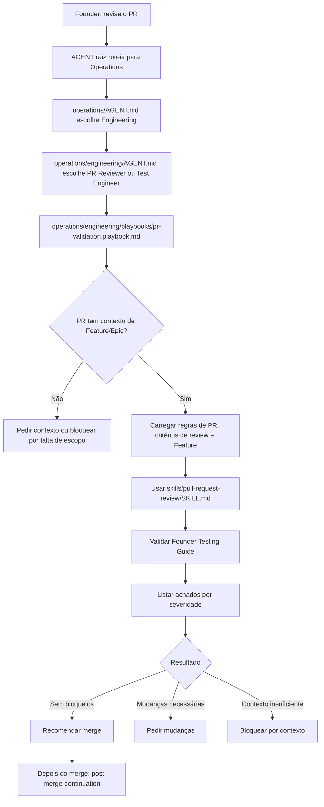

# Jornada: Review E PR

## Visão Humana

- **Trigger:** founder diz "revise o PR", "está pronto para merge?", "confere esse pull request" ou algo similar.
- **Objetivo:** validar um PR contra escopo, Feature, critérios de aceite, testes, riscos e guia de teste do founder antes de qualquer recomendação de merge.
- **Começa em:** `AGENT.md` raiz.
- **Passa por:** Operations, Engineering, role PR Reviewer ou Test Engineer, skill `pull-request-review` e playbook `pr-validation`.
- **Termina com:** achados por severidade, recomendação de merge/mudanças/bloqueio e ponte para `post-merge-continuation` depois que o merge acontecer.
- **Não faz:** merge automático, alteração de escopo de produto, criação de Feature, sync remoto de GitHub ou aprovação sem evidência.

## Diagrama Do Fluxo



## Fluxo Em Linguagem Simples

O modelo começa no `AGENT.md` raiz porque o founder fala em linguagem natural. A intenção é review de entrega, então a rota entra em Operations. Como PR e review pertencem à implementação, Operations direciona para Engineering. Engineering escolhe `PR Reviewer` ou `Test Engineer`, carrega `operations/engineering/playbooks/pr-validation.playbook.md` e usa `operations/engineering/skills/pull-request-review/SKILL.md` para revisar escopo, corretude, testes e riscos.

Esta jornada não cria um workflow novo. Review e PR ficam dentro de `feature-to-delivery-cycle` quando a implementação ainda está em andamento, ou entram diretamente por Engineering quando o founder traz um PR já preparado.

## Trigger Do Founder

- "revise o PR"
- "está pronto para merge?"
- "esse PR está bom?"
- "confere esse pull request antes de mergear"
- "podemos aprovar?"

## Momento

Review e PR. Isso acontece depois de `prepare-pr.playbook.md` ou quando o founder traz um PR existente para validação.

## Condição De Início

Esta jornada começa quando:

- existe um PR ou diff revisável;
- o PR aponta para uma Feature local, uma issue GitHub mapeada ou um escopo de entrega claro;
- Engineering está ativo ou precisa ser ativado antes da revisão;
- Product Ops já tem readiness suficiente para explicar o que o PR deveria entregar.

Se Engineering estiver inativo, o Chief retorna `activation_required: operations.engineering` antes de revisar o PR.

## Condição De Fim

Esta jornada termina quando:

- o modelo recomenda merge com evidência;
- ou lista mudanças necessárias por severidade;
- ou bloqueia a recomendação por falta de contexto, testes, Feature, critérios ou Founder Testing Guide.

## Owner

- Departamento: Operations
- Área: `operations/engineering/`
- Role primária: `operations/engineering/roles/pr-reviewer.role.md`
- Role condicional: `operations/engineering/roles/test-engineer.role.md`
- Skill primária: `operations/engineering/skills/pull-request-review/SKILL.md`
- Playbook: `operations/engineering/playbooks/pr-validation.playbook.md`

## Contrato De Rota

```text
AGENT.md
-> operations/AGENT.md
-> operations/engineering/AGENT.md
-> operations/engineering/roles/pr-reviewer.role.md
-> operations/engineering/playbooks/pr-validation.playbook.md
-> operations/engineering/skills/pull-request-review/SKILL.md
-> operations/engineering/skills/follow-code-standards/SKILL.md
-> conditional operations/engineering/skills/data-change-review/SKILL.md
```

Regras:

- O modelo deve declarar esta rota antes de revisar.
- O modelo não pode recomendar merge sem ler o contexto de PR, Feature/issue e critérios aplicáveis.
- O modelo deve validar o `Founder Testing Guide` antes de dizer que o PR está pronto.
- O modelo deve ordenar achados por severidade.
- O modelo deve separar bug, risco, lacuna de contexto, lacuna de teste e sugestão opcional.
- Não faça merge automaticamente.

## O Que O Modelo Faz Na Prática

### Etapa 1 - Rotear A Partir Da Intenção Do Founder

O modelo abre:

`AGENT.md`

Por quê:

- A solicitação do founder está em linguagem natural.
- A raiz escolhe o departamento dono.
- Review de PR pertence a Operations porque é trabalho de delivery.

Próxima etapa:

`operations/AGENT.md`

### Etapa 2 - Entrar Em Engineering

O modelo abre:

`operations/AGENT.md`

Por quê:

- O pedido é de review de implementação.
- Engineering é dono de PR, testes, qualidade de código e recomendação de merge.

Próxima etapa:

`operations/engineering/AGENT.md`

### Etapa 3 - Carregar O Playbook De Validação

Engineering abre:

`operations/engineering/playbooks/pr-validation.playbook.md`

Depois carrega:

- `.github/leanos/pr-validation-rules.md`
- `operations/engineering/knowledge/review-criteria.md`
- `operations/engineering/knowledge/code-standards.md`
- `operations/engineering/skills/pull-request-review/SKILL.md`
- `operations/engineering/skills/follow-code-standards/SKILL.md`
- `operations/engineering/skills/data-change-review/SKILL.md` quando dados, API ou persistência estiverem envolvidos

### Etapa 4 - Validar Escopo E Critérios

O modelo confirma:

- PR ou diff revisável;
- Feature local, issue mapeada ou escopo de entrega;
- critérios de aceite;
- Product Ops readiness;
- Design/Security/DevOps quando aplicável;
- testes automatizados ou justificativa clara de lacuna;
- Founder Testing Guide claro para um founder não técnico.

Se o PR não tiver contexto suficiente, o modelo retorna `blocked-by-context` em vez de revisar de memória.

### Etapa 5 - Produzir O Review

O output deve começar por achados por severidade:

```text
Achados:
- Blocker: ...
- High: ...
- Medium: ...
- Low: ...

Recomendação:
merge | mudanças necessárias | blocked-by-context

Evidência revisada:
- Feature / issue:
- Testes:
- Founder Testing Guide:
- Riscos:
```

Se não houver achados, diga isso claramente e ainda registre riscos residuais ou lacunas de teste.

## Perguntas Ao Founder

Pergunte apenas o que está faltando:

- "Qual é o PR ou diff que devo revisar?"
- "Esse PR está vinculado a qual Feature ou issue?"
- "Onde estão os critérios de aceite confirmados?"
- "Você quer que eu valide só readiness de merge ou também sugira correções?"

## Checkpoints De Confirmação

O modelo deve pedir confirmação antes de:

- alterar código durante o review;
- atualizar arquivos de Product Ops ou Engineering;
- abrir, atualizar ou fechar PR;
- executar ação remota de GitHub;
- marcar sync-state;
- recomendar merge quando houver risco não resolvido.

## Output Voltado Ao Founder

Quando pronto:

```text
Revisei o PR contra a Feature e os critérios de aceite.

Achados:
- Nenhum blocker encontrado.

Recomendação:
Pode seguir para merge, desde que você confirme o teste manual descrito no Founder Testing Guide.

Próximo passo depois do merge:
Roteie para post-merge-continuation para registrar aprendizado, release notes e próxima Feature.
```

Quando bloqueado:

```text
Ainda não recomendo merge.

O bloqueio principal é: <gap>.
O risco é: <risk>.

Próximo passo seguro:
<correção ou rota LeanOS necessária>.
```

## Ações Proibidas

Durante esta jornada, o modelo não pode:

- revisar sem PR, diff ou contexto de Feature;
- recomendar merge só porque os testes passaram;
- ignorar critérios de Product Ops;
- ignorar Design/Security/DevOps quando seus triggers se aplicam;
- esconder achados em resumo genérico;
- fazer merge automaticamente;
- atualizar GitHub remoto sem confirmação explícita.

## Resultados Possíveis

- PR recomendado para merge com evidência.
- PR precisa de mudanças.
- PR bloqueado por falta de contexto.
- PR bloqueado por lacuna de testes ou Founder Testing Guide.
- PR precisa de revisão de Design, Security ou DevOps antes de merge.

## Ponte De Continuação

Depois que o founder confirmar que o PR foi mergeado:

`post-merge-continuation`

Regras:

- Não trate a recomendação de merge como merge feito.
- Não atualize aprendizado ou release notes antes de confirmação de merge.
- Depois do merge, reinicie pelo `AGENT.md` raiz e rode a continuação pós-merge.

## Checklist De Validação Da Jornada

### Arquivos Existem

- [ ] `AGENT.md` existe.
- [ ] `operations/AGENT.md` existe.
- [ ] `operations/engineering/AGENT.md` existe.
- [ ] `operations/engineering/roles/pr-reviewer.role.md` existe.
- [ ] `operations/engineering/roles/test-engineer.role.md` existe.
- [ ] `operations/engineering/skills/pull-request-review/SKILL.md` existe.
- [ ] `operations/engineering/skills/follow-code-standards/SKILL.md` existe.
- [ ] `operations/engineering/playbooks/pr-validation.playbook.md` existe.
- [ ] `.github/leanos/pr-validation-rules.md` existe.

### Arquivos Apontam Uns Para Os Outros

- [ ] `AGENT.md` raiz roteia PR/review para Operations quando Engineering está ativo.
- [ ] `operations/AGENT.md` direciona review de implementação para Engineering.
- [ ] `operations/engineering/AGENT.md` expõe `pr-validation`.
- [ ] `pr-validation.playbook.md` usa `pull-request-review/SKILL.md`.
- [ ] `pull-request-review/SKILL.md` exige evidência antes de recomendação.

### Execução Da Jornada

- [ ] O modelo lista achados por severidade.
- [ ] O modelo valida o Founder Testing Guide.
- [ ] O modelo separa recomendação de merge de merge real.
- [ ] O modelo bloqueia quando falta Feature, PRD, critérios, testes ou contexto.
- [ ] O modelo oferece `post-merge-continuation` apenas depois de merge confirmado.

## Notas Para Design Do Framework

- Esta jornada não precisa de workflow próprio enquanto `pr-validation` estiver bem coberto por Engineering.
- Se reviews de PR passarem a envolver múltiplas áreas sempre, o framework pode promover isso para workflow depois de atualizar o source of truth.
