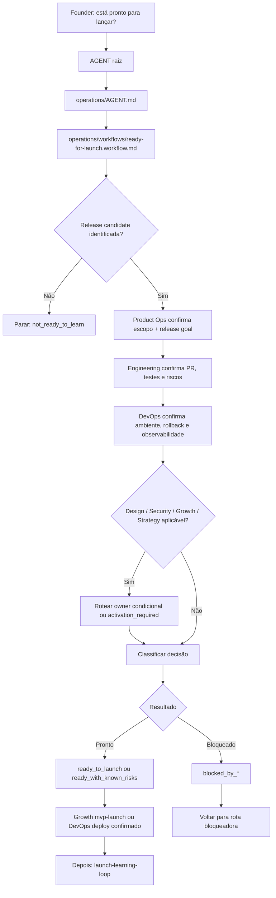

# Jornada: Ready For Launch

## Visão Humana

- **Trigger:** founder pergunta "está pronto para lançar?", "podemos lançar?", "vamos abrir beta?", "pode ir para usuários reais?" ou algo similar.
- **Objetivo:** decidir se uma release candidate pode ser exposta a usuários reais antes de acionar Growth, deploy ou learning loop.
- **Começa em:** `AGENT.md` raiz.
- **Passa por:** Operations, `ready-for-launch.workflow.md`, Product Ops, Engineering, DevOps e gates condicionais de Design/Security/Growth/Strategy.
- **Termina com:** uma decisão explícita de readiness, bloqueio ou risco aceito, além da menor próxima rota segura.
- **Não faz:** deploy automático, campanha automática, alteração de código, criação de Feature ou execução de Growth sem confirmação.

## Diagrama Do Fluxo



## Fluxo Em Linguagem Simples

O modelo começa no `AGENT.md` raiz porque o founder fala em linguagem natural. A pergunta "está pronto para lançar?" não é Growth ainda; é um gate operacional. Operations entra porque precisa checar escopo, entrega, evidência técnica, deploy path, rollback, observabilidade e riscos antes de usuários reais. Product Ops confirma o que será lançado. Engineering confirma o que foi implementado e validado. DevOps confirma se existe caminho seguro de release. Design, Security, Growth e Strategy entram apenas quando seus gatilhos forem aplicáveis.

## Trigger Do Founder

- "está pronto para lançar?"
- "podemos lançar?"
- "vamos abrir beta?"
- "pode ir para usuários reais?"
- "podemos fazer go-live?"
- "o que falta para lançar?"
- "coloca em produção para clientes"

## Momento

Ready for launch. Isso acontece depois de PR/review, pós-merge ou release candidate identificada, e antes de execução de lançamento, deploy, beta público ou learning loop com usuários.

## Condição De Início

Esta jornada começa quando:

- existe release candidate, PR validado, Feature mergeada, MVP slice, beta ou versão identificável;
- Product Ops, Engineering e DevOps estão ativos ou precisam ser ativados progressivamente;
- o founder está perguntando sobre readiness para usuários reais, não pedindo uma Feature nova.

Se DevOps estiver inativo depois de Product Ops e Engineering, o Chief retorna `activation_required: operations.devops`. Se Product Ops ou Engineering ainda estiverem inativos, a menor área bloqueadora vem antes.

## Condição De Fim

Esta jornada termina quando o modelo retorna uma destas decisões:

- `ready_to_launch`
- `ready_with_known_risks`
- `blocked_by_product`
- `blocked_by_design`
- `blocked_by_security`
- `blocked_by_engineering`
- `blocked_by_devops`
- `blocked_by_growth`
- `not_ready_to_learn`

## Owner

- Departamento: Operations
- Workflow: `operations/workflows/ready-for-launch.workflow.md`
- Área primária: `operations/devops/`
- Áreas de apoio: `operations/product-ops/`, `operations/engineering/`
- Áreas condicionais: `operations/design/`, `operations/security/`, `growth/marketing/`, `growth/customer-experience/`, `strategy/product/`

## Contrato De Rota

```text
AGENT.md
-> operations/AGENT.md
-> operations/workflows/ready-for-launch.workflow.md
-> operations/product-ops/AGENT.md
-> operations/product-ops/roles/product-owner.role.md
-> operations/engineering/AGENT.md
-> operations/engineering/roles/pr-reviewer.role.md
-> operations/devops/AGENT.md
-> operations/devops/roles/release-manager.role.md
-> conditional owner when applicable
-> Output / next route
```

Regras:

- O modelo deve declarar esta rota antes de executar.
- Readiness de launch pertence a Operations, não a Growth.
- Growth executa lançamento aprovado e learning loop, mas não decide sozinho se a release pode ir para usuários reais.
- DevOps não faz deploy automaticamente.
- Security entra quando dados, auth, permissões, pagamentos, privacidade, API, banco, secrets, abuso, compliance ou infraestrutura forem sensíveis.
- Growth entra quando launch plan, landing page, canal, suporte, onboarding ou coleta de feedback forem necessários.
- Strategy entra quando o gate mudar ICP, posicionamento, promessa, problema ou hipótese central.

## O Que O Modelo Faz Na Prática

### Etapa 1 - Reconhecer Readiness De Launch

O modelo abre:

`AGENT.md`

Por quê:

- O founder pergunta em linguagem natural.
- A raiz separa readiness de launch de execução de Growth.

Próxima etapa:

`operations/AGENT.md`

### Etapa 2 - Escolher O Workflow

O modelo abre:

`operations/AGENT.md`

Por quê:

- A solicitação cruza Product Ops, Engineering e DevOps.
- O departamento Operations roteia jornadas multiárea para `workflows/README.md`.

Próxima etapa:

`operations/workflows/ready-for-launch.workflow.md`

### Etapa 3 - Confirmar Release Candidate

O modelo identifica o que está candidato a lançamento:

- PR validado;
- Feature mergeada;
- MVP slice;
- beta;
- versão pronta para go-live;
- escopo de release definido.

Se nada disso existir, a decisão é `not_ready_to_learn` e o modelo volta para Product Ops, Engineering ou `feature-to-delivery-cycle`.

### Etapa 4 - Checar Product Ops

Product Ops confirma:

- escopo de release;
- release goal;
- critérios de aceite;
- não objetivos;
- checklist de release;
- riscos de produto;
- impacto esperado em usuário real.

Bloqueios aqui retornam `blocked_by_product`.

### Etapa 5 - Checar Engineering

Engineering confirma:

- PR/merge;
- testes automatizados ou lacuna explícita;
- build;
- validação manual;
- Founder Testing Guide;
- riscos técnicos restantes;
- regressões conhecidas.

Bloqueios aqui retornam `blocked_by_engineering`.

### Etapa 6 - Checar DevOps

DevOps carrega:

- `operations/devops/playbooks/release-operations.playbook.md`
- `operations/devops/skills/prepare-release/SKILL.md`
- `operations/devops/knowledge/deployment-readiness.md`
- `operations/devops/knowledge/release-notes.md`
- `operations/devops/knowledge/observability.md`

DevOps confirma:

- ambiente alvo;
- deploy path;
- rollback;
- release notes;
- observabilidade;
- post-release checks;
- limites de produção.

Bloqueios aqui retornam `blocked_by_devops`.

### Etapa 7 - Checar Gates Condicionais

O modelo explica se cada gate entra ou não entra:

- Design: UX, UI, copy, fluxo, acessibilidade ou componente ainda arriscado.
- Security: dados, auth, permissões, pagamentos, privacidade, API, banco, secrets, abuso, compliance ou infraestrutura.
- Growth Marketing: plano de lançamento, landing page, canal ou campanha.
- Growth CX: suporte, onboarding, feedback ou rotina de aprendizado.
- Strategy Product: ICP, posicionamento, problema, promessa ou hipótese central mudou.

Se Growth for necessário e estiver inativo, retorne `activation_required: growth.marketing` ou `activation_required: growth.customer-experience`.

### Etapa 8 - Produzir Decisão

O modelo responde em linguagem simples:

```text
Decisão:
ready_to_launch | ready_with_known_risks | blocked_by_*

O que já está pronto:
- ...

Riscos ou bloqueios:
- ...

Próximo passo recomendado:
- Growth mvp-launch;
- DevOps deploy confirmado;
- voltar para a área bloqueadora;
- launch-learning-loop depois que houver evidência de usuários.
```

## Playbooks Ativos

| Playbook | Quando Entra | Propósito |
| --- | --- | --- |
| `operations/product-ops/playbooks/delivery-readiness.playbook.md` | Escopo, critérios ou release goal estão em dúvida | Confirmar readiness de produto antes de launch |
| `operations/engineering/playbooks/pr-validation.playbook.md` | Evidência de PR, testes ou Founder Testing Guide precisa ser confirmada | Validar entrega antes da exposição a usuários reais |
| `operations/devops/playbooks/release-operations.playbook.md` | Sempre que release readiness for avaliada | Preparar release notes, rollback, deploy path e observabilidade |
| `operations/security/playbooks/pre-deploy-security-review.playbook.md` | Risco sensível de security existe | Bloquear lançamento inseguro |
| `growth/marketing/playbooks/mvp-launch.playbook.md` | Gate aprovado e Growth ativo | Executar lançamento aprovado |
| `growth/workflows/launch-learning-loop.workflow.md` | Lançamento rodou e há evidência | Transformar sinais de usuário em aprendizado |

## Ações Proibidas

Durante esta jornada, o modelo não pode:

- fazer deploy automaticamente;
- executar campanha ou email automaticamente;
- marcar `ready_to_launch` sem evidência de Product Ops, Engineering e DevOps;
- ignorar Design, Security ou Growth quando seus gatilhos se aplicam;
- tratar Growth como substituto de release readiness;
- criar código, branch, PR ou nova Feature;
- inventar métricas, feedback, status de deploy ou evidência externa.

Não faça deploy automaticamente.

## Checklist De Validação Da Jornada

### Arquivos Existem

- [ ] `AGENT.md` existe.
- [ ] `operations/AGENT.md` existe.
- [ ] `operations/workflows/ready-for-launch.workflow.md` existe quando Product Ops, Engineering e DevOps estão ativos.
- [ ] `operations/product-ops/AGENT.md` existe.
- [ ] `operations/engineering/AGENT.md` existe.
- [ ] `operations/devops/AGENT.md` existe.
- [ ] `operations/devops/playbooks/release-operations.playbook.md` existe.

### Arquivos Apontam Uns Para Os Outros

- [ ] `AGENT.md` raiz separa readiness de launch de execução/aprendizado de Growth.
- [ ] `operations/AGENT.md` reconhece launch readiness como jornada de Operations.
- [ ] `workflows/README.md` lista `ready-for-launch.workflow.md`.
- [ ] O workflow inclui `ready_to_launch`, `ready_with_known_risks`, `blocked_by_devops` e `not_ready_to_learn`.
- [ ] O workflow aponta Growth apenas como ponte depois do gate ou como bloqueio de ativação.

### Execução Da Jornada

- [ ] O modelo identifica a release candidate.
- [ ] Product Ops confirma escopo e release goal.
- [ ] Engineering confirma evidência de entrega.
- [ ] DevOps confirma release readiness.
- [ ] Gates condicionais são justificados.
- [ ] O output usa uma decisão explícita.
- [ ] A próxima rota é Growth `mvp-launch`, `launch-learning-loop`, DevOps confirmado ou rota bloqueadora.
