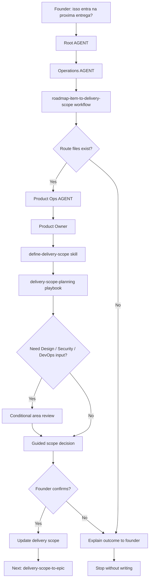

# Journey: Roadmap Item To Delivery Scope

This journey starts when a roadmap item is already worth tracking and the founder asks whether it should become part of a real delivery scope.

The purpose is not to create GitHub epics, sub-issues, branches or code. The purpose is to decide whether a roadmap item becomes a committed delivery scope with `scope_type`, `milestone` and `release_goal`.

## Human Overview

- **Trigger:** founder asks whether a roadmap item enters MVP, a release, an experiment, beta or the next delivery.
- **Goal:** decide if the roadmap item becomes delivery scope and define the lightweight delivery header.
- **Starts at:** Root `AGENT.md`, then `operations/AGENT.md`.
- **Passes through:** `roadmap-item-to-delivery-scope.workflow.md`, Product Ops, Product Owner, `define-delivery-scope.skill.md` and `delivery-scope-planning.playbook.md`.
- **Ends with:** a founder-confirmed delivery scope proposal or a decision to keep the item in roadmap/backlog.
- **Does not do:** create GitHub epics, create sub-issues, create branches, write code or start implementation.

## Flow Diagram



## Flow In Plain Words

The model starts at Root `AGENT.md` because the founder is asking in natural language. It enters Operations because delivery scope belongs to Operations, reads `roadmap-item-to-delivery-scope.workflow.md` because this is a delivery transition, activates Product Ops because Product Ops owns scope, acceptance criteria and issue readiness, loads Product Owner because the decision is product/delivery scope, uses `define-delivery-scope.skill.md` and `delivery-scope-planning.playbook.md`, then asks the founder to confirm before updating any delivery or MVP file.

## Founder Trigger

Real phrases that can start this journey:

- "Isso entra no MVP?"
- "Isso entra na proxima entrega?"
- "Esse item do roadmap vira escopo agora?"
- "Esse item deve ir para qual milestone?"
- "Vamos colocar isso na release?"
- "Isso deve virar experimento, beta ou release?"

## Moment

This happens after `idea-to-roadmap` and before epic creation.

It can happen:

- when a roadmap item is in Now, Next or candidate status;
- when the founder wants to decide whether a roadmap item becomes committed work;
- when the first MVP is being shaped;
- when the product already exists and the next delivery is a release, beta, experiment or internal scope.

## Human Goal

The founder wants to decide whether a roadmap item should become a real delivery commitment.

In founder-friendly language:

> "I want to know if this roadmap item should become part of what we are actually going to build next, and what kind of delivery it belongs to."

## Start Condition

This journey starts when:

- a roadmap or backlog item already exists;
- the item has enough product context to discuss delivery;
- the founder asks whether it enters MVP, release, beta, experiment or the next delivery;
- implementation has not started yet.

## End Condition

This journey ends when:

- the model recommends `scope_type`, `milestone` and `release_goal`, or recommends keeping the item out of delivery scope;
- Design, Security or DevOps applicability is called out when relevant;
- the founder confirms or rejects the proposed update;
- no GitHub epic, sub-issue, branch or code work has started.

## Owner

Department or area that owns the journey:

- Department: `operations/`
- Primary area: `operations/product-ops/`
- Supporting areas: `strategy/roadmap/`, `strategy/product/`
- Conditional areas: `operations/design/`, `operations/security/`, `operations/devops/`
- Workflow: `operations/workflows/roadmap-item-to-delivery-scope.workflow.md`
- Command, if any: none required. Natural language should activate this route.

## Route Contract

The required route is:

```text
Root AGENT.md
-> operations/AGENT.md
-> operations/workflows/roadmap-item-to-delivery-scope.workflow.md
-> operations/product-ops/AGENT.md
-> operations/product-ops/roles/product-owner.role.md
-> operations/product-ops/skills/define-delivery-scope.skill.md
-> operations/product-ops/playbooks/delivery-scope-planning.playbook.md
-> Output
```

Rules:

- The model cannot start this journey before a roadmap item exists.
- The model must declare the route before executing.
- Strategy provides roadmap/product context, but Operations/Product Ops owns the delivery-scope decision.
- MVP is only one possible `scope_type`, not the permanent delivery model.
- Design enters only when UX, UI, copy, accessibility, screen or flow impact exists.
- Security enters only when data, auth, permission, privacy, abuse, API, database, compliance, infrastructure or AI-generated-code risk exists.
- DevOps enters only when environment, deploy, CI/CD, observability, GitHub Project, config or release readiness is affected.
- GitHub does not enter as a remote write in this journey.
- If a route file does not exist, the model stops and reports the missing path.

## What The Model Does In Practice

### Step 1 - Understand the founder delivery question

The model starts from:

`AGENT.md`

Why:

- Root `AGENT.md` says natural-language requests route through the Navigation Chain when no command clearly matches.
- Root `AGENT.md` says Operations owns delivery scope, issue readiness, design, engineering, implementation, DevOps and security.
- The founder is asking for a delivery commitment, not a pure roadmap decision.

Navigation Evidence:

- `AGENT.md` routes delivery scope requests to `operations/AGENT.md`.
- The request asks whether a roadmap item becomes part of a concrete delivery.

What the model understands here:

- This is an Operations request.
- This is not a code request.
- This is not GitHub issue creation yet.

Next step:

`operations/AGENT.md`

### Step 2 - Enter Operations and select the workflow

The model opens:

`operations/AGENT.md`

Why:

- Root AGENT chose Operations as the owning department.
- Operations AGENT says journeys should open `workflows/README.md`.
- The request changes scope and delivery state, so it is a journey.

Navigation Evidence:

- `operations/AGENT.md` says delivery scope belongs to Operations.
- `operations/AGENT.md` says workflows are used for multi-step decisions and transitions.

What the model understands here:

- Operations owns the transition from roadmap item to delivery scope.
- Product Ops is the primary area.
- Design, Security and DevOps are conditional, not automatic.

Next step:

`operations/workflows/README.md`

### Step 3 - Select Roadmap Item To Delivery Scope workflow

The model opens:

`operations/workflows/README.md`

Why:

- Operations AGENT instructed workflow selection for journeys.
- The founder is asking whether a roadmap item becomes delivery scope.

Navigation Evidence:

- `operations/workflows/roadmap-item-to-delivery-scope.workflow.md` exists.
- The workflow purpose says it decides whether a roadmap item becomes concrete delivery scope before epic, issue or implementation work.

What the model understands here:

- This is the correct workflow.
- Product Ops must own the next step.
- Epic creation comes later.

Next step:

`operations/workflows/roadmap-item-to-delivery-scope.workflow.md`

### Step 4 - Read the workflow contract

The model opens:

`operations/workflows/roadmap-item-to-delivery-scope.workflow.md`

Why:

- The workflow defines the sequence for turning a roadmap item into delivery scope.

Navigation Evidence:

- The workflow requires Product Ops.
- The workflow says to confirm the roadmap item exists and has product context.
- The workflow says to decide `scope_type`, `milestone` and `release_goal`.
- The workflow says to stop before GitHub epics, sub-issues, branches or code.

What the model understands here:

- Product Ops is mandatory.
- Design, Security and DevOps are conditional.
- Founder confirmation is required before file updates.

Next step:

`operations/product-ops/AGENT.md`

### Step 5 - Enter Product Ops

The model opens:

`operations/product-ops/AGENT.md`

Why:

- The workflow requires Product Ops.
- Product Ops owns delivery scope, acceptance criteria, epic shaping and delivery boundaries.

Navigation Evidence:

- `operations/product-ops/AGENT.md` routes delivery-scope work to Product Owner.
- Product Owner is used when delivery scope needs coordination.

What the model understands here:

- Product Owner should make the product/delivery decision.
- Delivery Architect can enter later if technical boundaries are unclear.

Next step:

`operations/product-ops/roles/product-owner.role.md`

### Step 6 - Activate Product Owner

The model opens:

`operations/product-ops/roles/product-owner.role.md`

Why:

- Product Ops AGENT routes delivery scope coordination to Product Owner.
- Product Owner reads delivery scope, issue readiness, MVP files and Strategy context.

Navigation Evidence:

- Product Owner points to `define-delivery-scope.skill.md`.
- Product Owner points to `delivery-scope-planning.playbook.md`.

What the model understands here:

- The decision needs product value, roadmap context and delivery boundaries.
- MVP files are relevant only when `scope_type` is MVP.

Next step:

`operations/product-ops/skills/define-delivery-scope.skill.md`

### Step 7 - Define delivery scope

The model opens:

`operations/product-ops/skills/define-delivery-scope.skill.md`

Why:

- Product Owner points to this skill for deciding whether a roadmap item becomes delivery scope.

Navigation Evidence:

- The skill asks for `scope_type`, `milestone` and `release_goal`.
- The skill says MVP is one possible scope type.
- The skill says not to create epics or sub-issues in this step.

What the model understands here:

- It should recommend a delivery scope or recommend keeping the item in roadmap/backlog.
- It should not treat roadmap priority as delivery commitment.

Next step:

`operations/product-ops/playbooks/delivery-scope-planning.playbook.md`

### Step 8 - Use Delivery Scope Planning playbook

The model opens:

`operations/product-ops/playbooks/delivery-scope-planning.playbook.md`

Why:

- Product Owner points to this playbook.
- The playbook sequences the delivery-scope decision.

Navigation Evidence:

- The playbook says to set `scope_type`, `milestone` and `release_goal` only after founder confirmation.
- The playbook says to define non-goals and applicability for Design, Security and DevOps.
- The playbook says not to update GitHub.

What the model understands here:

- The output is a delivery scope proposal.
- Conditional specialist input must be called out, not assumed.

Next step:

Guided scope decision.

### Step 9 - Ask a guided delivery-scope question

The model pauses and asks the founder to choose the delivery direction.

Why:

- This changes delivery commitment.
- The playbook requires founder confirmation before file updates.
- The guided conversation standard prefers simple numbered decisions.

Founder-friendly options:

```text
Como voce quer tratar esse item agora?

1. Entra no MVP
2. Entra em uma release futura
3. Vira experimento
4. Fica como beta/internal
5. Continua no roadmap/backlog por enquanto
6. Nao sei, me ajude a decidir

Voce pode responder so com o numero ou do seu jeito.
```

What the model understands here:

- The founder owns the commitment.
- The model can recommend, but cannot silently change delivery scope.

Next step:

Founder-facing output and update proposal.

### Step 10 - Produce founder-friendly output

The model responds in plain language first.

Example:

```text
Minha leitura:
esse item parece importante, mas ainda nao deveria virar trabalho de engenharia.

Minha recomendacao:
- tratar como Release futura;
- definir milestone depois que o fluxo principal do MVP estiver validado;
- manter Design e Security como nao aplicaveis por enquanto;
- nao criar epic ainda.

Quer que eu registre esse item como delivery scope futuro?
```

Why:

- The workflow stops before epic, issue or implementation.
- Product Ops owns the delivery-scope proposal.
- Founder confirmation is required before writing.

## Active Roles

| Order | Role | When It Enters | Why It Enters | Route Evidence |
| --- | --- | --- | --- | --- |
| 1 | Product Owner | Always | Owns delivery scope, acceptance criteria and product/delivery commitment. | `operations/product-ops/AGENT.md`, `product-owner.role.md` |
| 2 | Delivery Architect | Conditional | Enters when technical boundaries, dependencies or implementation readiness are unclear. | `delivery-architect.role.md` |

## Active Skills

| Skill | Used By | Purpose | Route Evidence |
| --- | --- | --- | --- |
| `define-delivery-scope.skill.md` | Product Owner | Decide `scope_type`, `milestone` and `release_goal`. | `product-owner.role.md` points to it. |
| `check-delivery-coherence.skill.md` | Product Owner or Delivery Architect | Check delivery scope against strategy, roadmap and acceptance criteria. | Product Ops skills list includes it. |
| `define-delivery-boundaries.skill.md` | Delivery Architect | Define technical/operational boundaries when needed. | `delivery-architect.role.md` points to it. |

## Active Playbooks

| Playbook | Area | Role In The Journey | Route Evidence |
| --- | --- | --- | --- |
| `delivery-scope-planning.playbook.md` | `operations/product-ops` | Main decision playbook for this journey. | `product-owner.role.md` points to it. |
| `delivery-readiness.playbook.md` | `operations/product-ops` | Conditional check when implementation readiness is unclear. | `delivery-architect.role.md` points to it. |

## Founder Questions

Founder-friendly questions:

- Is this item important enough to become committed delivery work?
- Is this for MVP, a future release, experiment, beta or internal scope?
- What milestone should carry this?
- What is the release goal?
- What is intentionally out of scope?
- Does this need Design input?
- Does this need Security input?
- Does this need DevOps input?

Do not ask as a rigid form. Ask only what is missing.

## Guided Conversation Points

| Step | Purpose | Source |
| --- | --- | --- |
| Step 7 | Decide if roadmap item becomes delivery scope. | `operations/product-ops/skills/define-delivery-scope.skill.md` |
| Step 9 | Ask founder to choose scope direction. | `ai-standard/foundation/guided-conversation.md` |
| Confirmation | Confirm durable delivery-scope update. | `operations/product-ops/playbooks/delivery-scope-planning.playbook.md` |

## Confirmation Checkpoints

The model must ask for confirmation before:

- updating `operations/product-ops/knowledge/delivery-scope.md`;
- updating `operations/product-ops/mvp/*`;
- setting `scope_type`, `milestone` or `release_goal`;
- marking Design, Security or DevOps as applicable/not applicable;
- starting `delivery-scope-to-epic`;
- creating GitHub epics or issues;
- touching implementation files.

## Founder-facing Output

Recommended format:

```text
Minha leitura:
<short delivery interpretation>

Recomendacao:
- scope_type: <MVP / Release / Experiment / Beta / Internal / None>
- milestone: <milestone or TBD>
- release_goal: <goal or TBD>

Por que:
- <reason 1>
- <reason 2>

Antes de seguir:
- Design: <aplicavel / nao aplicavel / precisa avaliar>
- Security: <aplicavel / nao aplicavel / precisa avaliar>
- DevOps: <aplicavel / nao aplicavel / precisa avaliar>

Quer que eu registre esse delivery scope?
```

Only after this should the model show technical file updates.

## Internal File Updates After Confirmation

Files that can be updated if the founder confirms:

- `operations/product-ops/knowledge/delivery-scope.md`
- `operations/product-ops/knowledge/delivery-context.md`
- `operations/product-ops/mvp/scope.md` only when `scope_type` is MVP
- `operations/product-ops/mvp/prd.md` only when `scope_type` is MVP and PRD needs refinement
- `operations/product-ops/mvp/non-goals.md` only when `scope_type` is MVP
- `operations/product-ops/mvp/acceptance-criteria.md` only when acceptance direction is confirmed

Files that cannot be updated in this journey:

- GitHub issues, projects or milestones
- source code
- branches
- PRs

## Forbidden Actions

During this journey, the model cannot:

- treat roadmap priority as delivery commitment;
- mark an item as MVP just because it is important;
- create GitHub epics, issues or milestones;
- create sub-issues;
- create branches or write code;
- skip Product Ops;
- skip confirmation before file updates;
- invent milestone dates or release goals.

## Possible Outcomes

The journey can end with:

- **MVP**: the item belongs to the initial product delivery scope.
- **Release**: the item belongs to a future product release.
- **Experiment**: the item should be tested as a scoped experiment.
- **Beta**: the item should be exposed to a limited audience.
- **Internal**: the item is operational/internal work.
- **Not ready**: the item stays in roadmap/backlog.
- **Needs more product context**: return to Strategy Product or Roadmap.

## Continuation Bridge

At the end of this journey, the model must offer one clear next-step bridge when the delivery scope is confirmed and GitHub planning is useful.

Immediate bridge:

```text
Esse delivery scope esta definido.
Quer que eu prepare isso para virar epicos no GitHub Projects?
```

Later-session triggers:

- "vamos criar o epico disso"
- "manda esse scope para o GitHub"
- "cria os epicos desse delivery item"
- "vamos quebrar isso em epicos"
- "vamos atualizar o GitHub Projects com esse delivery item"

Next route:

`delivery-scope-to-epic`

Rules:

- Do not start `delivery-scope-to-epic` automatically.
- If the founder says yes, declare the new route before loading GitHub, DevOps or epic-planning files.
- If the founder says no, explain the delivery-scope outcome and stop without writing anything else.
- If the founder returns in a later session with a matching trigger, restart from Root `AGENT.md`, route to Operations, and load `delivery-scope-to-epic`.

## Next Recommended Journey

After this journey, the next flow can be:

- `delivery-scope-to-epic` when the founder wants to turn confirmed delivery scope into GitHub-ready epics.
- `idea-to-roadmap` when the item still needs roadmap placement.
- `new-idea-intake` when the idea is still too raw.

## Journey Validation Checklist

Use this checklist to test whether the journey really applies the Navigation Chain.

### Files Exist

- [x] `AGENT.md` exists.
- [x] `operations/AGENT.md` exists.
- [x] `operations/workflows/README.md` exists.
- [x] `operations/workflows/roadmap-item-to-delivery-scope.workflow.md` exists.
- [x] `operations/product-ops/AGENT.md` exists.
- [x] `operations/product-ops/roles/product-owner.role.md` exists.
- [x] `operations/product-ops/skills/define-delivery-scope.skill.md` exists.
- [x] `operations/product-ops/playbooks/delivery-scope-planning.playbook.md` exists.
- [x] `operations/product-ops/knowledge/delivery-scope.md` exists.
- [x] `strategy/roadmap/knowledge/roadmap.md` exists.
- [x] `strategy/roadmap/knowledge/backlog.md` exists.

### Files Point To Each Other

- [x] Root `AGENT.md` routes delivery scope to `operations/AGENT.md`.
- [x] `operations/AGENT.md` routes journeys to `workflows/README.md`.
- [x] `operations/workflows/README.md` lists `roadmap-item-to-delivery-scope.workflow.md`.
- [x] `roadmap-item-to-delivery-scope.workflow.md` requires Product Ops.
- [x] Product Ops AGENT routes delivery scope to Product Owner.
- [x] Product Owner points to `define-delivery-scope.skill.md`.
- [x] Product Owner points to `delivery-scope-planning.playbook.md`.

### Journey Execution

- [x] The model can explain the route before acting.
- [x] The model can say why each next file was loaded.
- [x] The model does not skip Operations or Product Ops.
- [x] The model asks for confirmation before updating delivery-scope files.
- [x] Founder-facing output appears before technical paths.
- [x] The continuation bridge offers `delivery-scope-to-epic` without starting it automatically.
- [x] Later-session triggers are listed for natural founder language.

### Conditional Areas

- [x] Design enters only when UX/UI/copy/accessibility/flow impact exists.
- [x] Security enters only when data/auth/privacy/abuse/API/compliance/infrastructure/security risk exists.
- [x] DevOps enters only when environment/deploy/CI/CD/observability/GitHub Project/release readiness is affected.
- [x] GitHub sync does not enter this journey.
- [x] Engineering does not enter this journey.

## Notes For Framework Design

- This journey replaces the old `roadmap-item-to-mvp-scope` concept.
- MVP remains valid as `scope_type: MVP`, but the durable framework concept is delivery scope.
- The next journey to design is `delivery-scope-to-epic`.
