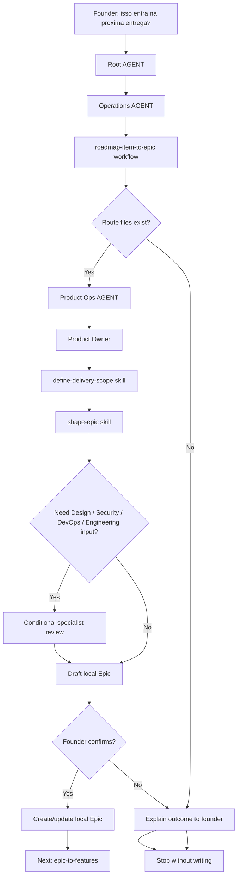

# Journey: Roadmap Item To Epic

## Human Overview

- **Trigger:** founder asks whether a roadmap item enters MVP, release, beta, experiment or the next delivery.
- **Goal:** create or update a local Epic that can later be broken into Features.
- **Starts at:** Root `AGENT.md`, then `operations/AGENT.md`.
- **Passes through:** `roadmap-item-to-epic.workflow.md`, Product Ops, Product Owner, delivery-scope and epic-shaping skills.
- **Ends with:** a founder-confirmed local Epic or a decision to keep/refine/reject the roadmap item.
- **Does not do:** create Features, write GitHub issues, create branches, write code or open PRs.

## Flow Diagram



## Flow In Plain Words

The model starts at Root `AGENT.md` because the founder speaks naturally. It enters Operations because turning roadmap into executable delivery work belongs to Operations. It reads `operations/workflows/roadmap-item-to-epic.workflow.md` because this is a cross-area planning transition. It enters Product Ops because Product Ops owns delivery scope, Epic shape and issue readiness. It uses Product Owner judgment to decide `scope_type`, milestone, release goal, scope boundary and Epic readiness. It asks Design, Security, DevOps or Engineering only when their criteria can change the Epic. It asks the founder to confirm before creating or updating the local Epic folder.

## Founder Trigger

- "isso entra na proxima entrega?"
- "isso entra no MVP?"
- "crie um epic para esse item"
- "transforma esse item do roadmap em entrega"
- "vamos planejar esse item para desenvolvimento"

## Moment

Roadmap planning to local Epic. This happens after `idea-to-roadmap` and before `epic-to-features`.

## Start Condition

This journey starts when:

- a roadmap or backlog item exists and can be identified;
- the item has enough product context to discuss delivery;
- the founder asks whether it should become real delivery work.

## End Condition

This journey ends when:

- a local Epic is proposed and the founder confirms or declines writing it;
- or the model explains why the roadmap item is not ready to become an Epic;
- or the model maps a missing route/file gap and stops.

## Owner

- Department: Operations
- Area: Product Ops
- Workflow: `operations/workflows/roadmap-item-to-epic.workflow.md`
- Primary role: `operations/product-ops/roles/product-owner.role.md`
- Primary playbook: `operations/product-ops/playbooks/delivery-scope-planning.playbook.md`

## Route Contract

```text
Root AGENT.md
-> operations/AGENT.md
-> operations/workflows/roadmap-item-to-epic.workflow.md
-> operations/product-ops/AGENT.md
-> operations/product-ops/roles/product-owner.role.md
-> operations/product-ops/skills/define-delivery-scope.skill.md
-> operations/product-ops/skills/shape-epic.skill.md
-> operations/product-ops/playbooks/delivery-scope-planning.playbook.md
-> ai-standard/templates/product/epic-template.md
-> Output
```

## Why This Replaces Two Old Journeys

The previous chain had two separate transitions:

```text
roadmap item -> delivery scope -> epic
```

That created an unnecessary extra step after LeanOS adopted local Epics as the real planning unit.

The official chain is now:

```text
new-idea-intake
-> idea-to-roadmap
-> roadmap-item-to-epic
-> epic-to-features
-> feature-to-delivery-cycle
```

`scope_type`, `milestone` and `release_goal` remain important, but they are Epic fields, not a separate workflow.

## Conditional Area Rules

- Design enters when UX, UI, copy, accessibility, screen, flow, behavior or component implications can change the Epic.
- Security enters when data, auth, permissions, privacy, abuse, API, database, compliance, infrastructure or AI-generated-code risk can change the Epic.
- DevOps enters when GitHub Project, milestone sync, environments, deploy, observability, config or release readiness can change the Epic.
- Engineering enters when feasibility, architecture boundary, dependencies, data model or implementation size can change the Epic.

## What The Model Does In Practice

### Step 1 - Confirm Route

The model opens:

`AGENT.md`

Why:

- The founder gave a natural-language planning request.
- Root routing should choose Operations because the request is moving from roadmap into delivery planning.

Next step:

`operations/AGENT.md`

### Step 2 - Load Operations Workflow

The model opens:

`operations/workflows/roadmap-item-to-epic.workflow.md`

Why:

- This is a cross-area transition from roadmap context into executable delivery shape.
- The workflow decides that Product Ops leads and Design, Security, DevOps or Engineering enter only when they can change Epic readiness.

Next step:

`operations/product-ops/AGENT.md`

### Step 3 - Load Product Ops

The model opens:

`operations/product-ops/AGENT.md`

Why:

- Product Ops owns Epic shape, delivery scope and readiness.
- The area lead chooses Product Owner before skills or playbooks.

Next step:

`operations/product-ops/roles/product-owner.role.md`

### Step 4 - Shape The Local Epic

The model opens:

- `operations/product-ops/skills/define-delivery-scope.skill.md`
- `operations/product-ops/skills/shape-epic.skill.md`
- `operations/product-ops/playbooks/delivery-scope-planning.playbook.md`
- `ai-standard/templates/product/epic-template.md`

Why:

- The roadmap item needs a delivery boundary, `scope_type`, milestone, release goal, outcome, non-goals, risks and likely Feature groups.
- The model should not create Features yet.

### Step 5 - Founder Confirmation

The model explains the recommendation in founder-friendly language, then asks before writing the local Epic.

If the founder confirms, the model may create or update the local Epic folder. If not, it explains the outcome and stops.

## Founder-Friendly Output

The model should explain the outcome before talking about files:

```text
Esse item ja parece pronto para virar um Epic local.

Minha recomendacao:
- criar o Epic "[EPIC] Customer Management";
- tratar como scope_type: MVP;
- vincular ao milestone "MVP v1";
- registrar que Design precisa avaliar tabela/lista de clientes antes das Features;
- nao sincronizar com GitHub ainda sem sua confirmacao.

Quer que eu crie esse Epic local agora?
```

## Stop Conditions

Stop without writing when:

- the roadmap or backlog item cannot be identified;
- the item lacks product context, user, outcome or value;
- the founder does not confirm Epic creation;
- the request shifts into Feature shaping, GitHub sync, branch creation, code or PR work.

When stopping, explain what happened and suggest the next safe route.

## Continuation Bridge

When the local Epic is confirmed, offer the next journey without starting it automatically:

```text
O Epic local esta pronto.
Quer que eu quebre esse Epic em Features usando a Delivery Readiness Matrix?
```

Next route:

`epic-to-features`

## Journey Validation Checklist

### Files Exist

- [ ] `operations/workflows/roadmap-item-to-epic.workflow.md` exists.
- [ ] No separate roadmap-to-delivery-scope workflow exists.
- [ ] No separate workflow exists between delivery scope and local Epic creation.
- [ ] `strategy/workflows/idea-to-roadmap.workflow.md` bridges to `roadmap-item-to-epic`.
- [ ] `operations/product-ops/AGENT.md` routes Epic shaping to Product Owner.
- [ ] `operations/product-ops/skills/define-delivery-scope.skill.md` exists.
- [ ] `operations/product-ops/skills/shape-epic.skill.md` exists.
- [ ] `operations/product-ops/playbooks/delivery-scope-planning.playbook.md` exists.
- [ ] `ai-standard/templates/product/epic-template.md` exists.
- [ ] The workflow stops before Feature files, GitHub issues, branch, code or PR work.

### Files Point To Each Other

- [ ] Root routes to Operations.
- [ ] Operations routes roadmap-to-delivery planning through workflows or Product Ops.
- [ ] Product Ops points to Product Owner.
- [ ] Product Owner points to delivery-scope and epic-shaping skills.
- [ ] `.leanos/index/workflows.yaml` includes `roadmap-item-to-epic`.

### Journey Execution

- [ ] The model can explain why it loaded each file.
- [ ] The model does not skip Product Ops.
- [ ] The model does not create Feature files in this journey.
- [ ] The model asks for confirmation before writing the local Epic.
- [ ] The model offers `epic-to-features` only after the local Epic exists.
