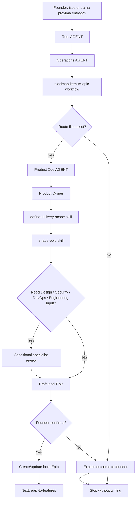

# Journey: Roadmap Item To Epic

This journey starts when a roadmap or backlog item is already worth planning and the founder asks whether it should become real delivery work.

The purpose is not to create Features, GitHub issues, branches, PRs or code. The purpose is to turn a roadmap item into a local LeanOS Epic with `scope_type`, `milestone`, `release_goal`, outcome, non-goals, risks and readiness notes.

## Human Overview

- **Trigger:** founder asks whether a roadmap item enters MVP, release, beta, experiment or the next delivery.
- **Goal:** create or update a local Epic that can later be broken into Features.
- **Starts at:** Root `AGENT.md`, then `operations/AGENT.md`.
- **Passes through:** `roadmap-item-to-epic.workflow.md`, Product Ops, Product Owner, delivery-scope and epic-shaping skills.
- **Ends with:** a founder-confirmed local Epic or a decision to keep/refine/reject the roadmap item.
- **Does not do:** create Features, write GitHub issues, create branches, write code or open PRs.

## Flow Diagram



## Flow In Plain Words

The model starts at Root `AGENT.md` because the founder speaks naturally. It enters Operations because turning roadmap into executable delivery work belongs to Operations. It reads `operations/workflows/roadmap-item-to-epic.workflow.md` because this is a cross-area planning transition. It enters Product Ops because Product Ops owns delivery scope, Epic shape and issue readiness. It uses Product Owner judgment to decide `scope_type`, milestone, release goal, scope boundary and Epic readiness. It asks Design, Security, DevOps or Engineering only when their criteria can change the Epic. It asks the founder to confirm before creating or updating the local Epic folder.

## Route Contract

```text
Root AGENT.md
-> operations/AGENT.md
-> operations/workflows/roadmap-item-to-epic.workflow.md
-> operations/product-ops/AGENT.md
-> operations/product-ops/roles/product-owner.role.md
-> operations/product-ops/skills/define-delivery-scope.skill.md
-> operations/product-ops/skills/shape-epic.skill.md
-> operations/product-ops/playbooks/delivery-scope-planning.playbook.md
-> ai-standard/templates/product/epic-template.md
-> Output
```

## Why This Replaces Two Old Journeys

The previous chain had two separate transitions:

```text
roadmap item -> delivery scope -> epic
```

That created an unnecessary extra step after LeanOS adopted local Epics as the real planning unit.

The official chain is now:

```text
new-idea-intake
-> idea-to-roadmap
-> roadmap-item-to-epic
-> epic-to-features
-> feature-to-delivery-cycle
```

`scope_type`, `milestone` and `release_goal` remain important, but they are Epic fields, not a separate workflow.

## Conditional Area Rules

- Design enters when UX, UI, copy, accessibility, screen, flow, behavior or component implications can change the Epic.
- Security enters when data, auth, permissions, privacy, abuse, API, database, compliance, infrastructure or AI-generated-code risk can change the Epic.
- DevOps enters when GitHub Project, milestone sync, environments, deploy, observability, config or release readiness can change the Epic.
- Engineering enters when feasibility, architecture boundary, dependencies, data model or implementation size can change the Epic.

## Founder-Friendly Output

The model should explain the outcome before talking about files:

```text
Esse item ja parece pronto para virar um Epic local.

Minha recomendacao:
- criar o Epic "[EPIC] Customer Management";
- tratar como scope_type: MVP;
- vincular ao milestone "MVP v1";
- registrar que Design precisa avaliar tabela/lista de clientes antes das Features;
- nao sincronizar com GitHub ainda sem sua confirmacao.

Quer que eu crie esse Epic local agora?
```

## Stop Conditions

Stop without writing when:

- the roadmap or backlog item cannot be identified;
- the item lacks product context, user, outcome or value;
- the founder does not confirm Epic creation;
- the request shifts into Feature shaping, GitHub sync, branch creation, code or PR work.

When stopping, explain what happened and suggest the next safe route.

## Continuation Bridge

When the local Epic is confirmed, offer the next journey without starting it automatically:

```text
O Epic local esta pronto.
Quer que eu quebre esse Epic em Features usando a Delivery Readiness Matrix?
```

Next route:

`epic-to-features`

## Evidence Checklist

- [ ] `operations/workflows/roadmap-item-to-epic.workflow.md` exists.
- [ ] No separate roadmap-to-delivery-scope workflow exists.
- [ ] No separate workflow exists between delivery scope and local Epic creation.
- [ ] `strategy/workflows/idea-to-roadmap.workflow.md` bridges to `roadmap-item-to-epic`.
- [ ] `operations/product-ops/AGENT.md` routes Epic shaping to Product Owner.
- [ ] `operations/product-ops/skills/define-delivery-scope.skill.md` exists.
- [ ] `operations/product-ops/skills/shape-epic.skill.md` exists.
- [ ] `operations/product-ops/playbooks/delivery-scope-planning.playbook.md` exists.
- [ ] `ai-standard/templates/product/epic-template.md` exists.
- [ ] The workflow stops before Feature files, GitHub issues, branch, code or PR work.
