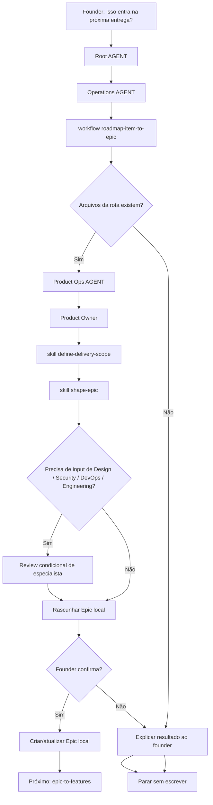

# Jornada: Item De Roadmap Para Epic

## Visão Humana

- **Trigger:** founder pergunta se um item de roadmap entra no MVP, release, beta, experimento ou próxima entrega.
- **Objetivo:** criar ou atualizar um Epic local que depois poderá ser quebrado em Features.
- **Começa em:** `AGENT.md` raiz, depois `operations/AGENT.md`.
- **Passa por:** `roadmap-item-to-epic.workflow.md`, Product Ops, Product Owner, skills de delivery-scope e epic-shaping.
- **Termina com:** um Epic local confirmado pelo founder ou uma decisão de manter/refinar/rejeitar o item de roadmap.
- **Não faz:** criar Features, escrever issues no GitHub, criar branches, escrever código ou abrir PRs.

## Diagrama Do Fluxo



## Fluxo Em Linguagem Simples

O modelo começa no `AGENT.md` raiz porque o founder fala naturalmente. Ele entra em Operations porque transformar roadmap em trabalho executável de delivery pertence a Operations. Ele lê `operations/workflows/roadmap-item-to-epic.workflow.md` porque esta é uma transição de planejamento entre áreas. Ele entra em Product Ops porque Product Ops é dono de escopo de delivery, formato do Epic e readiness de issue. Ele usa o julgamento do Product Owner para decidir `scope_type`, milestone, objetivo de release, limite de escopo e readiness do Epic. Ele chama Design, Security, DevOps ou Engineering apenas quando os critérios dessas áreas podem mudar o Epic. Ele pede confirmação ao founder antes de criar ou atualizar a pasta local do Epic.

## Trigger Do Founder

- "isso entra na próxima entrega?"
- "isso entra no MVP?"
- "crie um epic para esse item"
- "transforma esse item do roadmap em entrega"
- "vamos planejar esse item para desenvolvimento"

## Momento

Planejamento de roadmap para Epic local. Isso acontece depois de `idea-to-roadmap` e antes de `epic-to-features`.

## Condição De Início

Esta jornada começa quando:

- um item de roadmap ou backlog existe e pode ser identificado;
- o item tem contexto de produto suficiente para discutir delivery;
- o founder pergunta se ele deve virar trabalho real de delivery.

## Condição De Fim

Esta jornada termina quando:

- um Epic local é proposto e o founder confirma ou recusa a escrita;
- ou o modelo explica por que o item de roadmap ainda não está pronto para virar Epic;
- ou o modelo mapeia uma lacuna de rota/arquivo e para.

## Owner

- Departamento: Operations
- Área: Product Ops
- Workflow: `operations/workflows/roadmap-item-to-epic.workflow.md`
- Role primária: `operations/product-ops/roles/product-owner.role.md`
- Playbook primário: `operations/product-ops/playbooks/delivery-scope-planning.playbook.md`

## Contrato De Rota

```text
Root AGENT.md
-> operations/AGENT.md
-> operations/workflows/roadmap-item-to-epic.workflow.md
-> operations/product-ops/AGENT.md
-> operations/product-ops/roles/product-owner.role.md
-> operations/product-ops/skills/define-delivery-scope/SKILL.md
-> operations/product-ops/skills/shape-epic/SKILL.md
-> operations/product-ops/playbooks/delivery-scope-planning.playbook.md
-> ai-standard/templates/product/epic-template.md
-> Output
```

## Por Que Isso Substitui Duas Jornadas Antigas

A cadeia anterior tinha duas transições separadas:

```text
roadmap item -> delivery scope -> epic
```

Isso criou uma etapa extra desnecessária depois que o LeanOS adotou Epics locais como unidade real de planejamento.

A cadeia oficial agora é:

```text
idea-calibration
-> idea-to-roadmap
-> roadmap-item-to-epic
-> epic-to-features
-> feature-to-delivery-cycle
```

`scope_type`, `milestone` e `release_goal` continuam importantes, mas são campos do Epic, não um workflow separado.

## Regras De Áreas Condicionais

- Design entra quando implicações de UX, UI, copy, acessibilidade, tela, fluxo, comportamento ou componente podem mudar o Epic.
- Security entra quando dados, auth, permissões, privacidade, abuso, API, banco de dados, compliance, infraestrutura ou risco de código gerado por IA podem mudar o Epic.
- DevOps entra quando GitHub Project, sync de milestone, ambientes, deploy, observabilidade, config ou readiness de release podem mudar o Epic.
- Engineering entra quando viabilidade, limite de arquitetura, dependências, modelo de dados ou tamanho de implementação podem mudar o Epic.

## O Que O Modelo Faz Na Prática

### Etapa 1 - Confirmar Rota

O modelo abre:

`AGENT.md`

Por quê:

- O founder fez uma solicitação de planejamento em linguagem natural.
- O roteamento raiz deve escolher Operations porque a solicitação está saindo de roadmap e entrando em planejamento de delivery.

Próxima etapa:

`operations/AGENT.md`

### Etapa 2 - Carregar O Workflow De Operations

O modelo abre:

`operations/workflows/roadmap-item-to-epic.workflow.md`

Por quê:

- Esta é uma transição entre áreas do contexto de roadmap para formato executável de delivery.
- O workflow decide que Product Ops lidera e que Design, Security, DevOps ou Engineering entram apenas quando podem mudar a readiness do Epic.

Próxima etapa:

`operations/product-ops/AGENT.md`

### Etapa 3 - Carregar Product Ops

O modelo abre:

`operations/product-ops/AGENT.md`

Por quê:

- Product Ops é dono do formato do Epic, escopo de delivery e readiness.
- O lead da área escolhe Product Owner antes de skills ou playbooks.

Próxima etapa:

`operations/product-ops/roles/product-owner.role.md`

### Etapa 4 - Moldar O Epic Local

O modelo abre:

- `operations/product-ops/skills/define-delivery-scope/SKILL.md`
- `operations/product-ops/skills/shape-epic/SKILL.md`
- `operations/product-ops/playbooks/delivery-scope-planning.playbook.md`
- `ai-standard/templates/product/epic-template.md`

Por quê:

- O item de roadmap precisa de limite de delivery, `scope_type`, milestone, objetivo de release, outcome, non-goals, riscos e grupos prováveis de Features.
- O modelo ainda não deve criar Features.

### Etapa 5 - Confirmação Do Founder

O modelo explica a recomendação em linguagem amigável para o founder e pergunta antes de escrever o Epic local.

Se o founder confirmar, o modelo pode criar ou atualizar a pasta local do Epic. Se não, ele explica o resultado e para.

## Output Amigável Para O Founder

O modelo deve explicar o resultado antes de falar sobre arquivos:

```text
Esse item já parece pronto para virar um Epic local.

Minha recomendação:
- criar o Epic "[EPIC] Customer Management";
- tratar como scope_type: MVP;
- vincular ao milestone "MVP v1";
- registrar que Design precisa avaliar tabela/lista de clientes antes das Features;
- não sincronizar com GitHub ainda sem sua confirmação.

Quer que eu crie esse Epic local agora?
```

## Condições De Parada

Pare sem escrever quando:

- o item de roadmap ou backlog não pode ser identificado;
- o item não tem contexto de produto, usuário, outcome ou valor;
- o founder não confirma a criação do Epic;
- a solicitação muda para shaping de Feature, GitHub sync, criação de branch, código ou trabalho de PR.

Ao parar, explique o que aconteceu e sugira a próxima rota segura.

## Ponte De Continuação

Quando o Epic local for confirmado, ofereça a próxima jornada sem iniciá-la automaticamente:

```text
O Epic local está pronto.
Quer que eu quebre esse Epic em Features usando a Delivery Readiness Matrix?
```

Próxima rota:

`epic-to-features`

## Checklist De Validação Da Jornada

### Arquivos Existem

- [ ] `operations/workflows/roadmap-item-to-epic.workflow.md` existe.
- [ ] Nenhum workflow separado de roadmap-to-delivery-scope existe.
- [ ] Nenhum workflow separado existe entre escopo de delivery e criação de Epic local.
- [ ] `strategy/workflows/idea-to-roadmap.workflow.md` faz bridge para `roadmap-item-to-epic`.
- [ ] `operations/product-ops/AGENT.md` roteia shaping de Epic para Product Owner.
- [ ] `operations/product-ops/skills/define-delivery-scope/SKILL.md` existe.
- [ ] `operations/product-ops/skills/shape-epic/SKILL.md` existe.
- [ ] `operations/product-ops/playbooks/delivery-scope-planning.playbook.md` existe.
- [ ] `ai-standard/templates/product/epic-template.md` existe.
- [ ] O workflow para antes de arquivos de Feature, issues do GitHub, branch, código ou trabalho de PR.

### Arquivos Apontam Uns Para Os Outros

- [ ] A raiz roteia para Operations.
- [ ] Operations roteia planejamento de roadmap-to-delivery por workflows ou Product Ops.
- [ ] Product Ops aponta para Product Owner.
- [ ] Product Owner aponta para skills de delivery-scope e epic-shaping.
- [ ] `.leanos/index/workflows.yaml` inclui `roadmap-item-to-epic`.

### Execução Da Jornada

- [ ] O modelo consegue explicar por que carregou cada arquivo.
- [ ] O modelo não pula Product Ops.
- [ ] O modelo não cria arquivos de Feature nesta jornada.
- [ ] O modelo pede confirmação antes de escrever o Epic local.
- [ ] O modelo oferece `epic-to-features` apenas depois que o Epic local existe.
