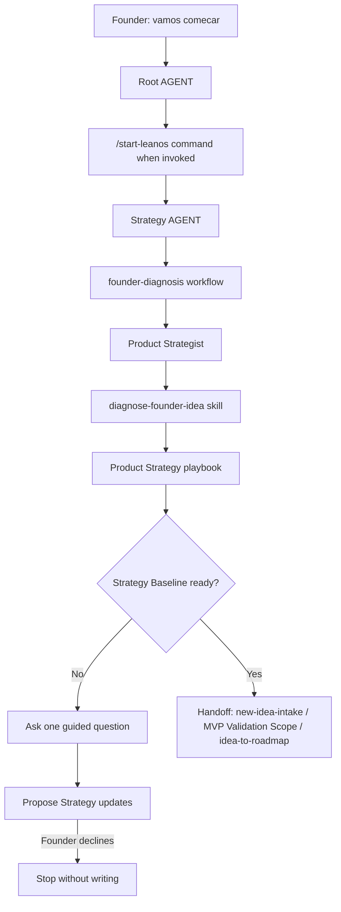

# Journey: Start LeanOS

This journey designs how LeanOS should handle a founder saying:

```text
"Vamos comecar."
```

The purpose is not to build a full MVP, roadmap or delivery plan immediately. The purpose is to diagnose the founder's current stage, build the minimum Strategy Baseline and identify the next safe route.

## Human Overview

- **Trigger:** founder wants to start, restart or understand where to begin.
- **Goal:** turn seed context into a clear Strategy Baseline gap and one guided next question.
- **Starts at:** Root `AGENT.md` or `.leanos/commands/start-leanos.md`.
- **Passes through:** `strategy/workflows/founder-diagnosis.workflow.md`, Product Strategist and Product Strategy playbook.
- **Ends with:** confirmed Strategy knowledge updates or a next route such as `new-idea-intake`, MVP Validation Scope or `idea-to-roadmap`.
- **Does not do:** create roadmap items, define MVP delivery scope, create Epics/Features, activate Operations/Growth or start implementation.

## Flow Diagram



## Flow In Plain Words

The model starts at Root `AGENT.md` because the founder is speaking in natural language. If `/start-leanos` is invoked, it loads the command first because command handling requires command files before action. It then enters Strategy and reads `founder-diagnosis.workflow.md` because startup is a progression-stage decision, not delivery work. Strategy Product uses `diagnose-founder-idea.skill.md` to name the current stage, baseline gaps and next guided question. The journey ends when the founder confirms Strategy updates or chooses a safe next route.

## Founder Trigger

Real phrases that can start this journey:

- "Vamos comecar."
- "Quero comecar agora."
- "Como eu inicio o LeanOS?"
- "Por onde comecamos?"
- "Quero configurar o LeanOS."

## Moment

Initial setup or restart. It can happen when the workspace is new, when the founder returns after setup, or when the current stage is unclear.

## Human Goal

The founder wants orientation without being forced into a long interview, technical audit or premature implementation.

In founder-friendly language:

> "Tell me what we already know, what is missing and the one next question that unlocks progress."

## Start Condition

This journey starts when:

- the founder asks to start or restart LeanOS;
- `leanos.yaml` has seed context or the founder provides enough context to begin;
- Strategy areas are active.

## End Condition

This journey ends when:

- the next Strategy Baseline gap is named and one guided question is asked;
- the founder confirms Strategy knowledge updates;
- Strategy Baseline is coherent enough to route to `new-idea-intake`, MVP Validation Scope or `idea-to-roadmap`;
- the founder declines updates or the request shifts into inactive delivery work.

## Owner

- Department: Strategy
- Area: Product, with Business and Roadmap support when needed
- Workflow: `strategy/workflows/founder-diagnosis.workflow.md`
- Command, if any: `.leanos/commands/start-leanos.md`

## Route Contract

The required route is:

```text
Root AGENT.md
-> .leanos/commands/start-leanos.md when invoked
-> strategy/AGENT.md
-> strategy/workflows/founder-diagnosis.workflow.md
-> strategy/product/AGENT.md
-> strategy/product/roles/product-strategist.role.md
-> strategy/product/skills/diagnose-founder-idea.skill.md
-> strategy/product/playbooks/product-strategy.playbook.md
```

## Stop Rules

- Do not ask a generic "tell me more" question when a specific baseline gap is visible.
- Do not create roadmap items before Strategy Baseline is minimally coherent.
- Do not define MVP delivery scope before Product Ops is active.
- Do not create Epics, Features, branches, PRs or source code.
- Do not activate Operations or Growth from this journey without a later confirmed gate.

## Completion Checklist

- [x] Root/start command routes startup into Strategy.
- [x] Strategy has a `founder-diagnosis` workflow.
- [x] Product has a `diagnose-founder-idea` skill.
- [x] The workflow names stage, gate, active requirements and activation limits.
- [x] The journey stops before roadmap, MVP delivery scope, Epic, Feature and implementation work.
