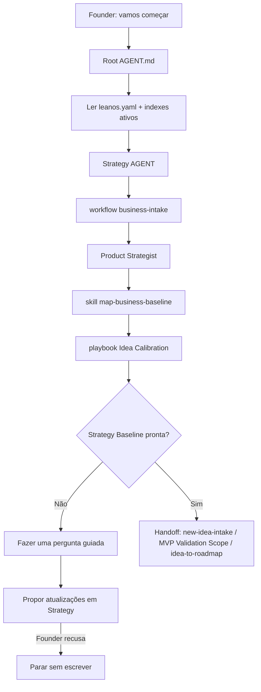

# Jornada: Iniciar O LeanOS

Esta jornada desenha como o LeanOS deve lidar com um founder dizendo:

```text
"Vamos começar."
```

O propósito não é construir imediatamente um MVP completo, roadmap ou plano de delivery. O propósito é mapear o estágio atual do negócio, calibrar a ideia inicial, construir a Strategy Baseline mínima e identificar a próxima rota segura.

## Visão Humana

- **Trigger:** founder quer começar, recomeçar ou entender por onde iniciar.
- **Objetivo:** transformar o contexto inicial em uma lacuna clara de Strategy Baseline e uma próxima pergunta guiada.
- **Começa em:** `AGENT.md` raiz.
- **Passa por:** `strategy/AGENT.md`, `strategy/workflows/business-intake.workflow.md`, Product Strategist e playbook de Idea Calibration.
- **Termina com:** atualizações confirmadas de knowledge em Strategy ou uma próxima rota como `new-idea-intake`, `mvp-validation-scope.playbook.md` ou `idea-to-roadmap`.
- **Não faz:** criar itens de roadmap, definir escopo de delivery do MVP, criar Epics/Features, ativar Operations/Growth ou iniciar implementação.

## Diagrama Do Fluxo



## Fluxo Em Linguagem Simples

O modelo começa no `AGENT.md` raiz porque o founder fala em linguagem natural. O roteamento raiz lê `leanos.yaml`, fase atual e indexes ativos antes de entrar em Strategy. Depois segue `business-intake.workflow.md` porque iniciar é uma decisão de estágio de progressão, não trabalho de delivery.

Strategy Product usa `map-business-baseline/SKILL.md` para mapear o estágio atual, as lacunas de baseline e a próxima pergunta guiada. `idea-calibration.playbook.md` conduz a conversa até a Strategy Baseline ficar aceitável. A jornada termina quando o founder confirma atualizações em Strategy ou escolhe uma próxima rota segura.

## Trigger Do Founder

Frases reais que podem iniciar esta jornada:

- "Vamos começar."
- "Quero começar agora."
- "Como eu inicio o LeanOS?"
- "Por onde começamos?"
- "Quero configurar o LeanOS."

## Contrato De Rota

A rota obrigatória é:

```text
Root AGENT.md
-> leanos.yaml
-> active .leanos/index/*
-> strategy/AGENT.md
-> strategy/workflows/business-intake.workflow.md
-> strategy/product/AGENT.md
-> strategy/product/roles/product-strategist.role.md
-> strategy/product/skills/map-business-baseline/SKILL.md
-> strategy/product/playbooks/idea-calibration.playbook.md
-> strategy/product/playbooks/mvp-validation-scope.playbook.md quando o founder quiser analisar o MVP de validação
```

## Regras De Parada

- Não faça uma pergunta genérica como "me conte mais" quando uma lacuna específica de baseline está visível.
- Não crie itens de roadmap antes que a Strategy Baseline esteja minimamente coerente.
- Não defina escopo de delivery do MVP antes de Product Ops estar ativo.
- Não crie Epics, Features, branches, PRs ou código fonte.
- Não ative Operations ou Growth a partir desta jornada sem um gate posterior confirmado.

## Checklist De Conclusão

- [x] O `AGENT.md` raiz roteia intenção de início para Strategy.
- [x] Strategy tem um workflow `business-intake`.
- [x] Product tem uma skill `map-business-baseline`.
- [x] O workflow nomeia estágio, gate, requisitos ativos e limites de ativação.
- [x] A jornada para antes de roadmap, escopo de delivery do MVP, Epic, Feature e trabalho de implementação.
